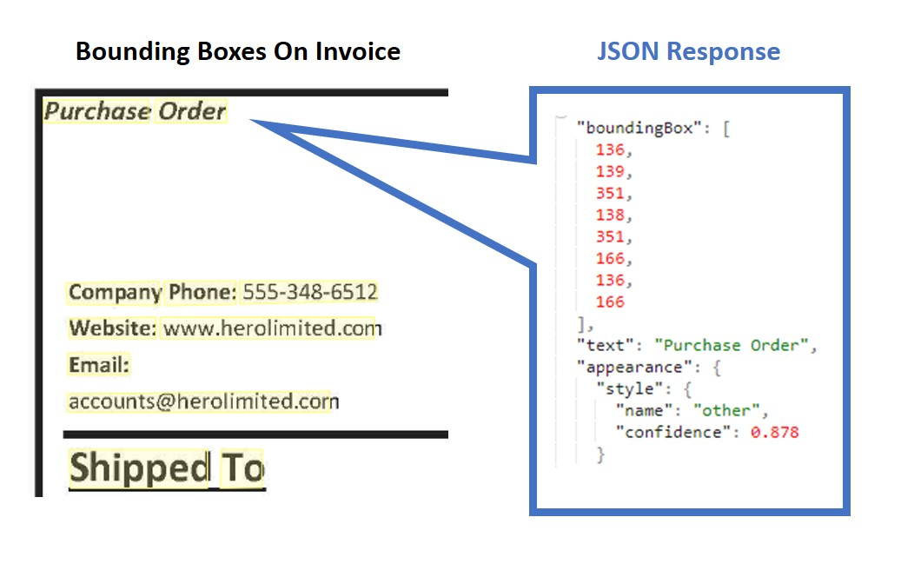

Form Recognizer is one of many Cognitive Services, Azure services with REST APIs and client library SDKs that can be used to build intelligence into your applications. 

Form Recognizer uses Optical Character Recognition (OCR) capabilities and deep learning models to extract text, key-value pairs, selection marks, and tables from documents.

> [!div class="mx-imgBorder"]
>    

OCR captures document structure by creating bounding boxes around detected objects in an image. The locations of the bounding boxes are recorded as coordinates in relation to the rest of the page. Form Recognizer services return bounding box data and other information in a structured form with the relationships from the original file.  

> [!div class="mx-imgBorder"]
> 

To build a high-accuracy model from scratch, people need to build deep learning models, use a large amount of compute resources, and face long model training times. These factors could make a project infeasible. Form Recognizer provides underlying models that have been trained on thousands of form examples. The underlying models enable you to do high-accuracy data extraction from your forms with little to no model training.   

## Form Recognizer service components 

Form Recognizer is composed of the following services: 

- **Layout Service**: takes an input of JPEG, PNG, PDF, and TIFF files. Returns a JSON file with the location of text in bounding boxes, text content, tables, selection marks (also known as checkboxes or radio buttons), and document structure. 

- **Prebuilt Models**: prebuilt models detect and extract information from document images and return the extracted data in a structured JSON output. Form Recognizer currently supports prebuilt models for: 
    - Receipts
    - Business Cards (in preview)
    - Invoices (in preview) 

- **Custom Models**: custom models extract data from forms specific to your business. Custom models can be trained by calling the Train Custom Model API.  
    - You can train custom models using:
        - Unsupervised learning (with unlabeled forms)
        - Supervised learning (with labeled forms)  

> [!NOTE]
> Some Form Recognizer features are in preview, as of the time this content was authored, and as a result, features and usage details may change.  You should refer to the [official page](/azure/cognitive-services/form-recognizer) for up-to-date information.

## Access services with the client library SDKs or REST API 

You can access Form Recognizer services by using a REST API or client library SDKs to integrate the services into your workflow or application. 

> [!TIP]
> This module's exercise focuses on the Python and .NET SDKs. Microsoft also publishes open-source SDKs for Java and Node.js. The underlying REST services can be used by any language.

Check out the [documentation](/azure/cognitive-services/form-recognizer/quickstarts/client-library) for quick start guides on all the available SDKs and the REST API.

Form Recognizer services are also supported by a user interface known as the Form OCR Test Tool (FOTT) that can do layout extraction and model training. 