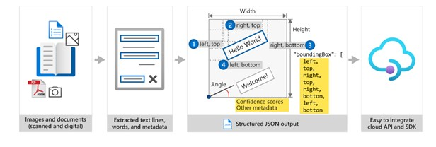

The Form Recognizer service enables you to extract data from forms, including a semantic understanding of the fields in the form and their corresponding values. Form Recognizer is one of many *Cognitive Services*, Azure services with REST APIs and client library SDKs that can be used to build intelligence into your applications. 

Form Recognizer uses Optical Character Recognition (OCR) capabilities with deep learning models to extract printed or handwritten text, key-value pairs, selection marks, and tables from documents.

   

OCR captures document structure by creating bounding boxes around detected objects in an image. The location of the bounding boxes are recorded as coordinates indicating the box's location relative to the rest of the page. Form recognizer services return bounding box data and other information in a JSON file.  

To build a high-accuracy form recognizer model from scratch, you would need an understanding of deep learning model structures. Without Form Recognizer services, you could also face prohibitively long training times which could make a project infeasible. One of the significant ways Form Recognizer saves time is by providing underlying models already trained on thousands of form examples. This enables you to perform high-accuracy data extraction from your forms with little to no model training.   

## Form Recognizer service components 

Form Recognizer is composed of the following services: 

- **Layout Service**: takes an input of JPEG, PNG, PDF, and TIFF files. Returns a JSON file with the location of text in bounding boxes, text content, tables, selection marks (also known as checkboxes or radio buttons), and document structure. 

- **Prebuilt Models**: prebuilt models detect and extract information from document images and return the extracted data in a structured JSON output. Form Recognizer currently supports prebuilt models for: 
    - Receipts
    - Business Cards (in preview)
    - Invoices (in preview) 

- **Custom Models**: custom models extract data from forms specific to your business. Custom models can be trained by calling the Train Custom Model API.  
    - You can train custom models using:
        - Unsupervised learning (with unlabeled forms)
        - Supervised learning (with labeled forms)  

> [!NOTE]
> Some Form Recognizer features are in preview, as of the time this content was authored, and as a result, features and usage details may change.  You should refer to the [official page](https://docs.microsoft.com/azure/cognitive-services/form-recognizer?azure-portal=true) for up-to-date information.

## Access services with the client library SDKs or REST API 

You can access Form Recognizer services by using a REST API or client library SDKs to integrate the services into your workflow or application. 

> [!TIP]
> This module's exercise focuses on the Python and .NET SDKs. Microsoft also publishes open-source SDKs for Java and Node.js. The underlying REST services can be used by any language.

Check out the [documentation](https://docs.microsoft.com/azure/cognitive-services/form-recognizer/quickstarts/client-library?tabs=preview%2Cv2-1&pivots=programming-language-rest-api) for quick start guides on all the available SDKs and the REST API.

Form Recognizer services are also supported by a user interface known as the Form OCR Test Tool (FOTT) that can perform layout extraction and model training. 