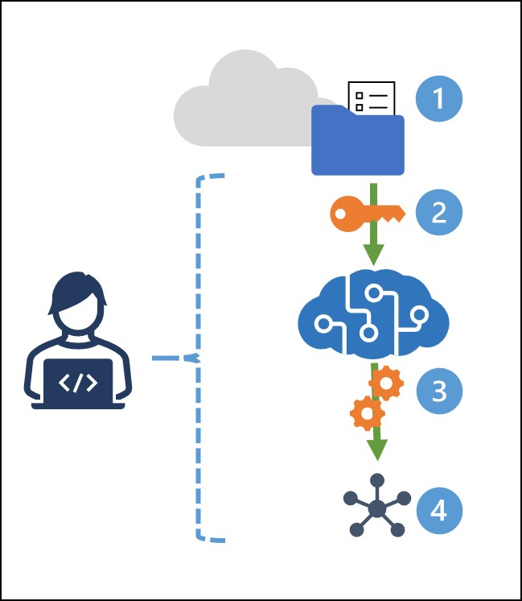

If the prebuilt models don't provide what you need, you can use Form Recognizer to train a custom model based on your own sample forms. 

The simplest way to train a custom model is to use an *unsupervised* learning technique in which you train the model using unlabeled sample forms. Form Recognizer's layout service analyzes the forms to determine their text layout, and detects key-value pairs and tables that contain the form data. This layout and field mapping information is then used to train a model that can extract data from similar forms.

To train a model with unlabeled sample forms:

1. Upload at least 5 sample images or PDF forms to an Azure Storage blob container to use for training. 
2. Generate a shared access security (SAS) URL for the container.
3. Use the **Train Custom Model** REST API function (or equivalent SDK method) to start training using the forms, passing the SAS URL for the container.
4. Use the **Get Custom Model** REST API function (or equivalent SDK method) to get the trained **model ID**.
    

>[!NOTE]
>You can [generate a SAS URL](https://docs.microsoft.com/azure/cognitive-services/form-recognizer/quickstarts/client-library?tabs=preview%2Cv2-1&pivots=programming-language-rest-api#train-a-custom-model) for the container through the Azure Portal.   