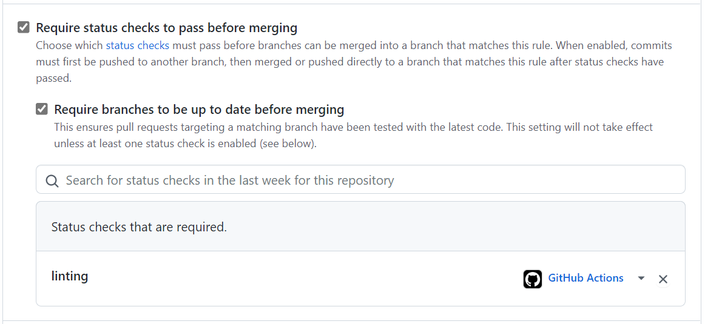

GitHub Actions can be used to automate tasks triggered by events. To trigger code quality checks when a pull request is created, you'll need to:

- Verify your code with linters and unit tests.
- Integrate code checks with pull requests.

## Verify your code

There are two common types of checks you'll want to do on your code: **linters** and **unit tests**.

You can use **linters** to check whether your code adheres to quality guidelines your organization has set. For example, to lint your code with Flake8, you'll create a `.flake8` configuration file, which contains the rules your code has to adhere to. 

To check whether the code works as expected, you can create **unit tests**. To easily test specific parts of your code, your scripts should contain **functions**. You can test functions in your scripts by creating test files. A popular tool to test Python code is **Pytest**.

> [!Tip]
> Learn more about [how to run unit tests with Pytest](/training/modules/test-python-with-pytest/).

To check your code by using GitHub Actions you'll need to:

- Install the tool (Flake8 or Pytest).
- Run the tests by specifying the folders within your repo that need to be checked.

> [!Tip]
> You can verify code automatically with GitHub Actions, or manually in Visual Studio Code. Learn more about [how to verify your code locally](/training/modules/source-control-for-machine-learning-projects/5-verify-your-code-locally).

## Integrate code checks with pull requests.

To trigger a GitHub Actions workflow when a pull request is created, you can use `on: pull_request`. 

You want to ensure that a pull request may only be merged when all quality checks have passed. 

To integrate the code checks with any pull requests that target the main branch, you'll need to do:

1. Navigate to the **Settings** tab in your repo.
2. Select **Branches**.
3. Enable **require status checks to pass before merging** within the branch protection rule for the main branch.

Here, you can search and select your linters and unit tests to set them as required. Whenever you then create a pull request, you'll notice that it will trigger your GitHub Actions and only when the workflows pass successfully will you be able to merge the pull request.

> [!Note]
> To configure the code checks to be required before merging a pull request, your job needs to have a name in the GitHub Actions workflow. You can then find the checks by searching for the job names.