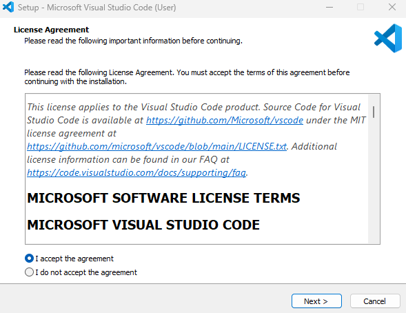

Visual Studio Code is a lightweight but powerful source code editor that runs on your desktop and is available for Windows, macOS and Linux. It comes with built-in support for **JavaScript**, TypeScript and Node.js and has a rich ecosystem of extensions for other languages and runtimes (such as C++, C#, Java, Python, PHP, Go, .NET).

## Download Visual Studio Code

Getting up and running with Visual Studio Code is quick and easy. It's a small download, so you can install it in a matter of minutes.

1. Open a new browser window, and then navigate to: [https://code.visualstudio.com](https://code.visualstudio.com).

    You can use any browser, such as the Microsoft Edge browser or the Chrome browser.

1. In the browser window, select **Download for Windows**.

    > [!NOTE]
    > The Visual Studio Code download page automatically detects your operating system. It will display the version download for your operating system, such as Linux, macOS, or Windows.
  
1. Wait for the installer file to finish downloading.

    The name of the installer file will be similar to the following (for a Windows PC): VSCodeUserSetup-x64-1.75.1.exe.

    > [!NOTE]
    > The file name depends on the current version of Visual Studio Code and your computer’s operating system.

## Install Visual Studio Code

Visual Studio Code is lightweight and should run on most available hardware and platform versions. You can review the [System Requirements](https://code.visualstudio.com/docs/supporting/requirements) to check whether your computer configuration is supported.

1. On your PC, open a file explorer application, and then navigate to your computer’s downloads folder.

1. In your file explorer application, select and run the Visual Studio Code installer file.

    On a Windows PC, you can double-click the installer file to begin the install process. For example, double-click **VSCodeUserSetup-x64-1.75.1**

    After a moment, the **Setup - Microsoft Visual Studio Code** dialog window will appear.

    

1. Select **I accept the license agreement**, and then continue following the online instructions to complete the installation.

    Accept the default options during the remainder of the installation.

    For detailed installation instructions, see the following Visual Studio Code documentation page: [https://code.visualstudio.com/docs/setup/windows](https://code.visualstudio.com/docs/setup/windows).

Congratulations, you've installed Visual Studio Code and are ready to start exploring this great integrated development environment!
