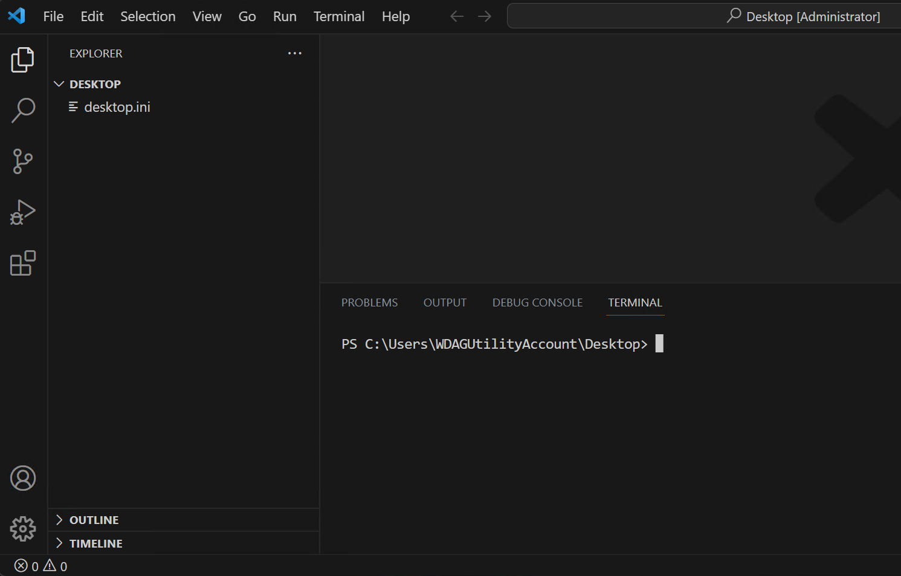
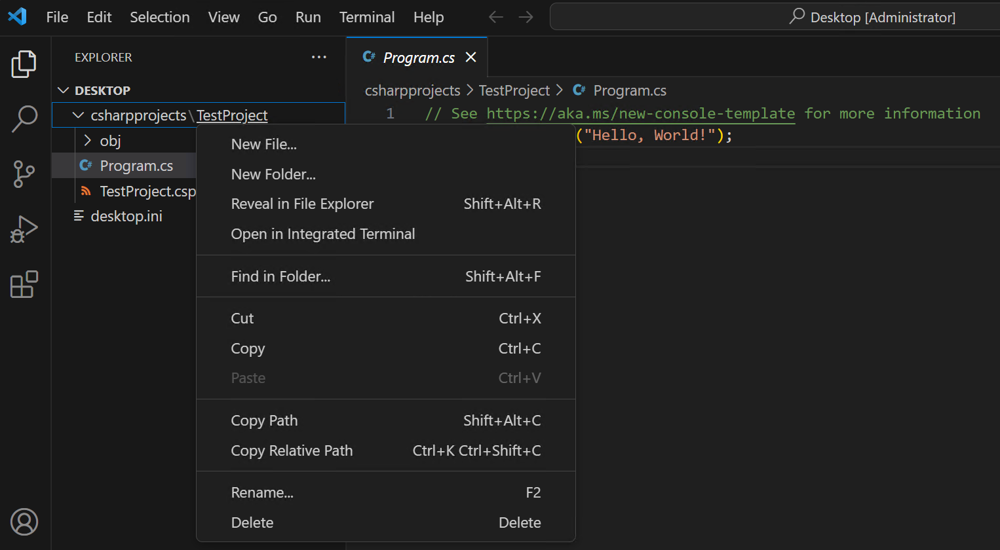
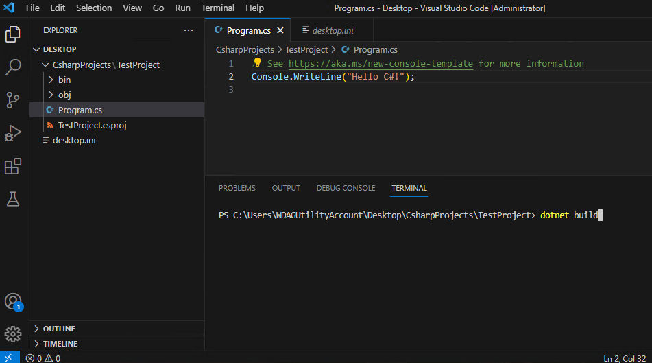

The .NET software development kit (SDK) includes a command-line interface (CLI) that can be accessed from Visual Studio Code's integrated Terminal. During this training, you use .NET CLI commands to create new console applications, build your project code, and run your applications.

For example, the following .NET CLI command to create a new console application in the specified folder location:

```dotnetcli
dotnet new console -o ./CsharpProjects/TestProject
```

The structure of a CLI command consists of the following three parts:

- The driver: `dotnet` in this example.
- The command: `new console` in this example.
- The command arguments: `-o ./CsharpProjects/TestProject` in this example.

> [!NOTE]
> Command arguments are optional parameters that can be used to provide additional information. The previous command could be run without specifying the optional folder location: `dotnet new console`. In this case, the new console application would be created at the folder location specified by the command prompt.

In this exercise, you use Visual Studio Code to create a new project folder, create a new console application using a CLI command, customize the application in the Visual Studio Code Editor, and then build and run your app.

## Create a C# console application in a specified folder

To begin, you create a console application in a folder location that's easy to find and reuse.

1. Ensure that you have **Visual Studio Code** open.

    You can use the Windows Start menu to locate and open Visual Studio Code.

1. On the Visual Studio Code **File** menu, select **Open Folder**.

    An Open Folder dialog will be displayed. You can use the Open Folder dialog to create a new folder for your C# project.

    > [!NOTE]
    > If you are working on your personal computer and you have a folder location that you use for your coding projects, you can use the Open Folder dialog to navigate to a desired folder location.

1. In the **Open Folder** dialog, navigate to the Windows Desktop folder.

    If you have a different folder location where you keep code projects, you can use that folder location instead. For this training, the important thing is to have a location that’s easy to locate and remember.

1. In the **Open Folder** dialog, select **Select Folder**.

    If you see a security dialog asking if you trust the authors, select **Yes**.

1. On the Visual Studio Code **Terminal** menu, select **New Terminal**.

    

    Notice that a command prompt in the Terminal panel displays the folder path for the current folder. For example:  

    ```output
    C:\Users\someuser\Desktop>
    ```

1. At the Terminal command prompt, to create a new console application in a specified folder, type **dotnet new console -o ./CsharpProjects/TestProject** and then press Enter.

    

    This .NET CLI command uses a .NET program template to create a new C# console application project in the specified folder location. The command creates the CsharpProjects and TestProject folders for you, and uses TestProject as the name of your `.csproj` file.

1. In the EXPLORER panel, expand the **CsharpProjects** folder.

    You should see the TestProject folder and two files, a C# program file named Program.cs and a C# project file named TestProject.csproj. The CLI command uses the folder name when it creates to project file (TestProject.csproj). The Program.cs file is the file containing your C# code.

1. In the EXPLORER panel, to view the C# code in the Editor panel, select **Program.cs**.

    As you can see, the default console application is the iconic “Hello World!” application.

    ```C#
    // See https://aka.ms/new-console-template for more information
    Console.WriteLine("Hello, World!");
    ```

    This app uses the `Console.WriteLine()` method to display "Hello, World!" in the console window.

## Update, build, and run your application

In this task, you use the EXPLORER view to open your code project folder, customize your "Hello" message", and then run your application.

1. In the Visual Studio Code EXPLORER view, right-click **TestProject**, and then select **Open in integrated Terminal**.

    

    > [!IMPORTANT]
    > The command prompt in the integrated Terminal panel shows the folder location where the command will run. Before running a `build` or `run` command, you must ensure that the Terminal is open to your project folder.

1. In the Visual Studio Code Editor, update the `Console.WriteLine()` method as follows:

    ```C#
    Console.WriteLine("Hello C#!");
    ```

    The first time you edit a .cs file, Visual Studio Code may prompt you to add the missing assets to build and debug your app. If you see the prompt, you can select **Yes**.

1. On the **File** menu, select **Save**.

    You always need to save your code changes to the file. Code changes that you've made in the Editor won't be recognized by the code compiler until the code is saved.

1. To compile a build of your application, enter the following command at the Terminal command prompt:

    ```C#
    dotnet build
    ```

    

    The `dotnet build` command builds the project and its dependencies into a set of binaries. The binaries include the project's code in Intermediate Language (IL) files with a .dll extension. Depending on the project type and settings, other files may also be included. If you're curious, you can find the TestProject.dll file in the EXPLORER panel at a folder location that's similar to the following path:

    `C:\Users\someuser\Desktop\CsharpProjects\TestProject\bin\Debug\net6.0\`

    > [!NOTE]
    > Your folder path will reflect your account and the folder path to your TestProject folder.

1. To run your application, enter the following command at the Terminal command prompt:

    ```C#
    dotnet run
    ```

    The `dotnet run` command runs source code without any explicit compile or launch commands. It provides a convenient option to run your application from the source code with one command. It's useful for fast iterative development from the command line. The command depends on the dotnet build command to build the code.

1. Notice that **Hello C#** is displayed in the Terminal panel on the line below the `dotnet run` command.

    If you see "Hello World!" displayed, ensure that you've saved your code changes.

Congratulations, you have completed setting up Visual Studio Code and building and running a simple line of code!
