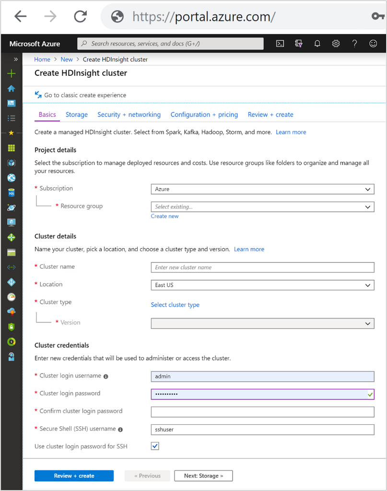
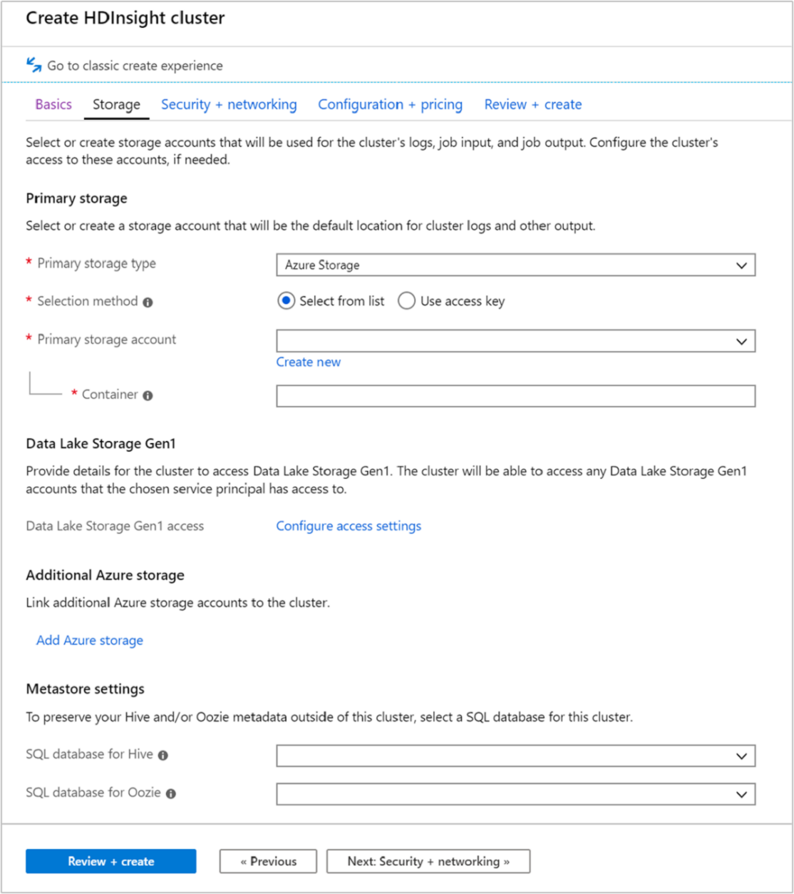
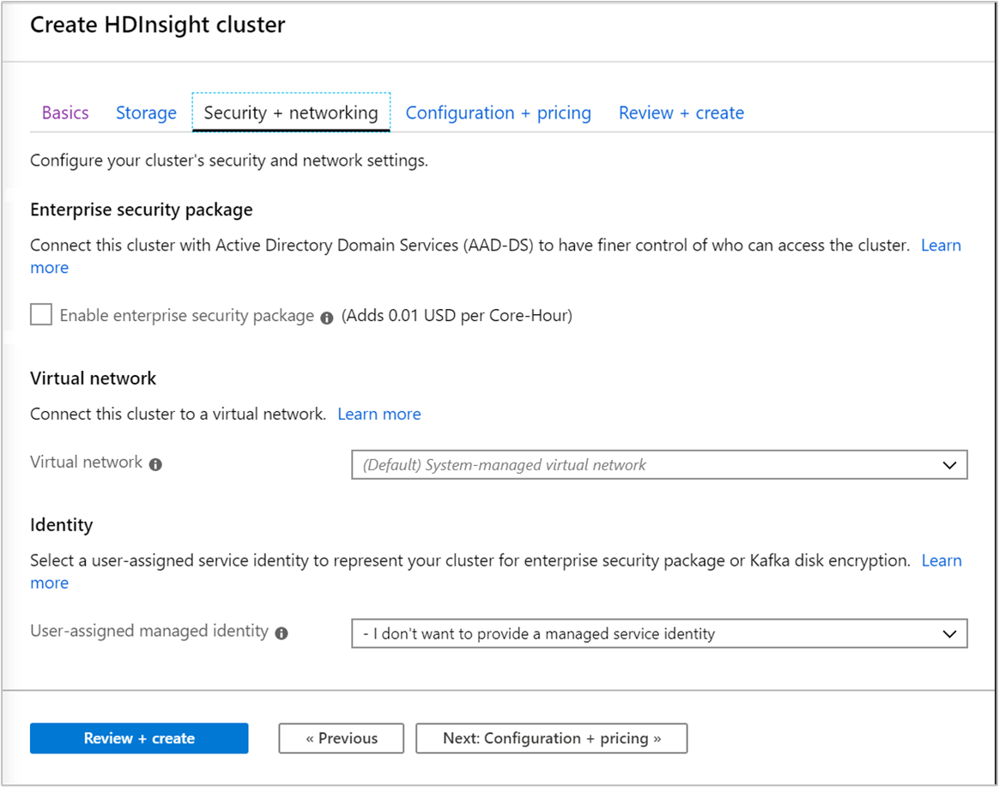
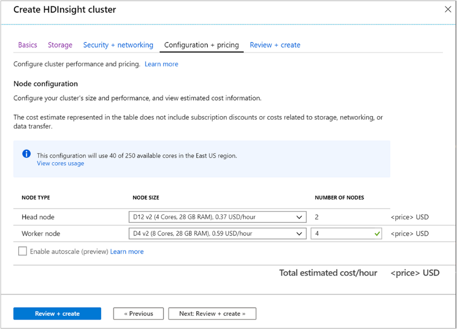

There are various methods for creating an HDInsight cluster, this can range from using the Azure portal for graphical setups, to scripted setups that can help with automated deployments. The following table shows the different methods you can use to setup an HDInsight cluster. 

|Clusters created with| Web browser| Command line| REST API| SDK|
|-|-|-|-|-|
|Azure portal| ✔| | | |
|Azure Data Factory| ✔| ✔| ✔| ✔|
|Azure CLI| | ✔| | |
|Azure PowerShell| | ✔| | |
|cURL| | ✔| ✔| |
|.NET SDK| | | |✔|
|Azure Resource Manager template| | ✔| | |

All HDInsight setups require the following basic information, including:

## Basics tab

### Project Details

**Subscription**

Defines the Azure subscription under which the HDInsight will be billed and managed.

**Resource group name**

A resource group is a logical grouping of Azure technologies and services that typically relate to the same application, or application life cycle. Grouping services in the same resource group eases administrative maintenance.

### Cluster Details

**Cluster name**

HDInsight cluster names have the following restrictions:

- Allowed characters: a-z, 0-9, A-Z
- Max length: 59
- Reserved names: apps
- The cluster naming scope is for all Azure, across all subscriptions. So, the cluster name must be unique worldwide.
- The first six characters must be unique within a VNET

**Location**

Specifies the location for where the cluster type is stored. If no location is defined, then the cluster is collocated in the same location as the default storage. The location should be as close to your users as possible to reduce latency.

**Cluster types**

Defines the technology stack provisioned on your cluster of resources. Select a cluster type based on the type of data you have and the kind processing your scenario requires. Available cluster types shown in the following table.  

|Cluster Type | Description |
|-|-|
|Apache Hadoop | A framework that uses HDFS, and a simple MapReduce programming model to process and analyze batch data. |
|Apache Spark | An open-source, parallel-processing framework that supports in-memory processing to boost the performance of big-data analysis applications.|
|HBase | A NoSQL database built on Hadoop that provides random access and strong consistency for large amounts of unstructured and semi-structured data--potentially billions of rows times millions of columns. |
|Apache Interactive Query | In-memory caching for interactive and faster Hive queries. |
|Apache Kafka | An open-source platform that's used for building streaming data pipelines and applications. Kafka also provides message-queue functionality that allows you to publish and subscribe to data streams. |

**Version**

Defines the version of HDInsight for this cluster. HDInsight 4.0 is the latest version and has the most recent frameworks provisioned to clusters.

### Cluster credentials

With HDInsight clusters, you can configure two user accounts during cluster creation.

**Cluster login and password**

The default username is admin. It uses the basic configuration on the Azure portal. Sometimes it is called "Cluster user."

**SSH username and password**

Used to connect to the cluster through SSH.

>**Note**: The Enterprise security package allows you to integrate HDInsight with Active Directory and Apache Ranger. Multiple users can be created using the Enterprise security package.

## Storage tab

HDInsight clusters can use the following storage options as shown in the storage screen:

- Azure Data Lake Storage Gen2
- Azure Data Lake Storage Gen1
- Azure storage General Purpose v2
- Azure storage General Purpose v1
- Azure storage Block blob (only supported as secondary storage)

The storage screen allows you to define the Primary storage account and default container. You can also link additional Azure Storage to the cluster. The Metastore settings enable you to define an external SQL database to store Hive tables after a cluster is deleted, and to improve the performance of Oozie by storing the metadata in an external store.

## Security and Networking

For Hadoop, Spark, HBase, Kafka, and Interactive Query cluster types, you can choose to enable the **Enterprise Security Package**. This package provides option to have a more secure cluster setup by using Apache Ranger and integrating with Azure Active Directory.

In addition, It is always recommended to deploy HDInsight clusters within a VNet and you can define and set the virtual networking in this screen. If your solution requires technologies that are spread across multiple HDInsight cluster types, an Azure virtual network can connect the required cluster types. This configuration allows the clusters, and any code you deploy to them, to directly communicate with each other.

## Configuration and Pricing

This page enables you to configure your cluster's size and performance and view estimated cost information. In this screen, you can define the virtual machines that will be used for the Head (Master) nodes and for the Workers Nodes too.

