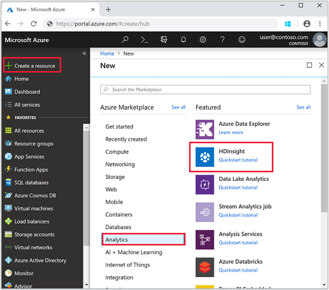
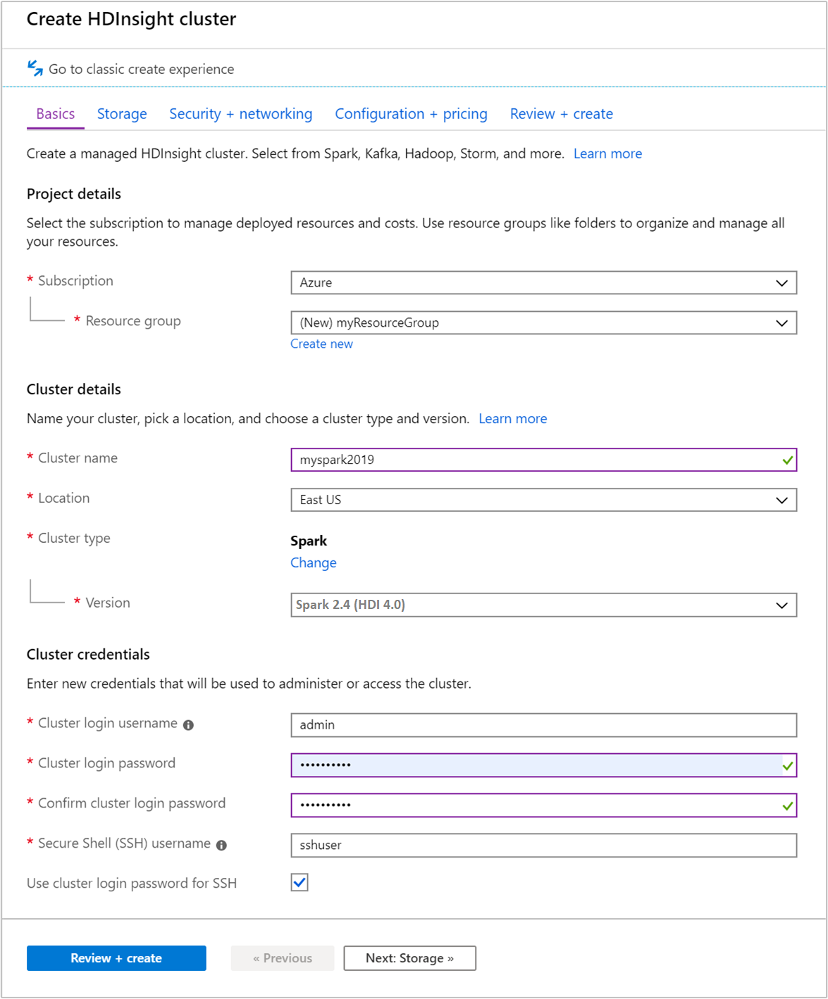
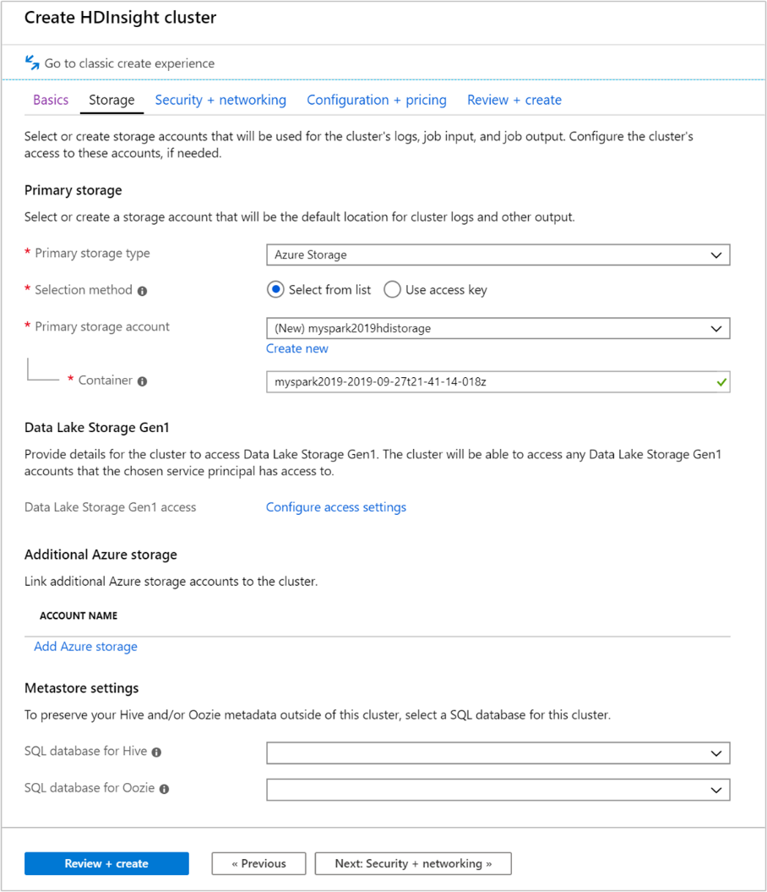

In this exercise, you will create an Azure HDInsight Spark Cluster using the Azure portal: 

1. In the Azure portal (https://portal.azure.com), select **Create a resource > Analytics > HDInsight**

2. Under Basics, provide the following values:

|Property| Description|
|-|-|
|Subscription| From the drop-down, select an Azure subscription used for this cluster.|
|Resource group | Specify whether you want to create a new resource group or use an existing one.|
|Cluster name | Give a name to your AzureHDInsight Spark cluster, for example myspark2019.|
|Location| Select a location for the resource group.|
|Cluster type| Select Spark as the cluster type.|
|Cluster version| This field will auto-populate with the default version once the cluster type has been selected. Select Spark 2.4 (HDI 4.0).|
|Cluster log in username| Enter the cluster log in username. The default name is admin. You use this account to log in in to the Jupyter notebook.|
|Cluster log in password| Enter the cluster log in password.|
|Secure Shell (SSH) username| Enter the SSH username. By default, this account shares the same password as the Cluster Log in username account.|

3. Select **Next: Storage >>** to continue to the Storage page. NOTE: ensure that the storage account is the same region as the cluster you are creating

4. Under **Storage**, provide the following values:

|Property |Description|
|-|-|
|Primary storage type | Use the default value Azure Storage.|
|Selection method | Use the default value Select from list.|
|Primary storage account | Use the auto-populated value.|
|Container | Use the auto-populated value.|

5. Select **Review + create** to continue.

6. Under **Review + create**, select **Create**. It takes about 20 minutes to create the cluster. The cluster must be created before you can proceed to the next session.