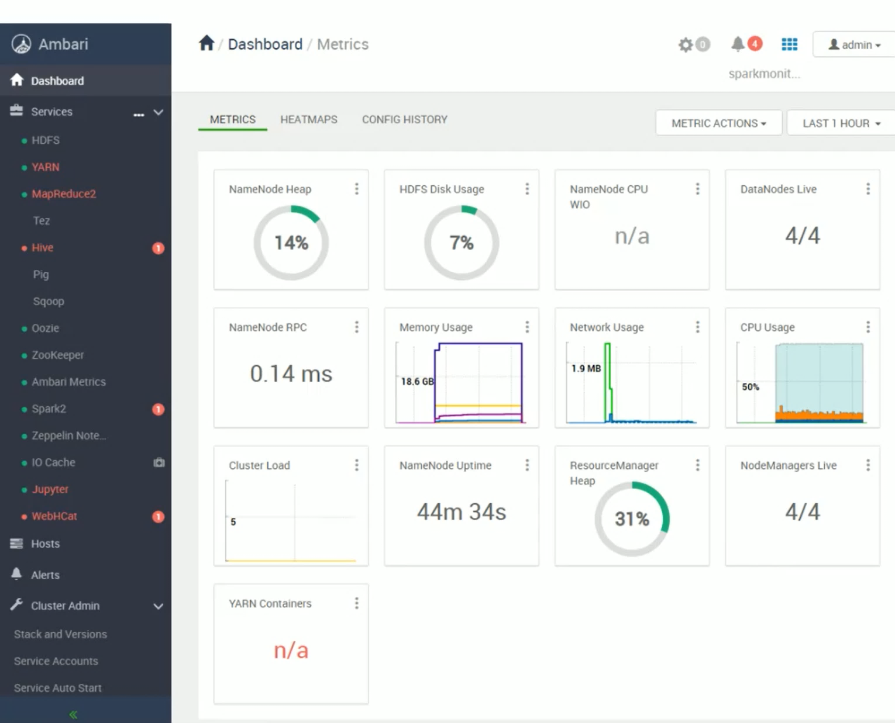

Monitoring of an HDInsight cluster is of interest to both data engineers and IT administrators, so they can monitor the following areas of the cluster:

- Cluster health and availability
- Resource utilization and performance
- Workload information and logs

IT admins will use monitoring to view the cluster health and availability, as well as monitoring the security of the cluster. Data engineers are more interested in workload information and logs watching out for the job’s failures or successes, performance of the cluster, and to view the workloads using logs. There are two main tools that can be used to perform monitoring: Apache Ambari and Azure Monitor.

## Apache Ambari

This is an open source cluster management and monitoring tool. It provides a dashboard with a series of widgets that enable you to view the health of an HDInsight cluster from a hardware perspective at both the cluster and the node level and is accessible from the overview screen of the HDInsight cluster in the Azure portal.

Apache Ambari opens in a web browser provides a dashboard of monitoring tools

There are many areas of Apache Ambari that are useful to both IT admins and Data Engineers. The initial dashboard is useful for IT admins to monitor cluster health in real time. But there are additional areas such as the YARN screen that enable Data Engineers to view queue capacities, jobs, and view the associated logs to monitor workloads on the cluster. In addition, there are alert capabilities that enable you to identify malfunctioning components so that you can be proactive in your support of the cluster. 

## Monitoring

Azure Monitor is an Azure wide monitoring tool which can be used on HD Insight clusters to monitor the health of your service. Aspects of Azure Monitor are exposed in the Azure Portal directly:

## Alerts

Alerts are a useful tool to proactively monitor a resource in Azure, and to act based on a condition. An alert can be set against a given resource – such as an HDInsight cluster – to determine the threshold of a condition that would dictate whether an alert is fired. A condition could include is AutoScale enabled. This condition could be either true or false. Actions can range from sending an email, to restarting a service depending on how the condition is defined.

## Metrics

Metrics are a component of Azure Monitor that enables you to setup visual charts that contain metrics of a resource that you want to monitor. This enables you to view measure and correlations of data point to provide an indication of whether an aspect of a service is performing in an acceptable range. HDInsight metrics include Gateway Requests to see the load on your cluster, and the number of active workers, which allows you to keep an eye on your cluster size of the HDInsight cluster

## Diagnostic Settings

This enables you to select a target (either a storage account, Event Hub service or Log Analytics account) to receive diagnostic data about the service that you have enable diagnostic settings on. This will send logs to your chosen target, which enables you to log activity of your service over a period, so that you can perform analysis later. This should be set only if you want to perform an in-depth analysis of the service.

## Azure Monitor

There is a directly link to Azure Monitor so that you can use the full capabilities Azure monitor provides.

## Resource health

This is a dashboard that is standard across all services in Azure, that enables you to view the health of the HDInsight service on a given day. There are no notifications from this area, and you must go and look in this yourself, but it can provide you with an overview of health information.