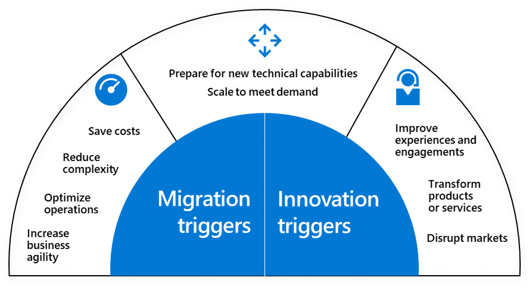

Organizations are adopting the cloud as a key enabler to drive business transformation, motivated by things such as processes and product improvement, market growth, and increased profitability. Let’s look at the most common motivation triggers for cloud adoption.

## Motivation triggers

Across organizations of all types, sizes, and industries, the decision to invest in cloud technologies is often tightly connected to some critical business events, as the cloud may enable the appropriate solution for the event. Moreover, proper cloud technology implementation may turn a reactive response into an innovation opportunity to drive growth for the organization.

:::row:::
:::column:::

**Critical Business Events**

:::column-end:::
:::row-end:::
:::row:::
:::column:::

- Datacenter exit
- Mergers, acquisition, or divestiture
- Reductions in capital expenses
- End of support for mission-critical technologies
- Regulatory compliance changes
- Deadlines for data sovereignty requirements
- Recent disruptions and IT stability

:::column-end:::
:::row-end:::

When addressing these business events, the expected business outcomes will determine the organization's cloud journey, which essentially can be one of two ways: migrate or innovate. The **migrate** journey is focused, largely, on completing a migration of existing on-premises applications to the cloud. And the **innovation** journey is frequently linked to migration since it is common for those migrated applications to undergo modernization efforts that drive business and product innovation.

Organizations will find different triggers to adopt new technologies like Azure. Some will drive the organization to migrate current applications, while others will require creation of new capabilities, products, and experiences.

Some common migration and innovation triggers include:

- Preparation for new technical capabilities
- Adjust scale to meet market or geographic demands
- Cost savings
- Reduction in vendor or technical complexity
- Optimization of internal operations
- Increased business agility
- Improvements to customer experiences or engagements
- Transformation of products or services
- Disruption of the market from new products or services

| | |
| ---| --- |
| | *There are many reasons—or triggers—for cloud adoption. Which triggers are most relevant to your business? Where do you see the most opportunity to take advantage of the benefits of cloud technology? Identifying these opportunities will help you develop your cloud adoption plan.*|
|

:::row:::

:::column:::

Here are the key points from this unit:

- The Microsoft Cloud Adoption Framework for Azure enables an actionable cloud journey that rapidly delivers on the desired business outcomes.

- There are three main stages of the Cloud Adoption Framework: Plan, Ready, and Adopt.

- Motivations for cloud adoption include:

  - Critical business events (such as end of support for mission-critical technologies)
  - Migration triggers (such as cost saving and operations optimization)
  - Innovation triggers (such as scaling to meet market or geographical demands)

:::column-end:::
:::row-end:::

You’ve just learned about the motivation triggers that begin a cloud adoption journey for organizations. Next, let’s talk about defining the strategy for your cloud adoption journey.
