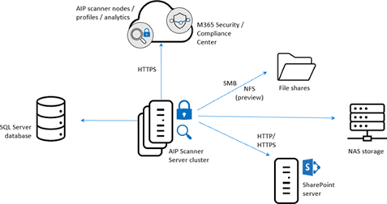

Adding on-premises files to an information protection solution is important in a hybrid scenario and when migrating into the cloud configurations.

## Requirements for on-premises labeling

The Unified Labeling Scanner enables you to label on-premises files. Here are some examples of when you might require the scanner:

- Legal requirements from the legal department and purchasing department

- Store only on-premises (example: contract between companies)

- Label and Protect at first

- Data privacy requirements from the data protection officer like:

- To label files before uploading them into the Cloud

- Handling sensitive data in a special way

- Storing files from the data privacy team or the working council on-premises only

- Requirements of an Information Protection Protect Officer

- Know your on-premises data with a scan

- Requirements of the Industry sector

- Storing data only in specific territory

- Storing data only in a specific information protection system

## Requirements and best practices for the unified labeling scanner

The Azure Information Protection unified labeling scanner scans and protects files in on-premises environments like NAS storages, file shares, and local SharePoint servers.

The table below lists locations where it's possible to scan with the Unified Labeling Scanner:

| **Product**| **Version**|
| :--- | :--- |
| SharePoint libraries and folder| SharePoint Server 2019 through SharePoint Server 2013 and SharePoint Server 2010 for customers with extended support.|
| UNC Path| Network shares that use the SMB or NFS (Preview) protocols|

To classify and protect your files, the scanner uses sensitivity labels configured in any of the following Microsoft 365 labeling admin center including:

- Microsoft 365 Security Center

- Microsoft Purview compliance portal

### Requirements for the unified labeling scanner

The following requirements must be fulfilled before installing the Unified Labeling Scanner:

- SQL Server database installed (SQL Express for Example)

- The SQL server database stores the labeling information and all information about the scanning process and the files, which are scanned.

- The Unified Labeling Client executable including the Scanner.

- One of the following roles: Compliance administrator or Compliance data administrator or Security administrator permissions or Global administrator.

- A configured Microsoft Entra token.

- Any Windows Server 2016 to Windows Server 2019 with UI.

### Service accounts needed

For the installation and to run the scanner the following service accounts are needed:

| **Requirement**| **Details**|
| :--- | :--- |
| Sign in locally user right assignment| Required to install and configure the scanner, but not required to run scans. Once you've confirmed that the scanner can discover, classify, and protect files, you can remove this right from the service account.|
| Sign in as a service user right assignment.| This right is automatically granted to the service account during the scanner installation and this right is required for the installation, configuration, and operation of the scanner.|
| Permissions to the data repositories| *File shares or local files*: Grant Read, Write, and Modify permissions for scanning the files and then applying classification and protection as configured.SharePoint: You must grant Full Control permissions for scanning the files and then applying classification and protection to the files that meet the conditions in the Azure Information Protection policy.*Discovery mode*: To run the scanner in discovery mode only, Read permission is sufficient.|
| For labels that reprotect or remove protection| To ensure that the scanner always has access to protected files, make this account a super user for Azure Information Protection, and ensure that the super user feature is enabled. Additionally, if you've implemented onboarding controls for a phased deployment, make sure that the service account is included in the onboarding controls you've configured.|
| Specific URL level scanning:| To scan and discover sites and subsites under a specific URL, grant Site Collector Auditor rights to the scanner account on the farm level.|

## Learn more

[Learn about the information protection scanner](/microsoft-365/compliance/deploy-scanner?azure-portal=true)
