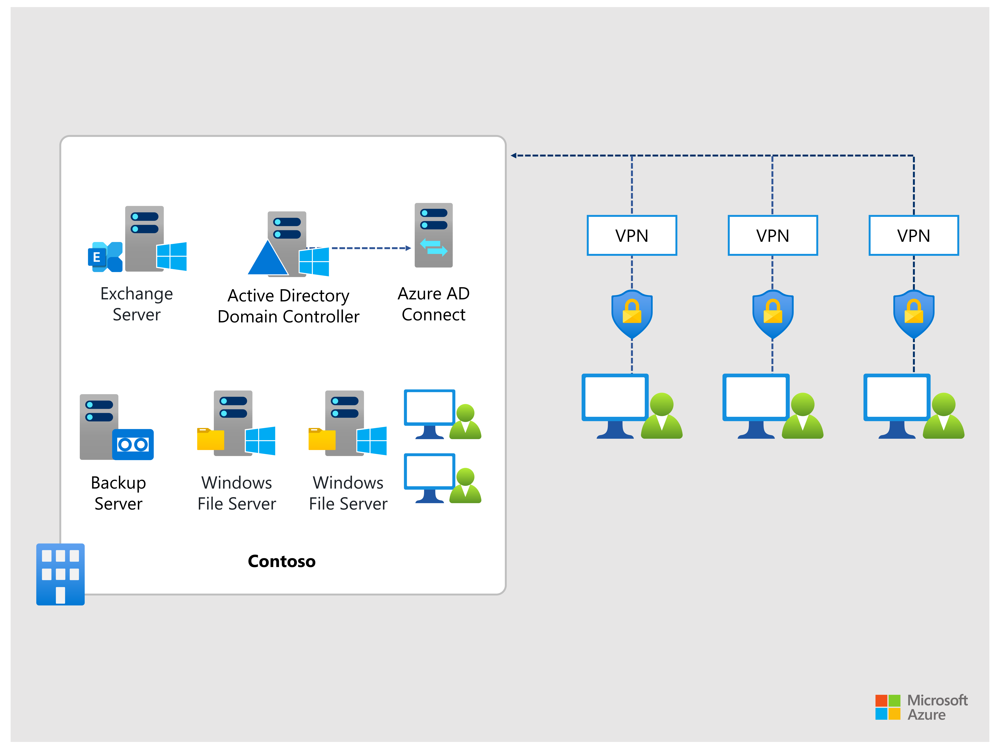

This unit presents the case study scenario, design requirements, conceptual and technical questions.

## Background scenario

Contoso, headquartered in Dallas, Texas, is a medium-sized insurance provider, with a customer base across the mid- and western United States. Its products include accident and health insurance, life insurance, as well as travel, home, and auto coverage. The company deals with various data, including confidential customer records and contracts, frequently updated marketing information, and large amounts of historical content that must be retained for compliance purposes. Customer records and contracts are created by using Microsoft Office products, marketing information is typically stored in the Adobe Acrobat format, and historical content is commonly compressed as ZIP-based archives.

Contoso uses its on-premises infrastructure to provide storage and implement backups. All data is hosted on file servers running Windows Server 2016, using both local and iSCSI attached devices. Storage devices are close to reaching their capacity. Backups are implemented by using several tape libraries, which are approaching their end-of-life. The operational team handling backups found them to be relatively unreliable due to frequently failing restores and data corruption issues. To remediate these issues, users commonly maintain multiple copies of the same data across different file servers. Unfortunately, this further exacerbates the storage capacity issues.

Contoso relies extensively on remote workforce, with insurance sales staff using their personal devices to occasionally establish VPN connections to headquarters. The lack of oversight of the remote devices has been assessed by the company's Information Security (InfoSec) team as a significant vulnerability. This assessment was proven fully justified by a recent incident that involved a malware transmitted through the company's on-premises Microsoft Exchange email. The malware managed to compromise one of the privileged Active Directory Domain Services (AD DS) accounts and attempted to encrypt data on one of the file servers. This attempt was detected and blocked by the Microsoft Defender Antivirus running on all of the company owned Windows computers, but prompted Contoso's CIO to start considering a cloud-based strategy for data storage and protection.

The CIO intends to migrate most the company's data to Microsoft 365 and Azure and to rely on cloud-based services to implement both short-term backups and long-term data retention. This approach to data storage must include provisions mitigating the risk of malware, with a particular focus on ransomware protection. The risk mitigation should address the issue of unsupervised devices used by remote workers. In addition, the new cloud-based architecture should deliver comprehensive monitoring and detection of cyberthreats, allowing the InfoSec team to detect, track, and block their exploits before they impact critical data assets.

## Initial architecture

## Design requirements

The CIO of Contoso defined the following set of requirements that the technology team must address in its design of the cloud-based solution for data backups and ransomware protection:

- Minimize the footprint of on-premises storage infrastructure.
- Minimize the footprint of on-premises backup infrastructure.
- Ensure that the data protection solution addresses the need for short-term backups.
- Ensure that the data protection solution addresses the need for long-term backups supporting 7-year retention required due to compliance reasons.
- Deliver continuous security protection and monitoring of remote devices.
- Control access to the company's assets based on a wide range of conditions, including the state of users' devices and dynamically evaluated risk, relying on heuristics and globally collected security-related telemetry.
- Protect backups against accidental or malicious deletions.

## High-level conceptual questions

Before you start designing the solution based on Contoso's requirements, consider the following high-level conceptual questions:

- What stakeholders should be involved in crafting a ransomware mitigation plan?
- Alongside technical elements of backup and recovery, what process would you use to create an incident recovery plan for a major data breach? 
- What methods would you recommend to mitigate the potential impact of ransomware that attempts to encrypt Microsoft 365-hosted content in place?
- What methods would you recommend to mitigate the potential impact of ransomware that copies Microsoft 365-hosted content, encrypts it, and deletes the original?
- What methods would you recommend to mitigate the potential impact of ransomware that attempts to copy data outside of a Microsoft 365 tenant?
- What would you recommend to mitigate ransomware risks in regard to Microsoft 365 collaboration and email services?
- Which are the data protection integration points between Microsoft 365 services and Microsoft 365 Defender products?
- What are the endpoint protection integration points available in a Microsoft 365 environment?
- How would you enhance identity protection in Microsoft 365 and Microsoft Azure environments? 

## Design questions

As you're architecting the solution based on the requirements of Contoso, answer the following design questions:

- How would you approach creating a business resiliency plan for Contoso based on the Cloud Adoption Framework? 
- Given identified risks from the scenario, are there any opportunities to achieve better security integration with business processes using the Cloud Adoption Framework?
- Which Microsoft 365 services would allow Contoso to increase their visibility into and traceability of cyberattacks affecting on-premises and cloud assets?
- Which Microsoft Azure services would allow Contoso to increase visibility into and traceability of cyberattacks affecting on-premises and cloud assets?
- What changes in the operational procedures would you recommend to Contoso to mitigate the potential impact of ransomware?
- What would you recommend to Contoso to implement endpoint protection?
- What infrastructure elements would you prioritize for system hardening in order to mitigate the ransomware risk for Contoso?