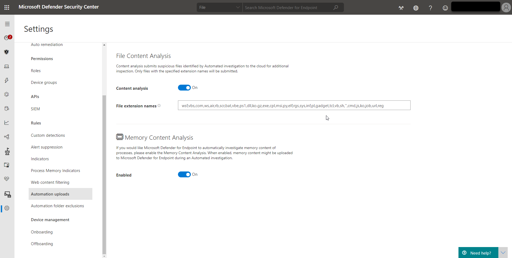

## Manage automation uploads

Enable the **File Content Analysis** capability so that certain files and email attachments can automatically be uploaded to the cloud for additional inspection in Automated investigation.  Identify the files and email attachments by specifying the file extension names and email attachment extension names.  For example, if you add exe and bat as file or attachment extension names, then all files or attachments with those extensions will automatically be sent to the cloud for additional inspection during Automated investigation.

Enable the Memory Content Analysis capability if you would like Microsoft Defender for Endpoint to automatically investigate memory content of processes. When enabled, memory content might be uploaded to Microsoft Defender for Endpoint during an Automated investigation.

### Add file extension names and attachment extension names.

To configure file settings:

- In the navigation pane, select Settings > Automation file uploads.

- Toggle the content analysis setting between On and Off.

- Configure the following extension names and separate extension names with a comma:

  - File extension names - Suspicious files except email attachments will be submitted for additional inspection

## Manage automation folder exclusions

Automation folder exclusions allow you to specify folders that the Automated investigation will skip.  You can control the following attributes about the folder that you'd like to be skipped:

- Folders

- Extensions of the files

- File names

### Folders

You can specify a folder and its subfolders to be skipped.

### Extensions

You can specify the extensions to exclude in a specific directory. The extensions are a way to prevent an attacker from using an excluded folder to hide an exploit. The extensions explicitly define which files to ignore.

### File names

You can specify the file names that you want to be excluded in a specific directory. The names are a way to prevent an attacker from using an excluded folder to hide an exploit. The names explicitly define which files to ignore.

### Add an automation folder exclusion

To manage folder exclusions:

- In the navigation pane, select **Settings > Automation folder exclusions**.

- Select New folder exclusion.

- Enter the folder details:

  - Folder

  - Extensions

  - File names

  - Description

- Select **Save**.

