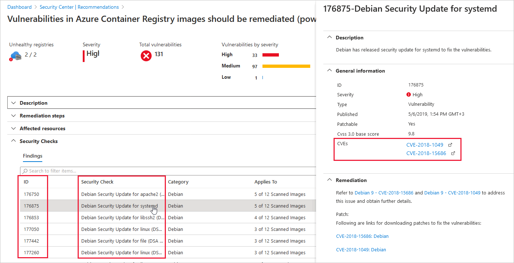

The asset inventory page of Microsoft Defender for Cloud provides a single page for viewing the security posture of the resources you've connected to Defender for Cloud.

Defender for Cloud periodically analyzes the security state of your Azure resources to identify potential security vulnerabilities. It then provides you with recommendations on how to remediate those vulnerabilities.

When any resource has outstanding recommendations, they'll appear in the inventory.

Use this view and its filters to address such questions as:

- Which of my subscriptions with Microsoft Defender for Cloud enabled have outstanding recommendations?

- Which of my machines with the tag 'Production' are missing the Log Analytics agent?

- How many of my machines tagged with a specific tag have outstanding recommendations?

- How many resources in a specific resource group have security findings from a vulnerability assessment service?

The asset management possibilities for this tool are substantial and continue to grow.

## Key features of asset inventory

The inventory page provides the following tools:

- **Summaries** - Before you define any filters, a prominent strip of values at the top of the inventory view shows:

  - Total resources: The total number of resources connected to Defender for Cloud.

  - Unhealthy resources: Resources with active security recommendations. Learn more about security recommendations.

  - Unmonitored resources: Resources with agent monitoring issues - they have the Log Analytics agent deployed, but the agent isn't sending data or has other health issues.

- **Filters** - The multiple filters at the top of the page provide a way to quickly refine the list of resources according to the question you're trying to answer. For example, if you wanted to answer the question: Which of my machines with the tag 'Production' are missing the Log Analytics agent? 

- As soon as you've applied filters, the summary values are updated to relate to the query results.

- Export options - Inventory provides the option to export the results of your selected filter options to a CSV file. You can also export the query itself to Azure Resource Graph Explorer to further refine, save, or modify the Kusto Query Language (KQL) query.

- Asset management options - Inventory lets you perform complex discovery queries. When you've found the resources that match your queries, inventory provides shortcuts for operations such as:

  - Assign tags to the filtered resources - select the checkboxes alongside the resources you want to tag.

  - Onboard new servers to Defender for Cloud - use the Add non-Azure servers toolbar button.

  - Automate workloads with Azure Logic Apps - use the Trigger Logic App button to run a logic app on one or more resources. Your logic apps have to be prepared in advance and accept the relevant trigger type (HTTP request).

## How does asset inventory work?

Asset inventory utilizes Azure Resource Graph (ARG), an Azure service that provides the ability to query Defender for Cloud's security posture data across multiple subscriptions.  ARG is designed to provide efficient resource exploration with the ability to query at scale. Using the Kusto Query Language (KQL), asset inventory can quickly produce deep insights by cross-referencing Defender for Cloud data with other resource properties.

## How to use asset inventory

- From Defender for Cloud's sidebar, select Inventory.

- Use the Filter by name box to display a specific resource, or use the filters as described below.

- Select the relevant options in the filters to create the specific query you want to perform.

- To use the Security findings contain filter, enter free text from the ID, security check, or CVE name of a vulnerability finding to filter to the affected resources:

- To use the Microsoft Defender for Cloud filter, select one or more options (Off, On, or Partial):

  - Off - Resources that aren't protected by a Microsoft Defender plans. You can right-click on any of these and upgrade them:

  - On - Resources that are protected by a Microsoft Defender plans

  - Partial - This applies to subscriptions that have some but not all of the Microsoft Defender plans disabled.
