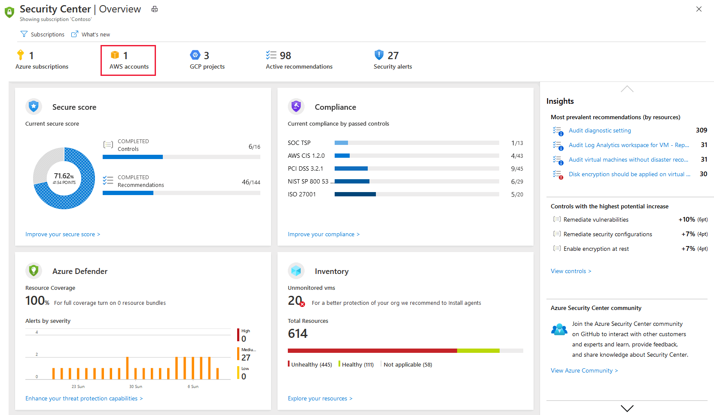

Onboarding your AWS account into Security Center, integrates AWS Security Hub and Azure Security Center. Security Center thus provides visibility and protection across both of these cloud environments to provide:

- Automatic agent provisioning (Security Center uses Azure Arc to deploy the Log Analytics agent to your AWS instances)

- Policy management

- Vulnerability management

- Embedded Endpoint Detection and Response (EDR)

- Detection of security misconfigurations

- A single view showing Security Center recommendations and AWS Security Hub findings

- Incorporation of your AWS resources into Security Center's secure score calculations

- Regulatory compliance assessments of your AWS resources

In the screenshot below, you can see AWS accounts displayed in Security Center's overview dashboard.



### Follow the steps below to create your AWS cloud connector.

**Set up AWS Security Hub:**

To view security recommendations for multiple regions, repeat the following steps for each relevant region. If you're using an AWS master account, repeat the following three steps to configure the master account and all connected member accounts across all relevant regions

- Enable AWS Config.

- Enable AWS Security Hub.

- Verify that there is data flowing to the Security Hub.

When you first enable Security Hub, it might take several hours for data to be available.

**Set up authentication for Security Center in AWS**

There are two ways to allow Security Center to authenticate to AWS:

- Create an IAM role for Security Center - This is the most secure method and is recommended

- AWS user for Security Center - A less secure option if you don't have IAM enabled

Create an IAM role for Security Center

From your Amazon Web Services console, under Security, Identity & Compliance, select IAM.

- Select Roles and Create role.

- Select Another AWS account.

- Enter the following details:

  - Account ID - enter the Microsoft Account ID (158177204117) as shown in the AWS connector page in Security Center.

  - Require External ID - should be selected

  - External ID - enter the subscription ID as shown in the AWS connector page in Security Center

- Select Next.

- In the Attach permission policies section, select the following policies:

  - SecurityAudit

  - AmazonSSMAutomationRole

  - AWSSecurityHubReadOnlyAccess

- Optionally add tags. Adding Tags to the user doesn't affect the connection.

- Select Next.

- In The Roles list, choose the role you created

- Save the Amazon Resource Name (ARN) for later.

**Configure the SSM Agent**

AWS Systems Manager is required for automating tasks across your AWS resources. If your EC2 instances don't have the SSM Agent, follow the relevant instructions from Amazon:

- [Installing and Configuring SSM Agent on Windows Instances](https://docs.aws.amazon.com/systems-manager/latest/userguide/sysman-install-ssm-win.html)

- [Installing and Configuring SSM Agent on Amazon EC2 Linux Instances](https://docs.aws.amazon.com/systems-manager/latest/userguide/sysman-install-ssm-agent.html)

**Complete Azure Arc prerequisites**

Make sure the appropriate Azure resources providers are registered:

- Microsoft.HybridCompute

- Microsoft.GuestConfiguration

Create a Service Principal for onboarding at scale. As an Owner on the subscription you want to use for the onboarding, create a service principal for Azure Arc onboarding as described in Create a Service Principal for onboarding at scale.

**Connect AWS to Security Center**

From Security Center's menu, select Multi cloud connectors.

Select Add AWS account.

Configure the options in the AWS authentication tab:

- Enter a Display name for the connector.

- Confirm that the subscription is correct. It is the subscription that will include the connector and AWS Security Hub recommendations.

- Depending on the authentication option, you chose in Step 2. Set up authentication for Security Center in AWS:

  - Select Assume Role and paste the ARN from Create an IAM role for Security Center. Pasting the ARN file in the relevant field of the AWS connection wizard in the Azure portal

  - OR

  - Select Credentials and paste the access key and secret key from the .csv file you saved in Create an AWS user for Security Center.

Select Next.

Configure the options in the Azure Arc Configuration tab:

Security Center discovers the EC2 instances in the connected AWS account and uses SSM to onboard them to Azure Arc.

- Select the Resource Group and Azure Region that the discovered AWS EC2s will be onboarded to in the selected subscription.

- Enter the Service Principal ID and Service Principal Client Secret for Azure Arc as described here Create a Service Principal for onboarding at scale

- If the machine connects to the internet via a proxy server, specify the proxy server IP address or the name and port number that the machine uses to communicate with the proxy server. Enter the value in the format http://<proxyURL>:<proxyport>

- Select Review + create.

- Review the summary information

- The Tags sections will list all Azure Tags that will be automatically created for each onboarded EC2 with its own relevant details to easily recognize it in Azure.

**Confirmation**

When the connector is successfully created and AWS Security Hub has been configured properly:

- Security Center scans the environment for AWS EC2 instances, onboarding them to Azure Arc, enabling it to install the Log Analytics agent and providing threat protection and security recommendations.

- The ASC service scans for new AWS EC2 instances every 6 hours and onboards them according to the configuration.

- The AWS CIS standard will be shown in the Security Center's regulatory compliance dashboard.

- If Security Hub policy is enabled, recommendations will appear in the Security Center portal and the regulatory compliance dashboard 5-10 minutes after onboard completes.

