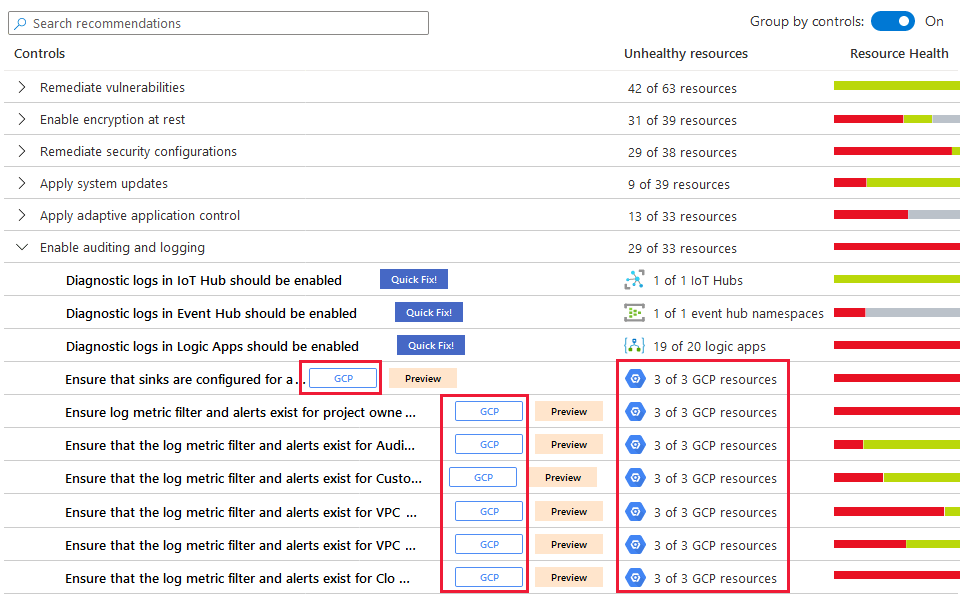

Onboarding your GCP account into Defender for Cloud, integrates GCP Security Command and Microsoft Defender for Cloud. Defender for Cloud thus provides visibility and protection across both of these cloud environments to provide:

- Detection of security misconfigurations

- A single view showing Defender for Cloud recommendations and GCP Security Command Center findings

- Incorporation of your GCP resources into Defender for Cloud's secure score calculations

- Integration of GCP Security Command Center recommendations based on the CIS standard into the Defender for Cloud's regulatory compliance dashboard

In the screenshot below, you can see GCP projects displayed in Defender for Cloud's overview dashboard.

>[!div class="mx-imgBorder"]
>

## Follow the steps below to create your GCP cloud connector.

### Set up GCP Security Command Center with Security Health Analytics

For all the GCP projects in your organization, you must also:

- Set up GCP Security Command Center using these instructions from the GCP documentation.

- Enable Security Health Analytics using these instructions from the GCP documentation.

- Verify that there is data flowing to the Security Command Center.

The instructions for connecting your GCP environment for security configuration follow Google's recommendations for consuming security configuration recommendations. The integration uses Google Security Command Center and will consume more resources that might impact your billing.

When you first enable Security Health Analytics, it might take several hours for data to be available.

### Enable GCP Security Command Center API

1. From Google's Cloud Console API Library, select the project you want to connect to Microsoft Defender for Cloud.

1. In the API Library, find and select **Security Command Center API**.

1. On the API's page, select **ENABLE**.

### Create a dedicated service account for the security configuration integration

1. In the GCP Console, select the project you want to connect to Defender for Cloud.

1. In the Navigation menu, Under IAM & admin options, select **Service accounts**.

1. Select **CREATE SERVICE ACCOUNT**.

1. Enter an account name, and select **Create**.

1. Specify the Role as Security Center Admin Viewer, and select **Continue**.

1.  The Grant users access to this service account section is optional. Select **Done**.

1. Copy the Email value of the created service account, and save it for later use.

1. In the Navigation menu, Under IAM & admin options, select **IAM**

1. Switch to organization level.

1. Select **ADD**.

1. In the New members field, paste the Email value you copied earlier.

1. Specify the Role as **Security Center Admin Viewer** and then select **Save**.

### Create a private key for the dedicated service account

Switch to project level.

1. In the Navigation menu, Under IAM & admin options, select **Service accounts**.

1. Open the dedicated service account and select **Edit**.

1. In the Keys section, select **ADD KEY** and then **Create new key**.

1. In the Create private key screen, select **JSON**, and then select **CREATE**.

1. Save this JSON file for later use.

### Connect GCP to Defender for Cloud

1. From Defender for Cloud's menu, select **Cloud connectors**.

1. Select **add GCP account**.

1. On the onboarding page, do the following and then select Next.

1. Validate the chosen subscription.

1. In the Display name field, enter a display name for the connector.

1. In the Organization ID field, enter your organization's ID.

1. In the Private key file box, browse to the JSON file you downloaded in the previous step. Create a private key for the dedicated service account.

### Confirmation

When the connector is successfully created and GCP Security Command Center has been configured properly:

- The GCP CIS standard will be shown in the Defender for Cloud's regulatory compliance dashboard.

- Security recommendations for your GCP resources will appear in the Defender for Cloud portal and the regulatory compliance dashboard 5-10 minutes after onboard completes:

>[!div class="mx-imgBorder"]
>
