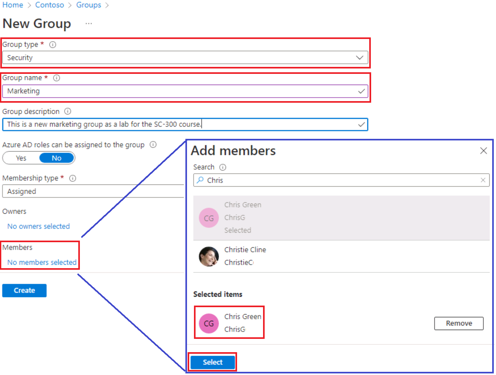

## Create a new user in Azure Active Directory

You can skip creating this user if you have already created the same user in the earlier module.

1. Browse to the [Azure Active Directory](https://portal.azure.com/) blade.

1. In the left navigation, under **Manage**, select **Users**.

1. In the Users blade, on the menu, select **New user**.

1. Create a user using the following information:

    | **Setting**| **Value**|
    | :--- | :--- |
    | User name| Chris|
    | Name| Chris Green|
    | First name| Chris|
    | Last name| Green|
    | Password| Pass@word1|

1. When complete, verify the account for Chris Green is shown in the **All users** list.

## Create a security group in Azure Active Directory

1. Browse to the [Azure Active Directory](https://portal.azure.com/) blade.

1. In the left navigation, under **Manage**, select **Groups**.

1. In the Groups blade, on the menu, select **New group**.

1. Create a group using the following information:

    | **Setting**| **Value**|
    | :--- | :--- |
    | Group type| Security|
    | Group name| Marketing|
    | `Membership type| Assigned|
    | Owners| Assign your own administrator account as the group owner|
    | Members| Chris Green|

    > [!div class="mx-imgBorder"]
    > 

1. When complete, verify the group named **Marketing** is shown in the **All groups** list.

## Assign a license to a group

1. In the **All groups** list, select **Marketing**.

1. In the Marketing blade, under **Manage**, select **Licenses**.

1. On the menu, select **Assignments**.

1. In the update license assignments blade, under **Select licenses**, review the list of available licenses and then select the check box for one of the licenses.

1. Under **Review license** options, review the available options for the license you have selected.

    > [!TIP]
    > When multiple licenses are selected, you can use the Review license options menu to select a specific license and view the license option for that license.

    > [!div class="mx-imgBorder"]
    > 

1. Select **Save**.

## Restore or remove a recently deleted user with Azure Active Directory

After you delete a user, the account remains in a suspended state for 30 days. During that 30-day window, the user account can be restored, along with all its properties. After that 30-day window passes, the permanent deletion process is automatically started.

You can view your restorable users, restore a deleted user, or permanently delete a user using Azure Active Directory (Azure AD) in the Azure portal.

> [!IMPORTANT]
> Neither you nor Microsoft customer support can restore a permanently deleted user.

## Required permissions

You must have one of the following roles to restore or permanently delete users.

- Global administrator
- Partner Tier1 Support
- Partner Tier2 Support
- User administrator

