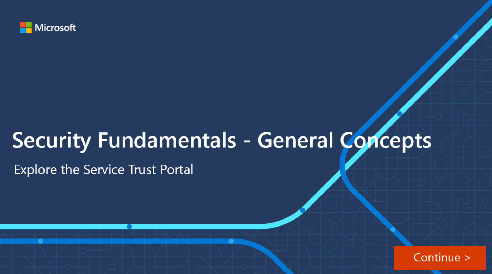

The Service Trust Portal provides information, tools, and other resources about Microsoft security, privacy, and compliance practices. Sign in with your Microsoft cloud services account to access all the available documentation.

From the main menu, you access:

  :::image type="content" source="../media/stp-top-nav-bar-inline.png" lightbox="../media/stp-top-nav-bar-expanded.png" alt-text="Service Trust Portal top navigation bar":::

- **Service Trust Portal** –  This link provides a quick way to get back to the home page for the Service Trust Portal.
- **Compliance Manager** – This link currently directs users to Compliance Manager in the Microsoft 365 compliance center.  Users are encouraged to use the Microsoft 365 Compliance Center for access to Compliance Manager and other compliance management capabilities in Microsoft 365. To find out more, see the Microsoft Compliance Manager documentation in the Learn More section of the Summary and resources unit.
- **Trust Documents** – Trust Documents provides a wealth of security implementation and design information with the goal of making it easier for organizations to meet regulatory compliance objectives, by understanding how Microsoft Cloud services keep customer data secure. To review content, select one of the following options on the Trust Documents pull-down menu.
    - **Audit Reports** provides a list of independent audit and assessment reports on Microsoft's Cloud services is displayed. These reports provide information about Microsoft Cloud services compliance with data protection standards and regulatory requirements.
    - **Data Protection** contains a wealth of resources such as audited controls, white papers, FAQs, penetration tests, risk assessment tools, and compliance guides.
    - **Azure Stack** contains documents that provide security and compliance solutions and support, tailored to the needs of Azure Stack customers.
- **Industries & Regions** – This link provides access to compliance information about Microsoft Cloud services organized by industry and region. 
    - **Industry Solutions** directs users to the landing page the for the Financial Services industry. This contains information such as compliance offerings, FAQs, and success stories. Resources for more industries will be released in the future, however you can find resources for more industries by going to the Trust Documents > Data Protection page in the STP.
    - **Regional Solutions** provides documents on Microsoft Cloud services compliance with the laws of various countries/regions. Specific countries/regions include Australia, Canada, Czech Republic, Denmark, Germany, Poland, Romania, Spain, and the United Kingdom. links currently have information for: Australia, Canada, Czech Republic, Denmark, Germany, Poland, Romania, Spain, and the United Kingdom.

- **Trust Center** – The option links to the Microsoft Trust Center, which provides more information about privacy, security, and compliance in the Microsoft Cloud.
- **Resources** – This option links to The Office 365 Security & Compliance Center which includes a variety of features and tools for data governance and protection.  The resources option also links to information about the Microsoft Global Datacenters and Frequently Asked Questions.
- **My Library** – This feature lets you save documents so that you can quickly access them on your My Library page. You can also set up notifications so that Microsoft sends you an email message when documents in your My Library are updated.
- **More** - This option provides an admin selection which is available only to Global Administrators and relates to options associated with Compliance Manager. Admins, however, are encouraged to use the Microsoft 365 Compliance Center.

In this interactive guide, you will explore a few of the menu options available on the Service Trust Portal. Select the image below to get started and follow the prompts on the screen.

