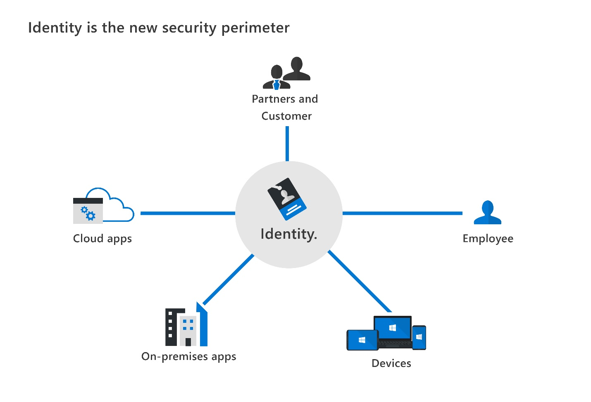

Digital collaboration has changed. Your employees and partners now need to collaborate and access organizational resources from anywhere, on any device, and without affecting their productivity.  There has also been an acceleration in the number of people working from home.

Enterprise security needs to adapt to this new reality. The security perimeter can no longer be viewed as the on-premises network. It now extends to:

- SaaS applications for business-critical workloads that might be hosted outside the corporate network.
- The personal devices that employees are using to access corporate resources (BYOD, or bring your own device) while working from home.
- The unmanaged devices used by partners or customers when interacting with corporate data or collaborating with employees
- Internet of things, referred to as IoT devices, installed throughout your corporate network and inside customer locations.

The traditional perimeter-based security model is no longer enough. Identity has become the new security perimeter that enables organizations to secure their assets.

But what do we mean by an identity? An identity is the set of things that define or characterize someone or something.  For example, a person’s identity includes the information they use to authenticate themselves, such, as their username and password and their level of authorization.

An identity may be associated with a user, an application, a device, or something else.

## Four pillars of an identity infrastructure

Identity is a concept that spans an entire environment, so organizations need to think about it broadly. There's a collection of processes, technologies, and policies for managing digital identities and controlling how they're used to access resources. These can be organized into four fundamental pillars that organizations should consider when creating an identity infrastructure. 

- **Administration**. Administration is about the creation and management/governance of identities for users, devices, and services.  As an administrator, you manage how and under what circumstances the characteristics of identities can change (be created, updated, deleted).
- **Authentication**. The authentication pillar tells the story of how much an IT system needs to know about an identity to have sufficient proof that they really are who they say they are? It involves the act of challenging a party for legitimate credentials.
- **Authorization**. The authorization pillar is about processing the incoming identity data to determine the level of access an authenticated person or service has within the application or service that it wants to access.
- **Auditing**. The auditing pillar is about tracking who does what, when, where, and how. Auditing includes having in-depth reporting, alerts, and governance of identities.

Addressing each of these four pillars is key to a comprehensive and robust identity and access control solution.
