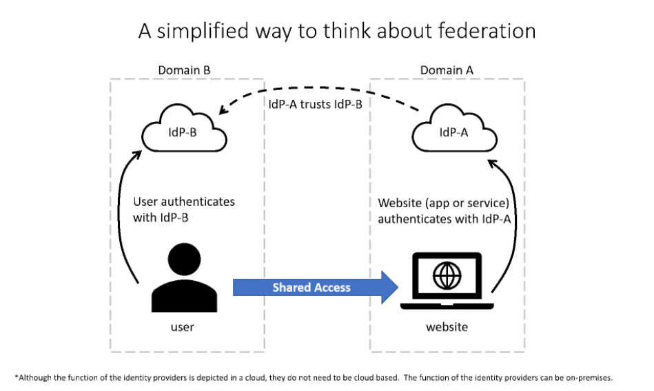

Federation enables the access of services across organizational or domain boundaries by establishing trust relationships between the respective domain’s identity provider.  With federation, there's no need for a user to maintain a different username and password when accessing resources in other domains.

The simplified way to think about this federation scenario is as follows:

- The website uses the authentication services of IdP-A.
- The user authenticates with IdP-B.
- IdP-A has a trust relationship configured with IdP-B.
- When the user’s credentials are passed to the website, the website trusts the user and allows access.

With federation, trust isn't always bidirectional.  Although IdP-A may trust IdP-B and allow the user in domain B to access the website in domain A, the opposite isn't true, unless that trust relationship is configured.

A common example of federation in practice is when a user logs in to a third-party site with their social media account, such as Twitter.  In this scenario, Twitter is an identity provider, and the third-party site might be using a different identity provider, such as Azure AD. There's a trust relationship between Azure AD and Twitter.
