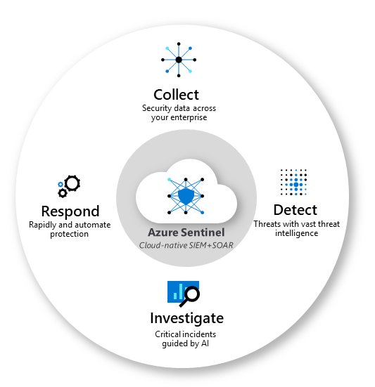

Effective management of an organization’s network security perimeter requires the right combination of tools and systems. Microsoft Microsoft Sentinel is a scalable, cloud-native SIEM/SOAR solution that delivers intelligent security analytics and threat intelligence across the enterprise. It provides a single solution for alert detection, threat visibility, proactive hunting, and threat response.

> [!div class="mx-imgBorder"]
> 

This diagram shows the end-to-end functionality of Microsoft Sentinel.

- **Collect** data at cloud scale across all users, devices, applications, and infrastructure, both on-premises and in multiple clouds.
- **Detect** previously uncovered threats and minimize false positives using analytics and unparalleled threat intelligence.
- **Investigate** threats with AI and hunt suspicious activities at scale, tapping into decades of cybersecurity work at Microsoft.
- **Respond** to incidents rapidly with built-in orchestration and automation of common security tasks.

Microsoft Sentinel helps enable end-to-end security operations. It starts with log ingestion and continues through to automated response to security alerts.

### Connect Sentinel to your data

Microsoft Sentinel comes with many connectors for Microsoft solutions, available out of the box and providing real-time integration. Included are Microsoft 365 Defender (formerly Microsoft Threat Protection) solutions, and Microsoft 365 sources, including Office 365, Azure AD, Microsoft Defender for Identity (formerly Azure ATP), Microsoft Defender for Cloud Apps, and more.

First, you must have your data ingested into Microsoft Sentinel, for which you need data connectors. There are data connectors that cover a wide range of scenarios and sources, including but not limited to:

- syslog
- Windows Event Logs
- Common Event Format (CEF)
- Trusted Automated eXchange of Indicator Information (TAXII), for threat intelligence
- Azure
- AWS services

### Workbooks

After you connect data sources to Microsoft Sentinel, you can monitor the data using the Microsoft Sentinel integration with Azure Monitor Workbooks. You'll see a canvas for data analysis and the creation of rich visual reports within the Azure portal. Through this integration, Microsoft Sentinel allows you to create custom workbooks across your data. It also comes with built-in workbook templates that allow quick insights across your data as soon as you connect a data source.

### Analytics

The power of Microsoft Sentinel comes into play here. Using built-in analytics alerts within the Microsoft Sentinel workspace, you’ll get notified when anything suspicious occurs. There are various types of alerts, some of which you can edit to your own needs. Other alerts are built on machine learning models that are proprietary to Microsoft.

### Manage incidents in Microsoft Sentinel

An incident is created when an alert that you've enabled is triggered. You can do standard incident management tasks like changing status or assigning incidents to individuals for investigation in Microsoft Sentinel. It also has investigation functionality, so you can visually investigate incidents by mapping entities across log data along a timeline.

### Security automation and orchestration

You can use Microsoft Sentinel to automate some of your security operations and make your security operations center (SOC) more productive. Microsoft Sentinel integrates with Azure Logic Apps, so you can create automated workflows, or playbooks, in response to events. This functionality could be used for incident management, enrichment, investigation, or remediation.

### Playbooks

A security playbook is a collection of procedures that can help automate and orchestrate your response. It can be run manually or set to run automatically when specific alerts are triggered. Security playbooks in Microsoft Sentinel are based on Azure Logic Apps. You get all the power, customizability, and built-in templates of Logic Apps. Each playbook is created for the specific subscription you choose.

### Investigation

Currently in preview, Microsoft Sentinel's deep investigation tools help you to understand the scope of a potential security threat and find the root cause. You choose an entity on the interactive graph to ask specific questions, then drill down into that entity and its connections to get to the root cause of the threat.

### Hunting

Use Microsoft Sentinel's powerful hunting search-and-query tools, based on the MITRE framework, to hunt proactively for security threats across your organization’s data sources, before an alert is triggered. After you discover which hunting query provides high-value insights into possible attacks, you can also create custom detection rules based on your query, and surface those insights as alerts to your security incident responders.

While hunting, you can bookmark interesting events, enabling you to return to them later, share them with others, and group them with other correlating events to create a compelling incident for investigation.

### Integrated threat protection

Threat protection is a continuously evolving battle front. Cybercriminals look for any vulnerability they can exploit to steal, damage, or extort company data, assets, and resources. Microsoft provides a suite of tools that give extended detection and response (XDR) through Microsoft 365 Defender and Microsoft Defender for Cloud.

> [!div class="mx-imgBorder"]
> 

Both tools integrate smoothly with Microsoft Sentinel to provide a complete and thorough threat protection capability for your organization.

> [!div class="mx-imgBorder"]
> 

### Microsoft Sentinel video presentation

In this nine-minute video, you’ll explore many of the key features available in Microsoft Sentinel, including incidents, workbooks, hunting, notebooks, analytics, and playbooks.

> [!VIDEO https://www.microsoft.com/videoplayer/embed/RE4LHLR]
