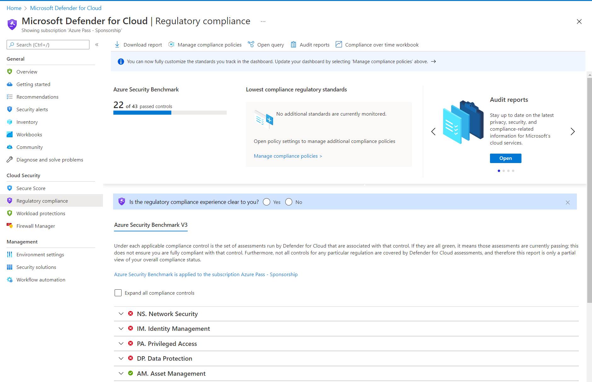

New services and features are released daily in Azure, developers are rapidly publishing new cloud applications built on these services, and attackers are always seeking new ways to exploit misconfigured resources.

The Azure Security Benchmark (ASB) and security baselines for Azure, which are closely related, help organizations secure their cloud solutions on Azure.

### The Azure Security Benchmark

Microsoft has found that using security benchmarks can help organizations quickly secure their cloud deployments and reduce risk to their organization.

The Azure Security Benchmark (ASB) provides prescriptive best practices and recommendations to help improve the security of workloads, data, and services on Azure.  The best way to understand the Azure Security Benchmark is to view it on GitHub [Azure Security Benchmark V3](https://github.com/MicrosoftDocs/SecurityBenchmarks/tree/master/Azure%20Security%20Benchmark/3.0). Spoiler alert, it's an excel spreadsheet. Some of the key pieces of information in ASB v3 are:
-  ASB ID - Each line item in the ASB has an identifier that maps to a specific recommendation.
- Control domain - ASB control domains include network security, data protection, identity management, privileged access, incident response, endpoint security to name just a few.  The control domain is best described as high-level feature or activity that isn't specific to a technology or implementation.
- Mapping to industry frameworks - The recommendations included in the ASB map to existing industry frameworks, such as the Center for Internet Security (CIS), the National Institute of Standards and Technology (NIST), and the Payment Card Industry Data Security Standards (PCI DSS) frameworks. This makes security and compliance easier for customer applications running on Azure services.
- Recommendation - For each control domain area there can be many distinct recommendations. Each recommendation captures specific functionality associated with the control domain area and is itself a control. For example, the "Network Security" control domain in ASB v3 has 10 distinct recommendations identified as NS-1 through NS-10. Each of these recommendations describes a specific control under network security.
- Security principle - Each recommendation lists a "Security Principle" that explains the "what" for the control at the technology-agnostic level
- Azure Guidance - Azure Guidance is focused on the "how", elaborating on the relevant technical features and ways to implement the controls in Azure.

Other pieces of information in the ASB include links to information on implementation, links to information about security stakeholders, and guidance on mapping to Azure policy.  These aren't shown in the image below.

:::image type="content" source="../media/azure-sec-benchmark.png" alt-text="A subset of information from the Azure Security Benchmark v3":::

Microsoft Defender for Cloud continuously assesses an organization's hybrid cloud environment to analyze the risk factors according to the controls and best practices in Azure Security Benchmark. Some of the controls used in the ASB include network security, identity and access control, data protection, data recovery, incident response, and more.  

> [!div class="mx-imgBorder"]
> 

### Security baselines for Azure

Security baselines for Azure apply guidance from the Azure Security Benchmark to the specific service for which it's defined.  For example, the security baseline for Azure Active Directory applies guidance from the Azure Security Benchmark version 2.0 to Azure Active Directory.

Security baselines for Azure help organizations strengthen their security through improved tooling, tracking, and security features. They also provide organizations a consistent experience when securing their environment. Content in the security baseline is grouped by the control domains defined by the Azure Security Benchmark and that are applicable to the service.

Each Azure security baseline includes the following information:

- **Azure ID**: The Azure Security Benchmark ID that corresponds to the recommendation.
- **Azure control**: The content is grouped by control domain area, as listed in the Azure Security Benchmark, and that is applicable to the service for which the security baseline is defined.
- **Recommendation**: This maps to the recommendation for the associated ASB ID (or Azure ID).  Each recommendation describes an individual control in a control domain.
- **Guidance**: The rationale for the recommendation and links to guidance on how to implement it.
- **Responsibility**: Who is responsible for implementing the control? Possible scenarios are customer responsibility, Microsoft responsibility, or shared responsibility.
- **Microsoft Defender for Cloud monitoring**: Does Microsoft Defender for Cloud monitor the control?

:::image type="content" source="../media/aad-security-baseline.png" alt-text="A subset of information from the Azure Active Directory security baseline":::

Refer to [Azure Security Benchmark documentation](/azure/security/benchmarks/) for a complete listing of the available baselines.

