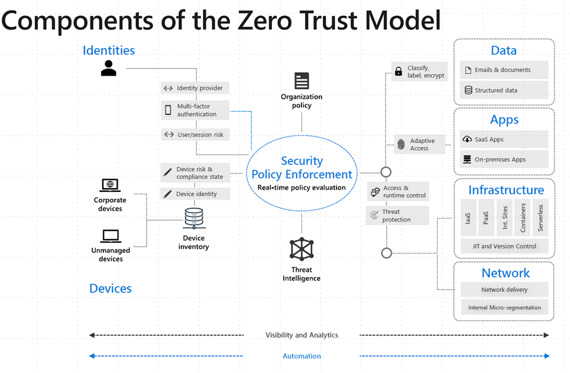
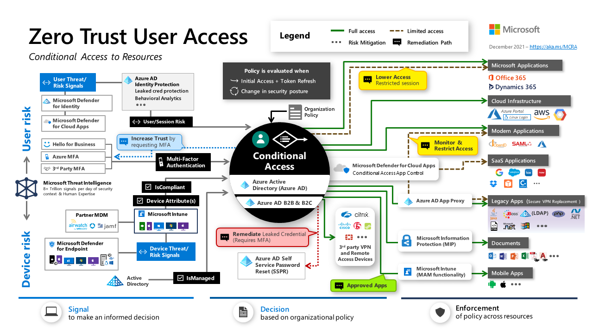

We'll start out with some design principles.

<!---->

### Conditional Access as a Zero Trust policy engine

The Microsoft approach to Zero Trust includes Conditional Access as the main policy engine. Here's an overview of that approach:

_Download an [SVG file](https://arch-center.azureedge.net/zero-trust-model.svg) of this architecture._

Conditional Access is used as the policy engine for a Zero Trust architecture that covers both policy definition and policy enforcement. Based on various signals or conditions, Conditional Access can block or give limited access to resources, as shown here:

Here's a more detailed view of the elements of Conditional Access and what it covers:

This diagram shows Conditional Access and related elements that can help protect user access to resources, as opposed to non-interactive or non-human access. The following diagram describes both types of identities:

Non-human access to resources must also be protected. Currently, you can't use Conditional Access to protect non-human access to cloud resources. You need to use another method, like grant controls for OAuth-based access.

### Principles of Conditional Access vs Principles of Zero Trust

Based on the preceding information, here's a summary of suggested principles. Microsoft recommends that you create an access model based on Conditional Access that's aligned with the three main Microsoft Zero Trust principles:

|  Zero Trust Principle | Conditional Access Principle
|---|---|
| **Verify explicitly**  | - Move the control plane to the cloud. Integrate apps with Azure AD and protect them by using Conditional Access. - Consider all clients to be external.  |
|  **Use least privileged access** | - Evaluate access based on compliance and risk, including user risk, sign-in risk, and device risk. -   Use these access priorities: -   Access the resource directly, using Conditional Access for protection. -   Publish access to the resource by using Azure AD Application Proxy, using Conditional Access for protection. -   Use Conditional Access—based VPN to access the resource. Restrict access to the level of the app or DNS name.  |
| **Assume breach**  | -   Segment network infrastructure. - Minimize use of enterprise PKI. - Migrate single sign-on (SSO) from AD FS to password hash synchronization (PHS). -   Minimize dependencies on DCs by using Kerberos KDC in Azure AD. - Move the management plane to the cloud. Manage devices by using Microsoft Endpoint Manager.  |

Here are some more detailed principles and recommended practices for Conditional Access:

-   Apply Zero Trust principles to Conditional Access.
-   Use report-only mode before putting a policy into production.
-   Test both positive and negative scenarios.
-   Use change and revision control on Conditional Access policies.
-   Automate the management of Conditional Access policies by using tools like Azure DevOps / GitHub or Azure Logic Apps.
-   Use block mode for general access only if and where you need to.
-   Ensure that all applications and your platform are protected. Conditional Access has no implicit "deny all."
-   Protect privileged users in all Microsoft 365 role-based access control (RBAC) systems.
-   Require password change and multi-factor authentication for high-risk users and sign-ins (enforced by sign-in frequency).
-   Restrict access from high-risk devices. Use an Intune compliance policy with a compliance check in Conditional Access.
-   Protect privileged systems, like access to the administrator portals for Office 365, Azure, AWS, and Google Cloud.
-   Prevent persistent browser sessions for admins and on untrusted devices.
-   Block legacy authentication.
-   Restrict access from unknown or unsupported device platforms.
-   Require compliant device for access to resources, when possible.
-   Restrict strong credential registration.
-   Consider using default session policy that allows sessions to continue if there's an outage, if the appropriate conditions were satisfied before the outage.
