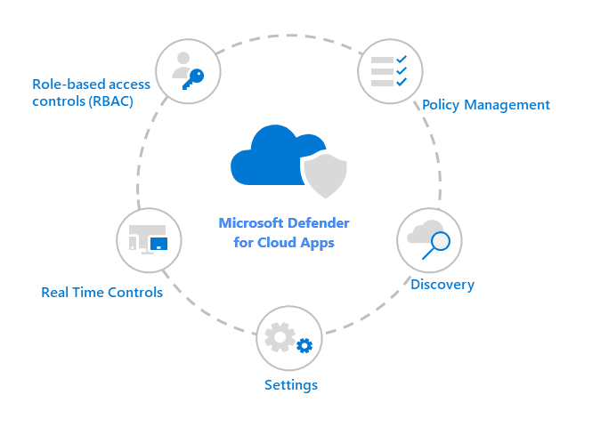
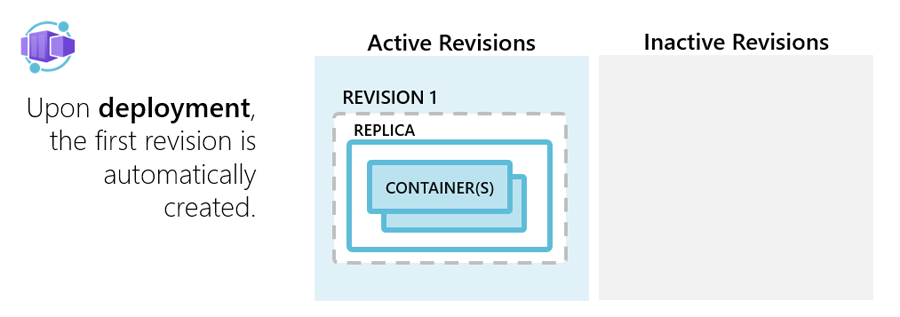
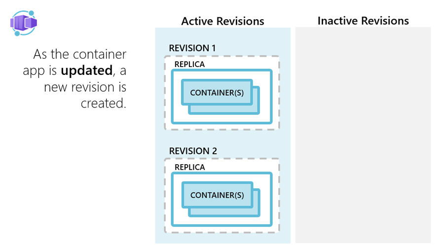

## Lifecycle management strategy in Defender for Cloud Apps

By using a lifecycle management strategy, you can ensure your configurations, exclusions, and policies for Microsoft Defender for Cloud Apps remain up to date and are reviewed on an established cadence.

To best maintain Defender for Cloud Apps posture, regularly follow the recommendations below:

### Role-based access controls

- Review any users that have access to the Defender for Cloud Apps portal and verify role need
- Inventory external users with access to your environment and determine validity

### Real-time controls

- Add applications for more control and visibility
- Remove old user/group exclusions from Conditional Access policy
- Update SAML certificate for third-party identity provider annually
- Verify app onboarding members

### Policy management

- Remove unneeded custom policies
- Review new policy templates
- Enhance policy strategy to determine what can be a saved query versus what requires an alert
- Ensure labeling strategy is in line with current Security and Compliance configuration

### Discovery

- Upgrade log collector
- Remove old data sources
- Add/Disable App Connectors

### Settings

- Review managed domains
- Verify current IP ranges for Corporate and VPN
- Verify App Tag strategy and add/remove as needed
- Check rights on admin quarantine folder
- Adjust score metrics based on industry best practices
- Review members allowed to view private activities
- Verify integrations are enabled:
  - Microsoft Purview Information Protection
  - Microsoft Defender for Identity
  - Azure Active Directory Information Protection
  - Microsoft Defender for Endpoint

## Application lifecycle management in Azure Container Apps

The Azure Container Apps application lifecycle revolves around [revisions](https://learn.microsoft.com/azure/container-apps/revisions).

When you deploy a container app, the first revision is automatically created. [More revisions are created](https://learn.microsoft.com/azure/container-apps/revisions) as [containers](https://learn.microsoft.com/azure/container-apps/containers) change, or any adjustments are made to the `template` section of the configuration.

A container app flows through four phases: deployment, update, deactivation, and shut down.

### Deployment

As a container app is deployed, the first revision is automatically created.

<!--

-->

### Update

As a container app is updated with a [revision scope-change](https://learn.microsoft.com/azure/container-apps/revisions#revision-scope-changes), a new revision is created. You can [choose](https://learn.microsoft.com/azure/container-apps/revisions#revision-modes) whether to automatically deactivate old revisions (single revision mode), or allow them to remain available (multiple revision mode).

### Zero downtime deployment

In single revision mode, Container Apps automatically ensures your app doesn't experience downtime when creating a new revision. The existing active revision isn't deactivated until the new revision is ready. If ingress is enabled, the existing revision continues to receive 100% of the traffic until the new revision is ready.

In multiple revision mode, you control when revisions are activated or deactivated and which revisions receive ingress traffic. If a [traffic splitting rule](https://learn.microsoft.com/azure/container-apps/revisions-manage#traffic-splitting) is configured with `latestRevision` set to `true`, traffic doesn't switch to the latest revision until it's ready.
<!--

-->

### Deactivate

Once a revision is no longer needed, you can deactivate a revision with the option to reactivate later. During deactivation, containers in the revision are [shut down](https://learn.microsoft.com/azure/container-apps/application-lifecycle-management#shutdown).

<!--

-->

### Shutdown

The containers are shut down in the following situations:

-   As a container app scales in
-   As a container app is being deleted
-   As a revision is being deactivated

When a shutdown is initiated, the container host sends a [SIGTERM message](https://wikipedia.org/wiki/Signal_(IPC)) to your container. The code implemented in the container can respond to this operating system-level message to handle termination.

If your application doesn't respond within 30 seconds to the `SIGTERM` message, then [SIGKILL](https://wikipedia.org/wiki/Signal_(IPC)) terminates your container.