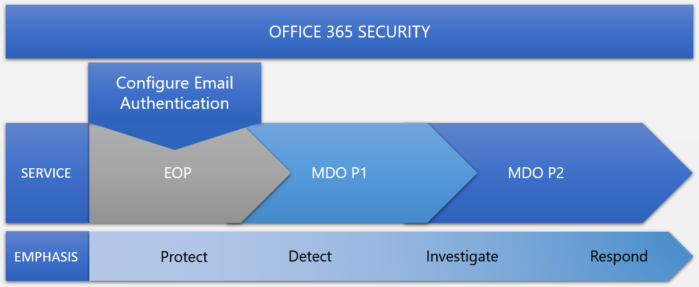

In this module, you learn how to:

- Evaluate security posture for collaboration and productivity workloads
- Design a Microsoft Defender XDR solution
- Design configurations and operational practices for Microsoft 365

The content in the module helps you prepare for the certification exam SC-100: Microsoft Cybersecurity Architect.

## Prerequisites

- Advanced experience and knowledge in identity and access, platform protection, security operations, securing data, and securing applications.
- Experience with hybrid and cloud implementations.

## What is Defender for Office 365 security?

Every Office 365 subscription comes with security capabilities. The goals and actions that you can take depend on the focus of these different subscriptions. In Office 365 security, there are three main security services (or products) tied to your subscription type:

1.  Exchange Online Protection (EOP)
2.  Microsoft Defender for Office 365 Plan 1 (Defender for Office P1)
3.  Microsoft Defender for Office 365 Plan 2 (Defender for Office P2)

Office 365 security builds on the core protections offered by EOP. EOP is present in any subscription where Exchange Online mailboxes can be found (remember, all the security products discussed here are Cloud-based).

You may be accustomed to seeing these three components discussed in this way:

|EOP|Microsoft Defender for Office 365 P1|Microsoft Defender for Office 365 P2|
|---|---|---|
|Prevents broad, volume-based, known attacks.|Protects email and collaboration from zero-day malware, phish, and business email compromise.|Adds post-breach investigation, hunting, and response, as well as automation, and simulation (for training).|

But in terms of architecture, let's start by thinking of each piece as cumulative layers of security, each with a security emphasis. More like this:

Though each of these services emphasizes a goal from among Protect, Detect, Investigate, and Respond, _**all**_ the services can carry out _**any**_ of the goals of protecting, detecting, investigating, and responding.

The core of Office 365 security is EOP protection. Microsoft Defender for Office 365 P1 contains EOP in it. Defender for Office 365 P2 contains P1 and EOP. The structure is cumulative. That's why, when configuring this product, you should start with EOP and work to Defender for Office 365.

Though email authentication configuration takes place in public DNS, it's important to configure this feature to help defend against spoofing. _If you have EOP,_ _**you should [configure email authentication](https://learn.microsoft.com/microsoft-365/security/office-365-security/email-authentication-about?view=o365-worldwide)**_.

If you have an Office 365 E3, or lower, you have EOP, but with the option to buy standalone Defender for Office 365 P1 through upgrade. If you have Office 365 E5, you already have Defender for Office 365 P2.

## The Office 365 security ladder from EOP to Microsoft Defender for Office 365

What makes adding Microsoft Defender for Office 365 plans an advantage to pure EOP threat management can be difficult to tell at first glance. To decide if an upgrade path is right for your organization, let's look at the capabilities of each product when it comes to:

- preventing and detecting threats
- investigating
- responding

starting with **Exchange Online Protection**:

|Prevent/Detect|Investigate|Respond|
|---|---|---|
|Technologies include:  - spam - phish - malware - bulk mail - spoof intelligence -  impersonation detection - Admin Quarantine -  False positives and false negative reporting by admin submissions and user reported messages -  Allow/Block for URLs and Files -  Reports|Audit log search -  Message Trace|Zero-hour auto purge (ZAP) -  Refinement and testing of Allow and blocklists|

Because these products are cumulative, if you evaluate Microsoft Defender for Office 365 P1 and decide to subscribe to it, you add these abilities.

Gains with **Defender for Office 365, Plan 1** (to date):

|Prevent/Detect|Investigate|Respond|
|---|---|---|
|Technologies include everything in EOP plus:  - Safe attachments - Safe links Microsoft Defender for Office 365 protection for workloads (ex. SharePoint Online, Teams, OneDrive for Business) - Time-of-click protection in email, Office clients, and Teams - anti-phishing in Defender for Office 365 - User and domain impersonation protection - Alerts, and SIEM integration API for alerts|SIEM integration API for detections - **Real-time detections tool** - URL trace - Same

So, Microsoft Defender for Office 365 P1 expands on the ***prevention*** side of the house, and adds extra forms of ***detection***.

Microsoft Defender for Office 365 P1 also adds **Real-time detections** for investigations. This threat hunting tool's name is in bold, because having it is a clear means of *knowing* you have Defender for Office 365 P1. It doesn't appear in Defender for Office 365 P2.

Gains with **Defender for Office 365, Plan 2** (to date):

|Prevent/Detect|Investigate|Respond|
|---|---|---|
|Technologies include everything in EOP, and Microsoft Defender for Office 365 P1 plus:  - Same|**Threat Explorer** - Threat Trackers - Campaign views|Automated Investigation and Response (AIR) - AIR from Threat Explorer - AIR for compromised users - SIEM Integration API for Automated Investigations|

So, Microsoft Defender for Office 365 P2 expands on the ***investigation and response*** side of the house, and adds a new hunting strength. Automation.

In Microsoft Defender for Office 365 P2, the primary hunting tool is called **Threat Explorer** rather than Real-time detections. If you see Threat Explorer when you navigate to the Microsoft Defender portal, you're in Microsoft Defender for Office 365 P2.