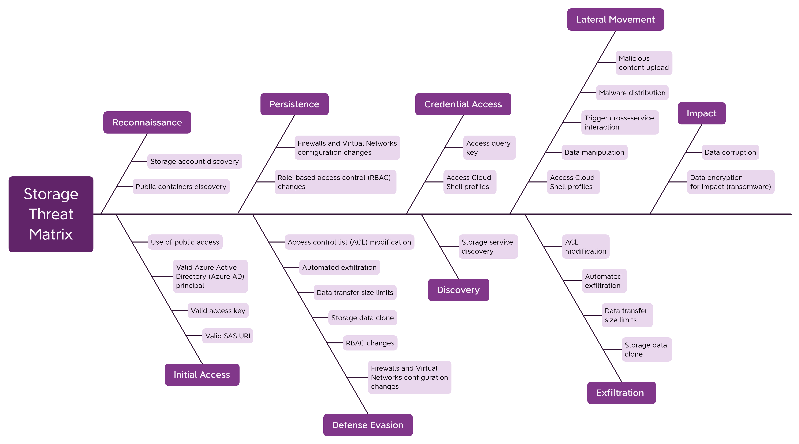
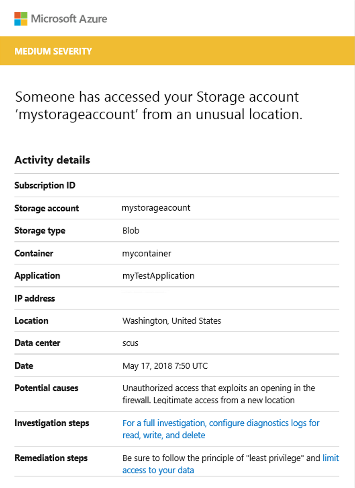
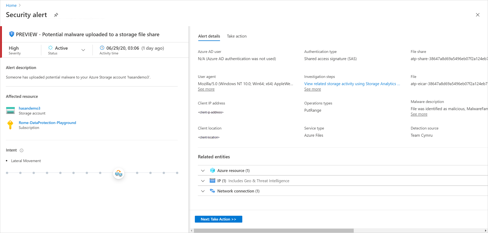

**Microsoft Defender for Storage** is an Azure-native layer of security intelligence that detects unusual and potentially harmful attempts to access or exploit your storage accounts. It uses advanced threat detection capabilities and [Microsoft Threat Intelligence](https://go.microsoft.com/fwlink/?linkid=2128684) data to provide contextual security alerts. Those alerts also include steps to mitigate the detected threats and prevent future attacks.

You can [enable Microsoft Defender for Storage](https://learn.microsoft.com/azure/storage/common/azure-defender-storage-configure) at either the subscription level (recommended) or the resource level.

Defender for Storage continually analyzes the telemetry stream generated by the [Azure Blob Storage](https://azure.microsoft.com/services/storage/blobs/) and Azure Files services. When potentially malicious activities are detected, security alerts are generated. These alerts are displayed in Microsoft Defender for Cloud, together with the details of the suspicious activity along with the relevant investigation steps, remediation actions, and security recommendations.

Analyzed telemetry of Azure Blob Storage includes operation types such as `Get Blob`, `Put Blob`, `Get Container ACL`, `List Blobs`, and `Get Blob Properties`. Examples of analyzed Azure Files operation types include `Get File`, `Create File`, `List Files`, `Get File Properties`, and `Put Range`.

Defender for Storage doesn't access the Storage account data and has no impact on its performance.

You can learn more by watching this video from the Defender for Cloud in the Field video series:

-   [Defender for Storage in the field](https://learn.microsoft.com/azure/defender-for-cloud/episode-thirteen)

Customers using the legacy per-transaction pricing plan need to migrate to the new per-storage account plan to access these new features and pricing. The legacy per-transaction pricing plan charges are based on the number of analyzed transactions in the storage account.

For further details, please refer to the [Microsoft Defender for Storage FAQ](https://learn.microsoft.com/azure/storage/common/azure-defender-storage-configure#faq---microsoft-defender-for-storage-pricing).

## What are the benefits of Microsoft Defender for Storage?

Defender for Storage provides:

-   **Azure-native security** - With 1-click enablement, Defender for Storage protects data stored in Azure Blob, Azure Files, and Data Lakes. As an Azure-native service, Defender for Storage provides centralized security across all data assets that are managed by Azure and is integrated with other Azure security services such as Microsoft Sentinel.
-   **Rich detection suite** - Powered by Microsoft Threat Intelligence, the detections in Defender for Storage cover the top storage threats such as unauthenticated access, compromised credentials, social engineering attacks, data exfiltration, privilege abuse, and malicious content.
-   **Response at scale** - Defender for Cloud's automation tools make it easier to prevent and respond to identified threats. Learn more in [Automate responses to Defender for Cloud triggers](https://learn.microsoft.com/azure/defender-for-cloud/workflow-automation).

## Security threats in cloud-based storage services

Microsoft security researchers have analyzed the attack surface of storage services. Storage accounts can be subject to data corruption, exposure of sensitive content, malicious content distribution, data exfiltration, unauthorized access, and more.

The potential security risks are described in the [threat matrix for cloud-based storage services](https://www.microsoft.com/security/blog/2021/04/08/threat-matrix-for-storage/) and are based on the [MITRE ATT&CK® framework](https://attack.mitre.org/techniques/enterprise/), a knowledge base for the tactics and techniques employed in cyber attacks.

## What kind of alerts does Microsoft Defender for Storage provide?

Security alerts are triggered for the following scenarios (typically from 1-2 hours after the event):

|Type of threat  | Description  |
|---------|---------|
|**Unusual access to an account**     | For example, access from a TOR exit node, suspicious IP addresses, unusual applications, unusual locations, and anonymous access without authentication.        |
|**Unusual behavior in an account**  | Behavior that deviates from a learned baseline, such as a change of access permissions in an account, unusual access inspection, unusual data exploration, unusual deletion of blobs/files, or unusual data extraction. |
|**Hash reputation based Malware detection**   | Detection of known malware based on full blob/file hash. This can help detect ransomware, viruses, spyware, and other malware uploaded to an account, prevent it from entering the organization, and spreading to more users and resources. See also [Limitations of hash reputation analysis](#limitations-of-hash-reputation-analysis). |
|**Unusual file uploads** | Unusual cloud service packages and executable files that have been uploaded to an account. |
| **Public visibility** | Potential break-in attempts by scanning containers and pulling potentially sensitive data from publicly accessible containers. | 
| **Phishing campaigns** | When content that's hosted on Azure Storage is identified as part of a phishing attack that's impacting Microsoft 365 users. |

You can check out [the full list of Microsoft Defender for Storage alerts](https://learn.microsoft.com/azure/defender-for-cloud/alerts-reference#alerts-azurestorage).

Alerts include details of the incident that triggered them, and recommendations on how to investigate and remediate threats. Alerts can be exported to Microsoft Sentinel or any other third-party SIEM or any other external tool. Learn more in [Stream alerts to a SIEM, SOAR, or IT Service Management solution](https://learn.microsoft.com/azure/defender-for-cloud/export-to-siem).

## Explore security anomalies

When storage activity anomalies occur, you receive an email notification with information about the suspicious security event. Details of the event include:

-   The nature of the anomaly
-   The storage account name
-   The event time
-   The storage type
-   The potential causes
-   The investigation steps
-   The remediation steps

The email also includes details on possible causes and recommended actions to investigate and mitigate the potential threat.

You can review and manage your current security alerts from Microsoft Defender for Cloud's [Security alerts tile](https://learn.microsoft.com/azure/defender-for-cloud/managing-and-responding-alerts). Select an alert for details and actions for investigating the current threat and addressing future threats.

## Limitations of hash reputation analysis

-   **Hash reputation isn't deep file inspection** - Microsoft Defender for Storage uses hash reputation analysis supported by [Microsoft Threat Intelligence](https://go.microsoft.com/fwlink/?linkid=2128684) to determine whether an uploaded file is suspicious. The threat protection tools don’t scan the uploaded files; rather they analyze the telemetry generated from the Blobs Storage and Files services. Defender for Storage then compares the hashes of newly uploaded files with hashes of known viruses, trojans, spyware, and ransomware.
    
-   **Hash reputation analysis isn't supported for all files protocols and operation types** - Some, but not all, of the telemetry logs contain the hash value of the related blob or file. In some cases, the telemetry doesn't contain a hash value. As a result, some operations can't be monitored for known malware uploads. Examples of such unsupported use cases include SMB file-shares and when a blob is created using [Put Block](https://learn.microsoft.com/rest/api/storageservices/put-block) and [Put Block List](https://learn.microsoft.com/rest/api/storageservices/put-block-list).