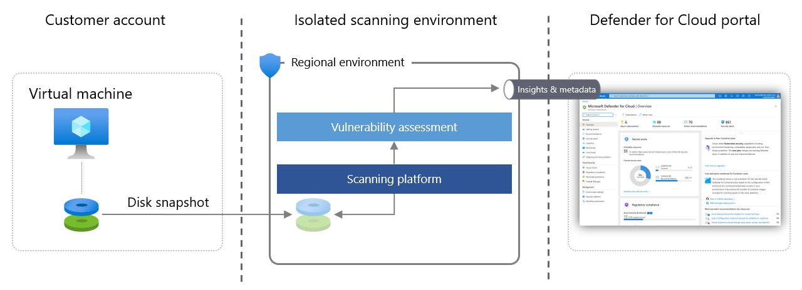

Defender for cloud offers foundational multicloud CSPM capabilities for free. These capabilities are automatically enabled by default on any subscription or account that has onboarded to Defender for Cloud. The foundational CSPM includes asset discovery, continuous assessment and security recommendations for posture hardening, compliance with Microsoft Cloud Security Benchmark (MCSB), and a [Secure score](https://learn.microsoft.com/azure/defender-for-cloud/secure-score-access-and-track) which measure the current status of your organization’s posture.

The optional Defender CSPM plan, provides advanced posture management capabilities such as [Attack path analysis](https://learn.microsoft.com/azure/defender-for-cloud/how-to-manage-attack-path), [Cloud security explorer](https://learn.microsoft.com/azure/defender-for-cloud/how-to-manage-cloud-security-explorer), advanced threat hunting, [security governance capabilities](https://learn.microsoft.com/azure/defender-for-cloud/concept-regulatory-compliance), and also tools to assess your [security compliance](https://learn.microsoft.com/azure/defender-for-cloud/review-security-recommendations) with a wide range of benchmarks, regulatory standards, and any custom security policies required in your organization, industry, or region. 

The following table summarizes each plan and their cloud availability.

| Feature | Foundational CSPM capabilities | Defender CSPM | Cloud availability |
|--|--|--|--|
| Continuous assessment of the security configuration of your cloud resources |  |  | Azure, AWS, GCP, on-premises |
| [Security recommendations to fix misconfigurations and weaknesses](https://learn.microsoft.com/azure/defender-for-cloud/review-security-recommendations) |  | | Azure, AWS, GCP, on-premises |
| [Secure score](https://learn.microsoft.com/azure/defender-for-cloud/secure-score-security-controls) |  |  | Azure, AWS, GCP, on-premises |
| [Governance](https://learn.microsoft.com/azure/defender-for-cloud/concept-regulatory-compliance) | - |  | Azure, AWS, GCP, on-premises |
| [Regulatory compliance](https://learn.microsoft.com/azure/defender-for-cloud/concept-regulatory-compliance) | - |  | Azure, AWS, GCP, on-premises |
| [Cloud security explorer](https://learn.microsoft.com/azure/defender-for-cloud/how-to-manage-cloud-security-explorer) | - |  | Azure, AWS |
| [Attack path analysis](https://learn.microsoft.com/azure/defender-for-cloud/how-to-manage-attack-path) | - |  | Azure, AWS |
| [Agentless scanning for machines](https://learn.microsoft.com/azure/defender-for-cloud/concept-agentless-data-collection) | - |  | Azure, AWS |

The following sections will provide an overview of a few of these features:

- Cloud security explorer
- Attack path analysis
- Agentless scanning for machines

The Microsoft Defender for cloud regulatory compliance dashboard is covered in the module on regulatory compliance. Secure score is covered in the following unit.
<!--
TODO: Link to other module here
-->

## Attack path analysis and cloud security explorer

The cloud security graph is a graph-based context engine that exists within Defender for Cloud. The cloud security graph collects data from your multicloud environment and other data sources. For example, the cloud assets inventory, connections and lateral movement possibilities between resources, exposure to internet, permissions, network connections, vulnerabilities and more. The data collected is then used to build a graph representing your multicloud environment.

Defender for Cloud then uses the generated graph to perform an attack path analysis and find the issues with the highest risk that exist within your environment. You can also query the graph using the cloud security explorer.

<!--

-->

### What is attack path analysis?

Attack path analysis is a graph-based algorithm that scans the cloud security graph. The scans expose exploitable paths that attackers may use to breach your environment to reach your high-impact assets. Attack path analysis exposes attack paths and suggests recommendations as to how best remediate issues that will break the attack path and prevent successful breach.

When you take your environment's contextual information into account, attack path analysis identifies issues that may lead to a breach on your environment, and helps you to remediate the highest risk ones first. For example its exposure to the internet, permissions, lateral movement, and more.

Learn how to use [attack path analysis](https://learn.microsoft.com/azure/defender-for-cloud/how-to-manage-attack-path).

### What is cloud security explorer?

By running graph-based queries on the cloud security graph with the cloud security explorer, you can proactively identify security risks in your multicloud environments. Your security team can use the query builder to search for and locate risks, while taking your organization's specific contextual and conventional information into account.

Cloud security explorer provides you with the ability to perform proactive exploration features. You can search for security risks within your organization by running graph-based path-finding queries on top the contextual security data that is already provided by Defender for Cloud, such as cloud misconfigurations, vulnerabilities, resource context, lateral movement possibilities between resources and more.

Learn how to use the [cloud security explorer](https://learn.microsoft.com/azure/defender-for-cloud/how-to-manage-cloud-security-explorer), or check out the [cloud security graph components list](https://learn.microsoft.com/azure/defender-for-cloud/attack-path-reference#cloud-security-graph-components-list).

## Agentless scanning for machines
<!--
https://learn.microsoft.com/azure/defender-for-cloud/concept-agentless-data-collection
-->
While agent-based methods use OS APIs in runtime to continuously collect security related data, agentless scanning for VMs uses cloud APIs to collect data. Defender for Cloud takes snapshots of VM disks and does an out-of-band, deep analysis of the OS configuration and file system stored in the snapshot. The copied snapshot doesn't leave the original compute region of the VM, and the VM is never impacted by the scan.

After the necessary metadata is acquired from the disk, Defender for Cloud immediately deletes the copied snapshot of the disk and sends the metadata to Microsoft engines to analyze configuration gaps and potential threats. For example, in vulnerability assessment, the analysis is done by Defender Vulnerability Management. The results are displayed in Defender for Cloud, seamlessly consolidating agent-based and agentless results.

The scanning environment where disks are analyzed is regional, volatile, isolated, and highly secure. Disk snapshots and data unrelated to the scan aren't stored longer than is necessary to collect the metadata, typically a few minutes.

