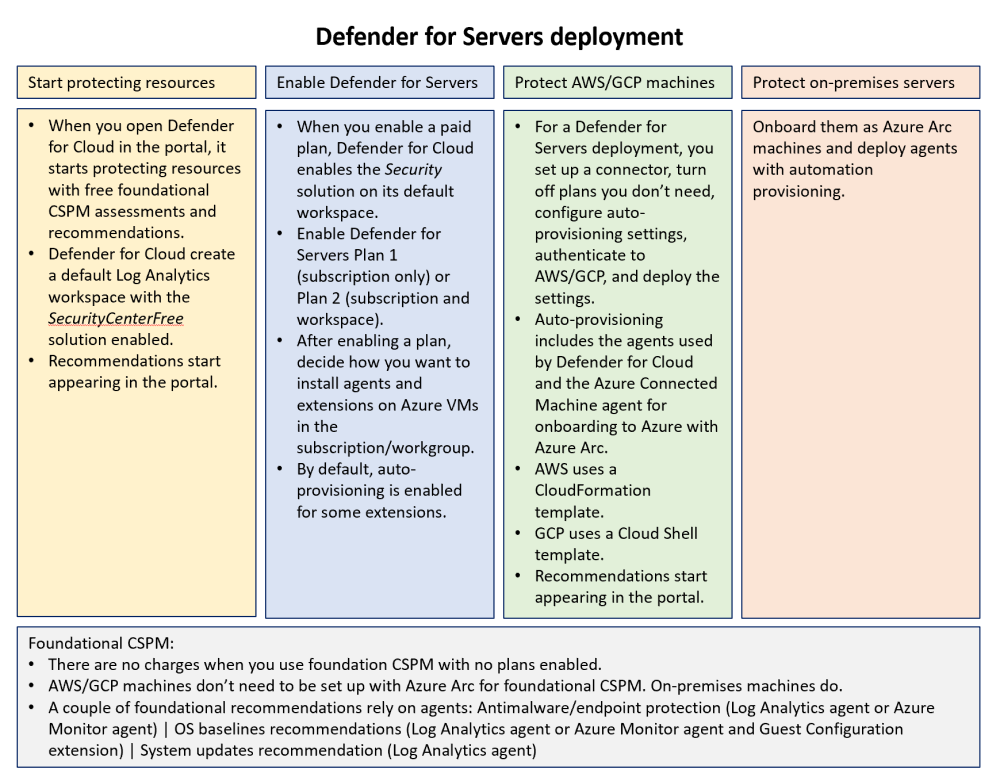

For an overview of how Defender for cloud integrates posture management and workload protections, see [[Design integrated security posture management and workload protection solutions in hybrid and multicloud environments]].

Defender for cloud has workload protections in 7 main areas:

- Servers
- Storage
- Databases
- Containers
- Application infrastructure
- Alerts
- Incidents

We will highlight three of those capabilities in this article.

## Server workload protections

Microsoft Defender for Servers extends protection to your Windows and Linux machines that run in Azure, Amazon Web Services (AWS), Google Cloud Platform (GCP), and on-premises. Defender for Servers integrates with Microsoft Defender for Endpoint to provide endpoint detection and response (EDR) and other threat protection features.

### Deployment overview

The following diagram shows an overview of the Defender for Servers deployment process:

-   Learn more about [foundational cloud security posture management (CSPM)](https://learn.microsoft.com/azure/defender-for-cloud/concept-cloud-security-posture-management#defender-cspm-plan-options).
-   Learn more about [Azure Arc](https://learn.microsoft.com/azure/azure-arc/) onboarding.

When you enable [Microsoft Defender for Servers](https://learn.microsoft.com/azure/defender-for-cloud/defender-for-servers-introduction) on an Azure subscription or a connected AWS account, all of the connected machines will be protected by Defender for Servers. You can enable Microsoft Defender for Servers at the Log Analytics workspace level, but only servers reporting to that workspace will be protected and billed and those servers won't receive some benefits, such as Microsoft Defender for Endpoint, vulnerability assessment, and just-in-time VM access.

## Application workload protections

**Microsoft Defender for App Service** uses the scale of the cloud to identify attacks targeting applications running over App Service. Attackers probe web applications to find and exploit weaknesses. Before being routed to specific environments, requests to applications running in Azure go through several gateways, where they're inspected and logged. This data is then used to identify exploits and attackers, and to learn new patterns that will be used later.

When you enable Microsoft Defender for App Service, you immediately benefit from the following services offered by this Defender plan:

-   **Secure** - Defender for App Service assesses the resources covered by your App Service plan and generates security recommendations based on its findings. Use the detailed instructions in these recommendations to harden your App Service resources.
    
-   **Detect** - Defender for App Service detects a multitude of threats to your App Service resources by monitoring:
    
    -   the VM instance in which your App Service is running, and its management interface
    -   the requests and responses sent to and from your App Service apps
    -   the underlying sandboxes and VMs
    -   App Service internal logs - available thanks to the visibility that Azure has as a cloud provider

As a cloud-native solution, Defender for App Service can identify attack methodologies applying to multiple targets. For example, from a single host it would be difficult to identify a distributed attack from a small subset of IPs, crawling to similar endpoints on multiple hosts.

The log data and the infrastructure together can tell the story: from a new attack circulating in the wild to compromises in customer machines. Therefore, even if Microsoft Defender for App Service is deployed after a web app has been exploited, it might be able to detect ongoing attacks.

### What threats can Defender for App Service detect?

#### Threats by MITRE ATT&CK tactics

Defender for Cloud monitors for many threats to your App Service resources. The alerts cover almost the complete list of MITRE ATT&CK tactics from pre-attack to command and control.

-   **Pre-attack threats** - Defender for Cloud can detect the execution of multiple types of vulnerability scanners that attackers frequently use to probe applications for weaknesses.
    
-   **Initial access threats** - [Microsoft Threat Intelligence](https://go.microsoft.com/fwlink/?linkid=2128684) powers these alerts that include triggering an alert when a known malicious IP address connects to your Azure App Service FTP interface.
    
-   **Execution threats** - Defender for Cloud can detect attempts to run high privilege commands, Linux commands on a Windows App Service, fileless attack behavior, digital currency mining tools, and many other suspicious and malicious code execution activities.

## Database workload protections

Microsoft Defender for SQL servers detects anomalous activities indicating unusual and potentially harmful attempts to access or exploit databases on the SQL server.

You'll see alerts when there are suspicious database activities, potential vulnerabilities, or SQL injection attacks, and anomalous database access and query patterns.

Microsoft Defender for SQL servers on machines extends the protections for your Azure-native SQL servers to fully support hybrid environments and protect SQL servers hosted in Azure, multicloud environments, and even on-premises machines:

-   [SQL Server on Virtual Machines](https://azure.microsoft.com/services/virtual-machines/sql-server/)
    
-   On-premises SQL servers:
    
    -   [Azure Arc-enabled SQL Server](https://learn.microsoft.com/sql/sql-server/azure-arc/overview)
    -   [SQL Server running on Windows machines without Azure Arc](https://learn.microsoft.com/azure/azure-monitor/agents/agent-windows)
        
-   Multicloud SQL servers:
    
    -   [Connect your AWS accounts to Microsoft Defender for Cloud](https://learn.microsoft.com/azure/defender-for-cloud/quickstart-onboard-aws)
    -   [Connect your GCP project to Microsoft Defender for Cloud](https://learn.microsoft.com/azure/defender-for-cloud/quickstart-onboard-gcp)