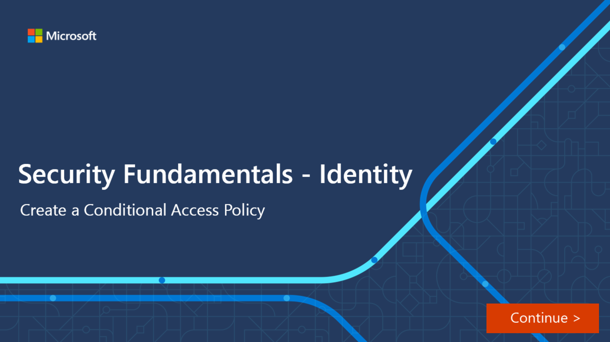

Conditional Access is a feature of Microsoft Entra that provides an extra layer of security before allowing authenticated users to access data or other assets. Conditional Access is implemented through policies that are created and managed in Microsoft Entra ID. A Conditional Access policy analyses signals including user, location, device, application, and risk to automate decisions for authorizing access to  resources (apps and data).

:::image type="content" source="../media/2-conditional-access-policies.png" alt-text="Image showing Conditional Access policy flow.  Signals are used to decide whether to allow or block access to apps and data.":::

Conditional Access policies at their simplest are if-then statements.  For example, a Conditional Access policy might state that *if* a user belongs to a certain group, then they're required to provide multi-factor authentication to sign in to an application.

> [!IMPORTANT]
> Conditional Access policies are enforced after first-factor authentication is completed. Conditional Access isn't intended to be an organization's first line of defense for scenarios like denial-of-service (DoS) attacks, but it can use signals from these events to determine access.

Watch the video to see how Conditional Access policies work.

> [!VIDEO https://www.microsoft.com/videoplayer/embed/RE4INyI]

### Conditional access policy components

A conditional access policy in Microsoft Entra ID consists of two components, assignments and access controls.

:::image type="content" source="../media/conditional-access-policy-components-v2.png" alt-text="Screen capture showing the two components of a conditional access policy, the assignments and the access controls.":::

#### Assignments

When creating a conditional access policy, admins can determine which signals to use through assignments. The assignments portion of the policy controls the who, what, where, and when of the Conditional Access policy. All assignments are logically ANDed. If you have more than one assignment configured, all assignments must be satisfied to trigger a policy. Some of the assignments include:

- **Users and groups** assign who the policy will include or exclude. This assignment can include all users, specific groups of users, directory roles, or external guest users.  This assignment can also include single tenant service principals (applications) that are registered in your tenant.
- **Cloud apps or actions** can include or exclude cloud applications, user actions, or authentication contexts that are subjected to the policy. Integration of Microsoft Defender for Cloud with conditional access enables real-time visibility and control over access to and activities performed within your cloud environment.
- **Conditions** define where and when the policy will apply.  Multiple conditions can be combined to create fine-grained and specific Conditional Access policies.  Some of the conditions include:
  - **Sign-in risk** and **user risk**. Integration with Microsoft Entra ID Protection allows Conditional Access policies to identify suspicious actions related to user accounts in the directory and trigger a policy.  Sign-in risk is the probability that a given sign-in, or authentication request, isn't authorized by the identity owner. User risk is the probability that a given identity or account is compromised.
  - **Devices platform**. Device platform, which is characterized by the operating system that runs on a device can be used when enforcing Conditional Access policies.
  - **IP location information**. Organizations can define trusted IP address ranges that can be used when making policy decisions. Also, administrators can opt to block or allow traffic from an entire country/region's IP range.
  - **Client apps**.  Clients apps, the software the user is employing to access the cloud app, including browsers, mobile apps, desktop clients, can also be used in access policy decision.
  - **Filters for devices**.  Organizations can enforce policies based on device properties, by using the filters for devices option.  As an example, this option may be used to target policies to specific devices like privileged access workstations.

#### Access controls

When the Conditional Access policy has been applied, an informed decision is reached on whether to block access, grant access, grant access with extra verification, or apply a session control to enable a limited experience. The decision is referred to as the access controls portion of the Conditional Access policy and defines how a policy is enforced. Common decisions are:

- **Block access**
- **Grant access**. Administrators can grant access without any additional control, or they can choose to enforce one or more controls when granting access. Examples of controls used to grant access include requiring users to perform multifactor authentication, requiring specific authentication methods to access a resource, requiring devices to meet specific compliance policy requirements, require a password change, and more. For a complete list, refer to [Grant controls in Conditional Access policy](/azure/active-directory/conditional-access/concept-conditional-access-grant).
- **Session**.  Within a Conditional Access policy, an administrator can make use of session controls to enable limited experiences within specific cloud applications. As an example, Conditional Access App Control uses signals from Microsoft Defender for Cloud Apps to block the download, cut, copy, and print capabilities for sensitive documents, or to require labeling of sensitive files. Other session controls include sign-in frequency and application enforced restrictions that, for selected applications, use the device information to provide users with a limited or full experience, depending on the device state. For a complete list, refer [Session controls in Conditional Access policy](/azure/active-directory/conditional-access/concept-conditional-access-session).

### Interactive Guide

In this interactive guide, you'll walk through the different assignments and access controls for a conditional access policy and then create a Conditional Access policy for a group of users.

