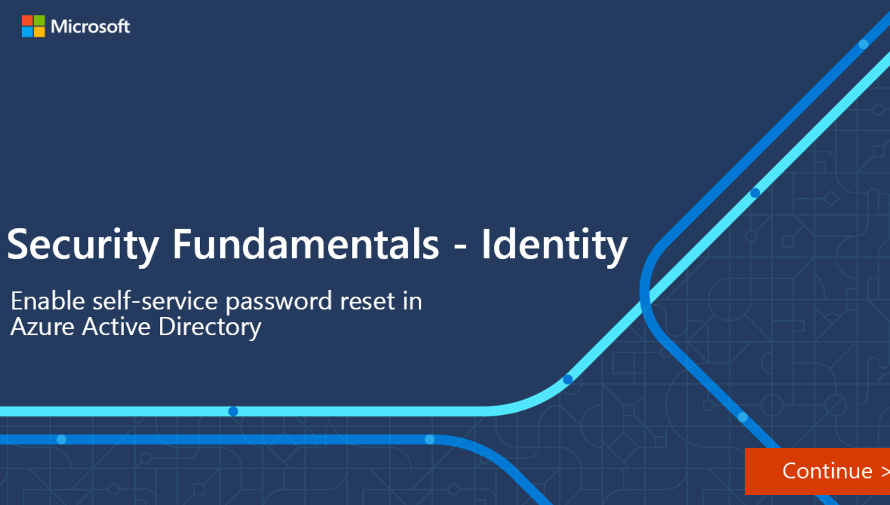

Self-service password reset (SSPR) is a feature of Azure AD that allows users to change or reset their password, without administrator or help desk involvement.

If a user's account is locked or they forget their password, users can follow a prompt to reset their password and get back to work. Self-service password reset has several benefits:

- It increases security, as help desks add an additional security layer, which could be compromised.
- It saves the organization money by reducing the number of calls and requests to help desk staff.
- It increases productivity, allowing the user can get back to work faster.

Self-service password reset works in the following scenarios:

- Password change - when a user knows their password but wants to change it to something new.
- Password reset - when a user can't sign in, such as when they forgot password, and want to reset their password.
- Account unlock - when a user can't sign in because their account is locked out and want to unlock their account.

To use self-service password reset, users must be:

- Assigned an Azure AD license, see **Licensing requirements for Azure Active Directory self-service password reset** in the Learn More section below.
- Enabled for SSPR by an administrator.
- Registered, with the authentication methods they want to use. Two or more authentication methods are recommended in case one is unavailable.

The following authentication methods are available for SSPR:

- Mobile app notification
- Mobile app code
- Email
- Mobile phone
- Office phone
- Security questions

When a user resets their password using self-service password reset, that password can also be written back to an on-premises Active Directory. Password writeback allows users to use their updated credentials with on-premises devices and applications without a delay.

To keep users informed about account activity, admins can configure e-mail notifications to be sent when an SSPR event happens. These notifications can cover both regular user accounts and admin accounts. For admin accounts, this notification provides an additional layer of awareness when a privileged administrator account password is reset using SSPR. All global admins would be notified when SSPR is used on an admin account.

## Interactive Guide

In this interactive guide, you'll enable self-service password reset for users in Azure Active Directory.

