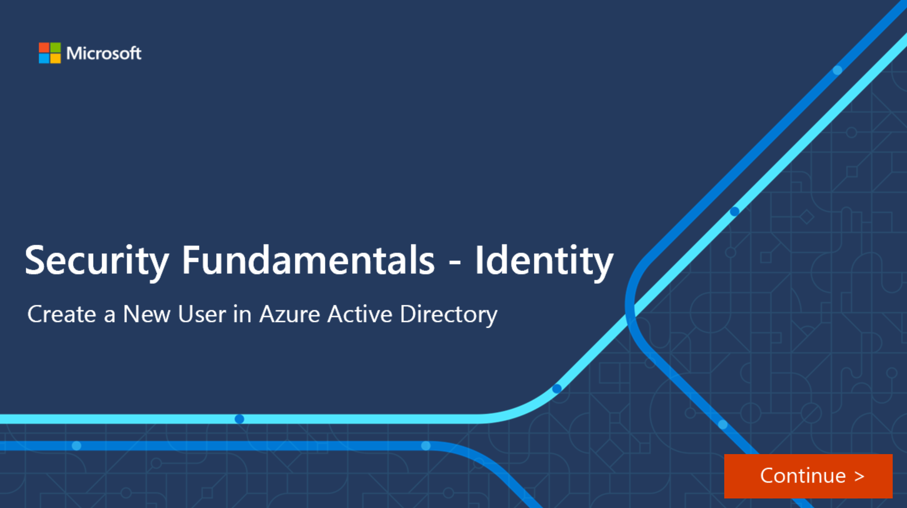

Azure AD manages different types of identities: users, service principals, managed identities, and devices. In this unit, we consider each type of Azure AD identity.

## User

A user identity is a representation of something that's managed by Azure AD.  Employees and guests are represented as users in Azure AD. If you have several users with the same access needs, you can create a group. You use groups to give access permissions to all members of the group, instead of having to assign access rights individually.

Azure AD business-to-business (B2B) collaboration, a feature within External Identities, includes the capability to add guest users. With B2B collaboration, an organization can securely share applications and services with guest users from another organization.

## Interactive guide

In the following interactive guide, you'll add a new user to Azure Active Directory.

## Service principal

A service principal is a security identity used by applications or services to access specific Azure resources. You can think of it as an identity for an application.

For an application to delegate its identity and access functions to Azure AD, the application must first be registered with Azure AD.  The process of registering creates a globally unique app object that's stored in your home tenant or directory. A service principal is created in each tenant where the application is used and references the globally unique app object. The service principal defines what the app does in the tenant, such as who accesses the app, and what resources the app can access.

## Managed identity

A managed identity is automatically managed in Azure AD. Managed identities are typically used to manage the credentials for authenticating a cloud application with an Azure service.

There are several benefits to using managed identities, including:

- Application developers can authenticate to services that support managed identities for Azure resources. For a complete list of services, refer to [Azure Services that support managed identities](/azure/active-directory/managed-identities-azure-resources/services-support-managed-identities).
- Any Azure service that supports Azure AD authentication can use managed identities to authenticate to another Azure service; for example, accessing Azure Key Vault.
- Managed identities can be used without any extra cost.

There are two types of managed identities: system-assigned and user-assigned.

**System-assigned**. Some Azure services allow you to enable a managed identity directly on a service instance. When you enable a system-assigned managed identity, an identity is created in Azure AD that's tied to the lifecycle of that service instance. When the resource is deleted, Azure automatically deletes the identity for you. By design, only that Azure resource can use this identity to request tokens from Azure AD.

**User-assigned**. You may also create a managed identity as a standalone Azure resource. A user-assigned managed identity is assigned to one or more instances of an Azure service. You can create a user-assigned managed identity and assign it to one or more instances of an Azure service. With user-assigned managed identities, the identity is managed separately from the resources that use it.

The following table summarizes the differences between system-assigned and user-assigned managed identities:

|Property  |System-assigned managed identity  |User-assigned managed identity  |
|---------|---------|---------|
|Creation|Created as part of an Azure resource, such as an Azure virtual machine or Azure App Service.|Created as a standalone Azure resource.|
|Lifecycle|Shared lifecycle with the Azure resource. When the parent resource is deleted, the managed identity is also deleted.|Independent life cycle. Must be explicitly deleted.|
|Sharing across Azure resources|Cannot be shared. Associated with a single Azure resource.|Can be shared. A user-assigned managed identity can be associated with more than one Azure resource.|
|Common use cases|Workloads that are contained within a single Azure resource.  Workloads for which you need independent identities, such as an application that runs on a single virtual machine.|Workloads that run on multiple resources and which can share a single identity.  Workloads that need preauthorization to a secure resource as part of a provisioning flow.  Workloads where resources are recycled frequently, but permissions should stay consistent.  For example, a workload where multiple virtual machines need to access the same resource.|

## Device

A device is a piece of hardware, such as mobile devices, laptops, servers, or printer.  Device identities can be set up in different ways in Azure AD, to determine properties such as who owns the device. Managing devices in Azure AD allows an organization to protect its assets by using tools such as Microsoft Intune to ensure standards for security and compliance. Azure AD also enables single sign-on to devices, apps, and services from anywhere through these devices.

There are multiple options for getting devices into Azure AD:

- **Azure AD registered devices** can be Windows 10, iOS, Android, or macOS devices. Devices that are Azure AD registered are typically owned personally, rather than by the organization.  They're signed in with a personal Microsoft account or another local account.  
- **Azure AD joined** devices exist only in the cloud. Azure AD joined devices are owned by an organization and signed in with their account. Users sign in to their devices with their Azure AD or synced Active Directory work or school accounts. You can configure Azure AD joined devices for all Windows 10 devices (except Windows 10 Home).
- **Hybrid Azure AD joined devices** can be Windows 7, 8.1, or 10, or Windows Server 2008, or newer. Devices that are hybrid Azure AD joined are owned by an organization and signed in with an Active Directory Domain Services account belonging to that organization. They exist in the cloud and on-premises.

IT admins can use tools like Microsoft Intune, a mobile device management (MDM) solution, to manage devices. Refer to [Microsoft Intune](/mem/intune/fundamentals/what-is-intune) for more information.
