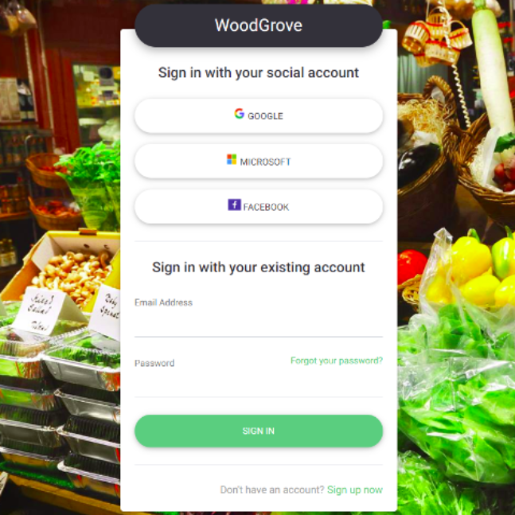

Today’s world is about collaboration, working with people both inside and outside of your organization. That means you'll sometimes need to provide access to your organization’s applications or data to external users.

Azure AD External Identities is a set of capabilities that enable organizations to allow access to external users, such as customers or partners. Your customers, partners, and other guest users can "bring their own identities" to sign in.

This ability for external users is enabled through Azure AD support of external identity providers like other Azure AD tenants, Facebook, Google, or enterprise identity providers. Admins can set up federation with identity providers so your external users can sign in with their existing social or enterprise accounts instead of creating a new account just for your application.

There are two different Azure AD External Identities: B2B and B2C.

- B2B collaboration allows you to share your apps and resources with external users.
- B2C is an identity management solution for consumer and customer facing apps.

## B2B collaboration

B2B collaboration allows you to share your organization’s applications and services with guest users from other organizations, while maintaining control over your own data. B2B collaboration uses an invitation and redemption process, allowing external users to access your resources with their credentials. Developers can customize the invitation and redemption process using Azure AD business-to-business APIs.

With B2B collaboration, external users are managed in the same directory as employees but are typically annotated as guest users. Guest users can be managed in the same way as employees, added to the same groups, and so on.  With B2B, SSO to all Azure AD-connected apps is supported.

## B2C access management

Azure AD B2C is a customer identity access management (CIAM) solution. Azure AD B2C allows external users to sign in with their preferred social, enterprise, or local account identities to get single sign-on to your applications. Azure AD B2C supports millions of users and billions of authentications per day. It takes care of the scaling and safety of the authentication platform, monitoring, and automatically handling threats like denial-of-service, password spray, or brute force attacks.

With Azure AD B2C, external users are managed in the Azure AD B2C directory, separately from the organization's employee and partner directory. SSO to customer owned apps within the Azure AD B2C tenant is also supported.

Azure AD B2C is an authentication solution that you can customize with your brand so that it blends with your web and mobile applications.

:::image type="content" source="../media/customized-screen.png" alt-text="Azure AD B2C customized sign-in screen":::

Azure AD External Identities is a feature of Premium P1 and P2 Azure AD editions, and pricing is based on Monthly Active Users. For more information, see [Azure AD pricing](https://azure.microsoft.com/pricing/details/active-directory/external-identities/).
