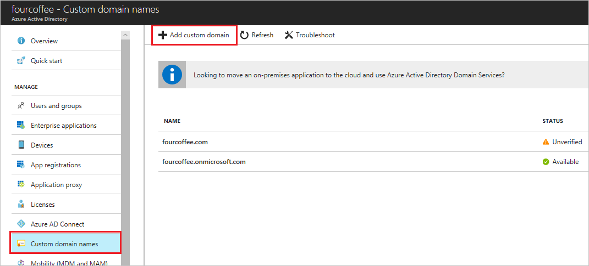
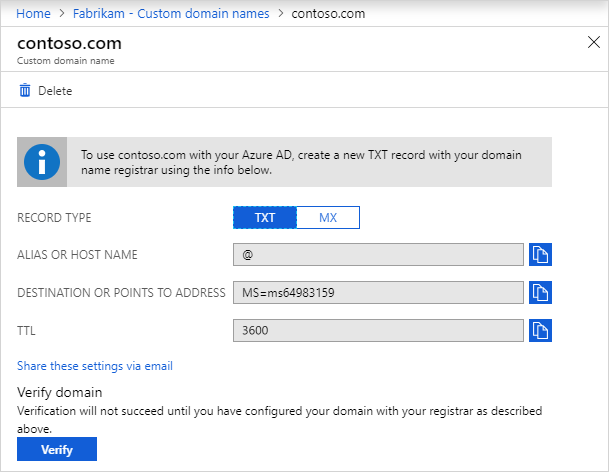
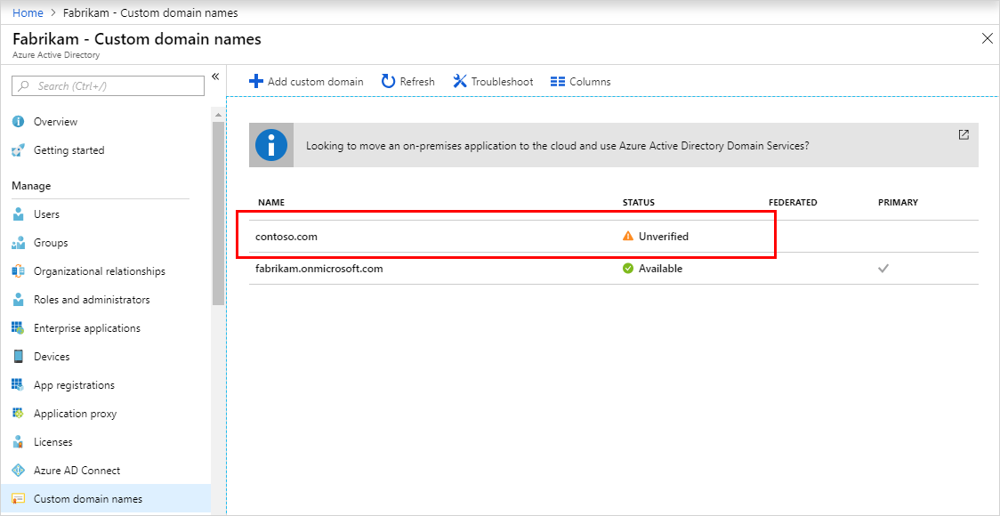
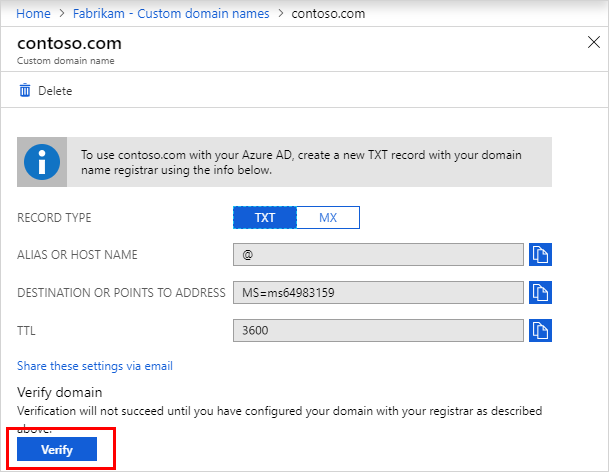

( from https://docs.microsoft.com/en-us/azure/active-directory/enterprise-users/domains-manage )

A domain name is an important part of the identifier for many Azure Active Directory (Azure AD) resources: it's part of a user name or email address for a user, part of the address for a group, and is sometimes part of the app ID URI for an application. A resource in Azure AD can include a domain name that's owned by the organization that contains the resource. Only a Global Administrator can manage domains in Azure AD.

## Set the primary domain name for your Azure AD organization

When your organization is created, the initial domain name, such as ‘contoso.onmicrosoft.com,’ is also the primary domain name. The primary domain is the default domain name for a new user when you create a new user. Setting a primary domain name streamlines the process for an administrator to create new users in the portal. To change the primary domain name:

1. Sign in to the [Azure portal](https://portal.azure.com/) with an account that's a Global Administrator for the organization.

1. Select **Azure Active Directory**.

1. Select **Custom domain names**.

1. Select the name of the domain that you want to be the primary domain.

1. Select the **Make primary** command. Confirm your choice when prompted.

You can change the primary domain name for your organization to be any verified custom domain that isn't federated. Changing the primary domain for your organization won't change the user name for any existing users.

## Add custom domain names to your Azure AD organization

You can add up to 900 managed domain names. If you're configuring all your domains for federation with on-premises Active Directory, you can add up to 450 domain names in each organization.

## Add subdomains of a custom domain

If you want to add a subdomain name such as ‘europe.contoso.com’ to your organization, you should first add and verify the root domain, such as contoso.com. The subdomain is automatically verified by Azure AD. To see that the subdomain you added is verified, refresh the domain list in the browser.

If you have already added a contoso.com domain to one Azure AD organization, you can also verify the subdomain europe.contoso.com in a different Azure AD organization. When adding the subdomain, you are prompted to add a TXT record in the DNS hosting provider.

## What to do if you change the DNS registrar for your custom domain name

If you change the DNS registrars, there are no additional configuration tasks in Azure AD. You can continue using the domain name with Azure AD without interruption. If you use your custom domain name with Microsoft 365, Intune, or other services that rely on custom domain names in Azure AD, see the documentation for those services.

## Delete a custom domain name

You can delete a custom domain name from your Azure AD if your organization no longer uses that domain name, or if you need to use that domain name with another Azure AD.

To delete a custom domain name, you must first ensure that no resources in your organization rely on the domain name. You can't delete a domain name from your organization if:

- Any user has a user name, email address, or proxy address that includes the domain name.

- Any group has an email address or proxy address that includes the domain name.

- Any application in your Azure AD has an app ID URI that includes the domain name.

You must change or delete any such resource in your Azure AD organization before you can delete the custom domain name.

### ForceDelete option

You can **ForceDelete** a domain name in the Azure AD Admin Center or using Microsoft Graph API. These options use an asynchronous operation and update all references from the custom domain name like “user@contoso.com” to the initial default domain name such as “user@contoso.onmicrosoft.com.”

To call **ForceDelete** in the Azure portal, you must ensure that there are fewer than 1000 references to the domain name, and any references where Exchange is the provisioning service must be updated or removed in the Exchange Admin Center. This includes Exchange Mail-Enabled Security Groups and distributed lists. Also, the **ForceDelete** operation won't succeed if either of the following is true:

- You purchased a domain via Microsoft 365 domain subscription services

- You are a partner administering on behalf of another customer organization

The following actions are performed as part of the **ForceDelete** operation:

- Renames the UPN, EmailAddress, and ProxyAddress of users with references to the custom domain name to the initial default domain name.

- Renames the EmailAddress of groups with references to the custom domain name to the initial default domain name.

- Renames the identifierUris of applications with references to the custom domain name to the initial default domain name.

An error is returned when:

- The number of objects to be renamed is greater than 1000

- One of the applications to be renamed is a multi-tenant app

## Add your custom domain name using the Azure Active Directory portal

(from https://docs.microsoft.com/en-us/azure/active-directory/fundamentals/add-custom-domain?context=azure/active-directory/users-groups-roles/context/ugr-context )

Every new Azure AD tenant comes with an initial domain name, *<domainname>.onmicrosoft.com*. You can't change or delete the initial domain name, but you can add your organization's names. Adding custom domain names helps you to create user names that are familiar to your users, such as *alain@contoso.com*.

### Before you begin

Before you can add a custom domain name, create your domain name with a domain registrar. For an accredited domain registrar, see [ICANN-Accredited Registrars](https://www.icann.org/registrar-reports/accredited-list.html).

### Create your directory in Azure AD

After you get your domain name, you can create your first Azure AD directory. Sign into the Azure portal for your directory, using an account with the **Owner** role for the subscription, to create your new directory.

> [!IMPORTANT]
> Important
> The person who creates the tenant is automatically the Global administrator for that tenant. The Global administrator can add additional administrators to the tenant.
> [!TIP]
> Tip
> If you plan to federate your on-premises Windows Server AD with Azure AD, then you need to select I plan to configure this domain for single sign-on with my local Active Directory when you run the Azure AD Connect tool to synchronize your directories.
You also need to register the same domain name you select for federating with your on-premises directory in the Azure AD Domain step in the wizard. To see what that setup looks like, see [Verify the Azure AD domain selected for federation](https://docs.microsoft.com/en-us/azure/active-directory/hybrid/how-to-connect-install-custom). If you don't have the Azure AD Connect tool, you can [download it here](https://go.microsoft.com/fwlink/?LinkId=615771).

### Add your custom domain name to Azure AD

After you create your directory, you can add your custom domain name.

1. Sign in to the [Azure portal](https://portal.azure.com/) using a Global administrator account for the directory.

1. Search for and select *Azure Active Directory* from any page. Then select **Custom domain names** > **Add custom domain**.

1. In **Custom domain name**, enter your organization's new name, in this example, *contoso.com*. Select **Add domain**.

> [!IMPORTANT]
> Important
> You must include .com, .net, or any other top-level extension for this to work properly.
The unverified domain is added. The contoso.com page appears showing your DNS information. Save this information. You need it later to create a TXT record to configure DNS.

### Add your DNS information to the domain registrar

After you add your custom domain name to Azure AD, you must return to your domain registrar and add the Azure AD DNS information from your copied TXT file. Creating this TXT record for your domain verifies ownership of your domain name.

Go back to your domain registrar and create a new TXT record for your domain based on your copied DNS information. Set the time to live (TTL) to 3600 seconds (60 minutes), and then save the record.

> [!IMPORTANT]
> Important
> You can register as many domain names as you want. However, each domain gets its own TXT record from Azure AD. Be careful when you enter the TXT file information at the domain registrar. If you enter the wrong or duplicate information by mistake, you'll have to wait until the TTL times out (60 minutes) before you can try again.
### Verify your custom domain name

After you register your custom domain name, make sure it's valid in Azure AD. The propagation from your domain registrar to Azure AD can be instantaneous or it can take a few days, depending on your domain registrar.

To verify your custom domain name, follow these steps:

1. Sign in to the [Azure portal](https://portal.azure.com/) using a Global administrator account for the directory.

1. Search for and select *Azure Active Directory* from any page, then select **Custom domain names**.

1. In **Custom domain names**, select the custom domain name. In this example, select **contoso.com**.

1. On the **contoso.com** page, select **Verify** to make sure your custom domain is properly registered and is valid for Azure AD.

After you've verified your custom domain name, you can delete your verification TXT or MX file.

