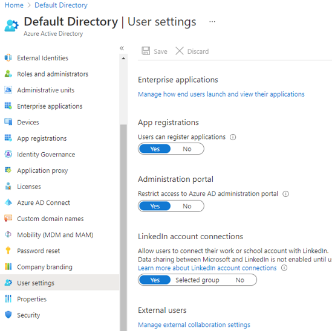
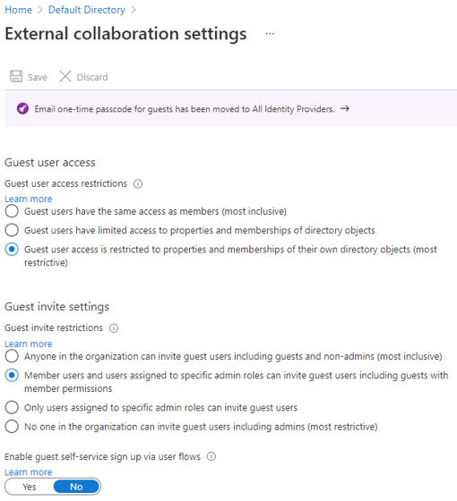

Tenant-wide settings are the configuration options that apply to all resources within your tenant as the name implies.  These tenant wide options are set in specific places, to control the look, feel, and configuration of your tenant and its members.

Tenant-wide option

- **Tenant Properties**
   - Azure AD --> Properties
   - Where you give the name of your directory and set values like the primary contact
- **User Settings**
   - Azure AD --> Users --> User Settings
   - Where you define what global rights your users have, like registering applications
- **External Collaboration Settings**
   - Azure AD --> Users --> User Settings --> Manage external collaboration
   - Where you define what task an external guest user can perform like inviting more guest users

## Configure tenant-wide user settings

> [!div class="mx-imgBorder"]
> 

In Azure Active Directory (Azure AD), all users are granted a set of default permissions. A user’s access consists of the type of user, their role assignments, and their ownership of individual objects. The default user permissions can be changed only in user settings in Azure AD.

### Member and guest users

The set of default permissions received depends on whether the user is a native member of the tenant (member user) or if the user is brought over from another directory as a B2B collaboration guest (guest user).

- Member users can register applications, manage their own profile photo and mobile phone number, change their own password, and invite B2B guests. In addition, users can read all directory information (with a few exceptions).

- Guest users have restricted directory permissions. They can manage their own profile, change their own password, and retrieve some information about other users, groups, and apps; however, they cannot read all directory information. For example, guest users cannot enumerate the list of all users, groups, and other directory objects. Guests can be added to administrator roles, which grant them full read and write permissions contained in the role. Guests can also invite other guests.

The following default permissions for member users can be restricted in the following ways:

| **Permission**| **Setting explanation**|
| :--- | :--- |
| Users can register application| <ul><li>By default, member users can register applications.</li> <li>Setting this option to No prevents users from creating application registrations. The ability can then be granted back to specific individuals by adding them to the Application Developer role.</li></ul>|
| Restrict access to Azure AD administration portal| <ul><li>Setting this option to No lets non-administrators use the Azure AD administration portal to read and manage Azure AD resources. Yes restricts all non-administrators from accessing any Azure AD data in the administration portal.</li> <li>This setting does not restrict access to Azure AD data using PowerShell or other clients such as Visual Studio. When set to Yes, to grant a specific non-admin user the ability to use the Azure AD administration portal assign any administrative role such as the Directory Readers role.</li> <li>This role allows reading basic directory information, which member users have by default (guests and service principals do not).</li></ul>|

### Sign in with LinkedIn

With more than 500 million members worldwide, LinkedIn is the largest and most trusted source of professional identities. Use this power to enhance the sign-in experience of your sites and applications.

Use sign in with LinkedIn to:

- Reduce friction and obtain more sign-ups by allowing members to Sign In with LinkedIn, without having the need to create a new account.

- Minimize the costs and time associated with implementing your own login, identity, profile management, and password management.

- Personalize your sites and applications with the latest member profiles.

### Manage security defaults

Managing security can be difficult with common identity-related attacks like password spray, replay, and phishing becoming more and more popular. Security defaults make it easier to help protect your organization from these attacks with preconfigured security settings:

- Requiring all users to register for Azure AD Multi-factor Authentication(MFA).

- Requiring administrators to perform multifactor authentication.

- Blocking legacy authentication protocols.

- Requiring users to perform multifactor authentication when necessary.

- Protecting privileged activities like access to the Azure portal.

### Availability

Microsoft is making security defaults available to everyone. The goal is to ensure that all organizations have a basic level of security enabled at no extra cost.

## Configure the external user options

> [!div class="mx-imgBorder"]
> 

Here you configure the actions that external users can take while using the cloud resources of your tenant.

- **Guest user access** - Guest users can be given rights to where they operate almost as a full user, to restriction where they can only look at their own content.
- **Guest invite settings** - Who can invite guests to join the organization; from guest themselves to only admins.
- **Guest self-service up** - Allow guest to partake in self-service options for users.

## Configure tenant properties for the directory

> [!div class="mx-imgBorder"]
> 

Set the basic values the define the look at feel of your tenant within Azure AD.

- **Name** - friendly name for your tenant, for use in the Azure portal
- **Country or region** - location of your primary company and the Azure datacenters being used
- **Notification language** - language used for sending notifications and alerts
- **Tenant ID** - unique identifier for your tenant to be used programatically, as needed
- **Technical contact** - primary contact for the tenant, defaults to the user who created the tenant
- **Global privacy contact** - user or alias to content for privacy topics
- **Privacy statement URL** - link to a PDF or webpage containing the privacy rules for your cloud solutions
