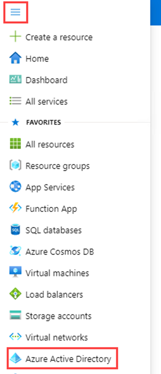
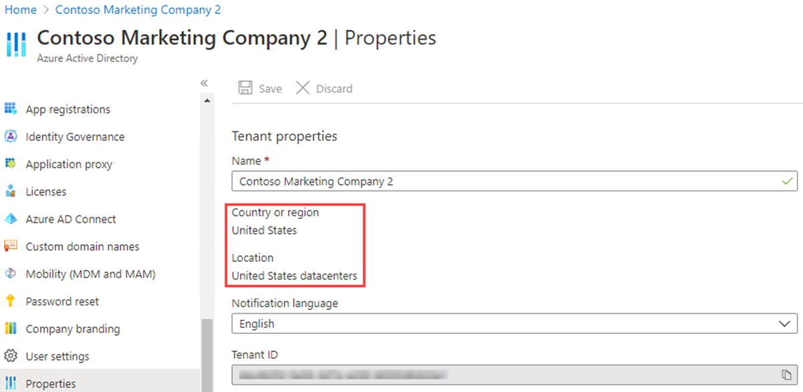
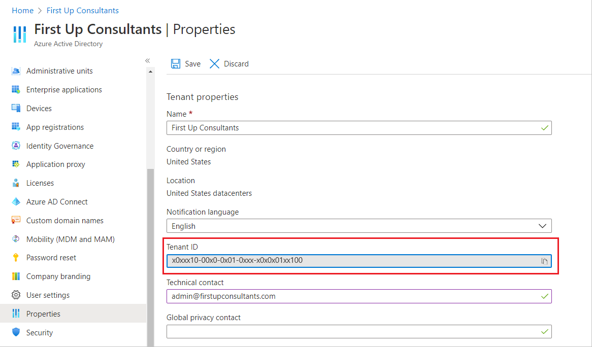
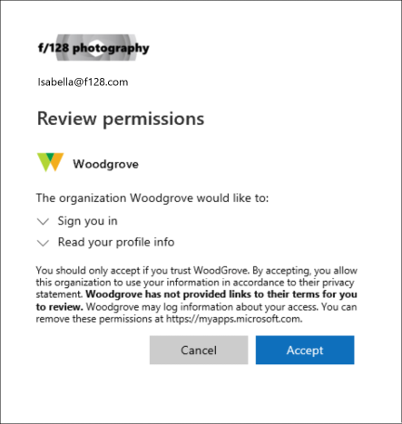

### Changing the tenant display name

1. Browse to the [Azure portal](https://portal.azure.com/) and sign in using a Global administrator account for the directory.

1. Select the **Show portal menu** hamburger icon and then select **Azure Active Directory**.

> [!div class="mx-imgBorder"]
> 

1. In the left navigation, in the Manage section, select **Properties**.

1. In the **Name** box, change the tenant name. For example, Contoso Marketing Company can be changed to Contoso Marketing Company 2.

1. Select **Save** to update the tenant properties.

### Finding the Country or region associated with your tenant

1. In the **Azure Active Directory** blade, in the Manage section, select **Properties**.

1. Under **Tenant properties**, locate **Country or region** and review the information.

> [!IMPORTANT]
> When the tenant is created, the Country or region are specified at that time. This setting cannot be changed later.

### Finding the location associated with your tenant

Just as the Country or region are found in the Azure Active Directory Properties blade, so is the location information.

1. In the **Properties** blade, under **Tenant properties**, locate **Location** and review the information.

> [!div class="mx-imgBorder"]
> 

### Finding the tenant ID

Azure subscriptions have a trust relationship with Azure Active Directory (Azure AD). Azure AD is trusted to authenticate users, services, and devices for the subscription. Each subscription has a tenant ID associated with it, and there are a few ways you can find the tenant ID for your subscription.

1. In the **Azure Active Directory** blade, in the Manage section, select **Properties**.

1. Under **Tenant properties**, locate **Tenant ID**. This is your unique tenant identifier.

> [!div class="mx-imgBorder"]
> 

### Changing the Technical contact and adding your privacy info on Azure AD, including Global privacy contact and Privacy statement URL

Microsoft strongly recommends you add both your global privacy contact and your organization's privacy statement, so your internal employees and external guests can review your policies. Because privacy statements are uniquely created and tailored for each business, we strongly recommend you contact a lawyer for assistance.

> [!NOTE]
> For information about viewing or deleting personal data, see [Azure Data Subject Requests for the GDPR](https://docs.microsoft.com/microsoft-365/compliance/gdpr-dsr-azure). For more information about GDPR, see the [GDPR section of the Service Trust portal](https://servicetrust.microsoft.com/ViewPage/GDPRGetStarted).

You add your organization's privacy information in the **Properties** area of Azure AD. To access the Properties area and add your privacy information:

1. In the **Azure Active Directory** blade, in the Manage section, select **Properties**.

> [!div class="mx-imgBorder"]
> 

1. Add your privacy info for your employees:

- **Technical contact**. Type the email address for the person to contact for technical support within your organization.

- **Global privacy contact**. Type the email address for the person to contact for inquiries about personal data privacy. This person is also who Microsoft contacts if there's a data breach. If there's no person listed here, Microsoft contacts your global administrators.

- **Privacy statement URL**. Type the link to your organization's document that describes how your organization handles both internal and external guest's data privacy.

> [!IMPORTANT]
> If you don't include either your own privacy statement or your privacy contact, your external guests will see text in the Review Permissions box that says, <your org name> has not provided links to their terms for you to review. For example, a guest user will see this message when they receive an invitation to access an organization through B2B collaboration.

> [!div class="mx-imgBorder"]
> 

1. Select **Save**.

