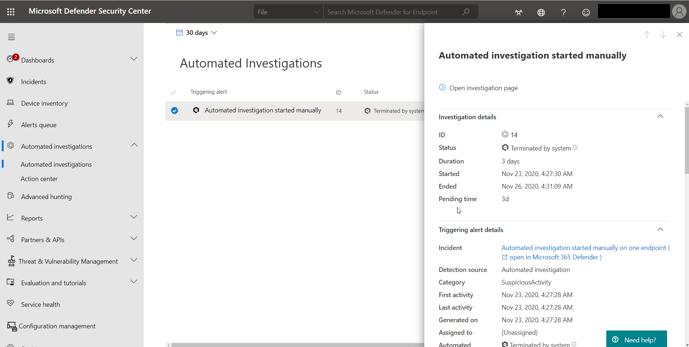
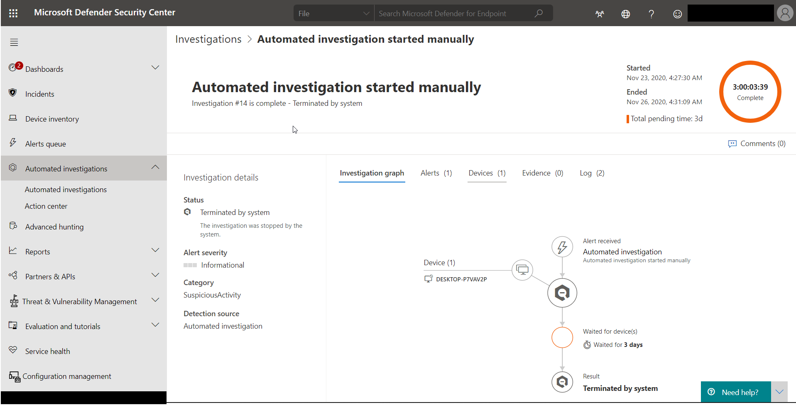

Your security operations team receives an alert whenever Microsoft Defender detects a malicious or suspicious artifact for Endpoint. Security operations teams face challenges in addressing the multitude of alerts that arise from the seemingly never-ending flow of threats. Microsoft Defender for Endpoint includes automated investigation and remediation (AIR) capabilities that can help your security operations team address threats more efficiently and effectively.

>[!VIDEO https://www.microsoft.com/videoplayer/embed/RE4bOeh?rel=0]

The technology in automated investigation uses various inspection algorithms and is based on processes that are used by security analysts. AIR capabilities are designed to examine alerts and take immediate action to resolve breaches. AIR capabilities significantly reduce alert volume, allowing security operations to focus on more sophisticated threats and other high-value initiatives. The Action center keeps track of all the investigations that were initiated automatically, along with details, such as investigation status, detection source, and any pending or completed actions.

## How the automated investigation starts

When an alert is triggered, a security playbook goes into effect. Depending on the security playbook, an automated investigation can start. For example, suppose a malicious file resides on a device. When that file is detected, an alert is triggered, and the automated investigation process begins. Microsoft Defender for Endpoint checks to see if the malicious file is present on any other devices in the organization. Details from the investigation, including verdicts (Malicious, Suspicious, and No threats found) are available during and after the automated investigation. To learn more about what happens after a verdict is reached, see Automated investigation results and remediation actions.

### Details of an automated investigation

During and after an automated investigation, you can view details about the investigation. Select a triggering alert to view the investigation details. From there, you can go to the Investigation graph, Alerts, Devices, Evidence, Entities, and Log tabs.

- **Alerts** - The alert(s) that started the investigation.

- **Devices** - The device(s) where the threat was seen.

- **Evidence** - The entities that were found to be malicious during an investigation.

- **Entities** - Details about each analyzed entity, including a determination for each entity type (Malicious, Suspicious, or No threats found).

- **Log** - The chronological, detailed view of all the investigation actions taken on the alert.

- **Pending actions** - If there are any actions awaiting approval as a result of the investigation, the Pending actions tab is displayed. On the Pending actions tab, you can approve or reject each action.

### How an automated investigation expands its scope

While an investigation is running, any other alerts generated from the device are added to an ongoing automated investigation until that investigation is completed. In addition, if the same threat is seen on other devices, those devices are added to the investigation.

If an incriminated entity is seen in another device, the automated investigation process expands its scope to include that device, and a general security playbook starts on that device. If ten or more devices are found during this expansion process from the same entity, then that expansion action requires approval and is visible on the Pending actions tab.

### How threats are remediated

As alerts are triggered and an automated investigation runs, a verdict is generated for each piece of evidence investigated. Verdicts can be Malicious, Suspicious, or No threats found.

As verdicts are reached, automated investigations can result in one or more remediation actions. Examples of remediation actions include sending a file to quarantine, stopping a service, removing a scheduled task, and more. (See Remediation actions.)

Depending on the level of automation set for your organization, as well as other security settings, remediation actions can occur automatically or only upon approval by your security operations team. Additional security settings that can affect automatic remediation include protection from potentially unwanted applications (PUA).

All remediation actions, whether pending or completed, can be viewed in the Action Center [https://securitycenter.windows.com](https://securitycenter.windows.com?azure-portal=true). If necessary, your security operations team can undo a remediation action. 

## Automation levels in automated investigation and remediation capabilities

Automated investigation and remediation (AIR) capabilities in Microsoft Defender for Endpoint can be configured to one of several levels of automation. Your automation level affects whether remediation actions following AIR investigations are taken automatically or only upon approval.

- Full automation (recommended) means remediation actions are taken automatically on artifacts determined to be malicious.

- Semi-automation means some remediation actions are taken automatically, but other remediation actions await approval before being taken. (See the table in Levels of automation.)

- All remediation actions, whether pending or completed, are tracked in the Action Center

### Levels of automation

**Full - remediate threats automatically (also referred to as full automation)**

With full automation, remediation actions are performed automatically. All remediation actions that are taken can be viewed in the Action Center on the History tab. If necessary, a remediation action can be undone.

**Semi - require approval for any remediation (also referred to as semi-automation)**

With this level of semi-automation, approval is required for any remediation action. Such pending actions can be viewed and approved in the Action Center, on the Pending tab.

**Semi - require approval for core folders remediation (also a type of semi-automation)**

With this level of semi-automation, approval is required for any remediation actions needed on files or executables that are in core folders. Core folders include operating system directories, such as the Windows (\windows\*).

Remediation actions can be taken automatically on files or executables that are in other (non-core) folders.

Pending actions for files or executables in core folders can be viewed and approved in the Action Center, on the Pending tab.

Actions that were taken on files or executables in other folders can be viewed in the Action Center, on the History tab.

**Semi - require approval for non-temp folders remediation (also a type of semi-automation)**

With this level of semi-automation, approval is required for any remediation actions needed on files or executables that are not in temporary folders.

Temporary folders can include the following examples:

- \users\*\appdata\local\temp\*

- \documents and settings\*\local settings\temp\*

- \documents and settings\*\local settings\temporary\*

- \windows\temp\*

- \users\*\downloads\*

- \program files\

- \program files (x86)\*

- \documents and settings\*\users\*

Remediation actions can be taken automatically on files or executables that are in temporary folders.

Pending actions for files or executables that are not in temporary folders can be viewed and approved in the Action Center, on the Pending tab.

Actions that were taken on files or executables in temporary folders can be viewed and approved in the Action Center on the History tab.

**No automated response (also referred to as no automation)**

With no automation, the automated investigation does not run on your organization's devices. As a result, no remediation actions are taken or pending as a result of an automated investigation. However, other threat protection features, such as protection from potentially unwanted applications, can be in effect, depending on how your antivirus and next-generation protection features are configured.

Using the no automation option is not recommended because it reduces the security posture of your organization's devices. Consider setting up your automation level to full automation (or at least semi-automation).

### Important points about automation levels

Full automation has proven to be reliable, efficient, and safe, and is recommended for all customers. Full automation frees up your critical security resources so they can focus more on your strategic initiatives.  If your security team has defined device groups with a level of automation, those settings are not changed by the new default settings that are rolling out.

## View Investigations

To view automated investigations, select the Automated investigations in the portal navigation.  You can preview the investigation or go to the investigation page.

You can view the details of an automated investigation to see information such as the investigation graph, alerts associated with the investigation, the device that was investigated, and other information.

### Investigation graph

The investigation graph provides a graphical representation of an automated investigation. All investigation-related information is simplified and arranged in specific sections. Clicking on any of the icons brings you the relevant section where you can view more information.

A progress ring shows two status indicators:

- Orange ring - shows the pending portion of the investigation

- Green ring - shows the running time portion of the investigation

- Image of start, end, and pending time for an automated investigation

### Alerts

The Alerts tab for an automated investigation shows details such as a short description of the alert that initiated the automated investigation, severity, category, the device associated with the alert, user, time in queue, status, investigation state, and to whom the investigation is assigned.

Additional alerts seen on a device can be added to an automated investigation as long as the investigation is ongoing.

Selecting an alert using the check box brings up the alerts details pane where you can open the alert page, manage the alert by changing its status, see alert details, automated investigation details, related device, logged-on users, and comments and history.

Clicking on an alert title brings you to the alert page.

### Devices

The Devices tab Shows details of the device name, IP address, group, users, operating system, remediation level, investigation count, and when it was last investigated.  Devices that show the same threat can be added to an ongoing investigation and will be displayed in this tab. If ten or more devices are found during this expansion process from the same entity, then that expansion action will require approval and will be seen in the Pending actions view.

Selecting a device using the checkbox brings up the device details pane where you can see more information such as device details and logged-on users. Clicking on a device name brings you to the device page.

### Evidence

The Evidence tab shows details related to threats associated with this investigation.

### Entities

The Entities tab shows details about entities such as files, processes, services, drives, IP addresses, and the table details, such as the number of entities that were analyzed. You'll gain insight into details such as how many are remediated, suspicious, or had no threats found.

### Log

The Log tab gives a detailed, chronological view of all the investigation actions taken on the alert. You'll see the action type, action, status, device name, description of the action, comments entered by analysts who may have worked on the investigation, execution start time, duration, pending duration.

As with other sections, you can customize columns, select the number of items to show per page, and filter the log. Available filters include action type, action, status, device name, and description.  You can also click on an action to bring up the details pane where you'll see information such as the summary of the action and input data.

### Pending actions

When you select the pending actions link, you'll be taken to the Action center. You can also access the page from the navigation page by going to automated investigation > Action center.

