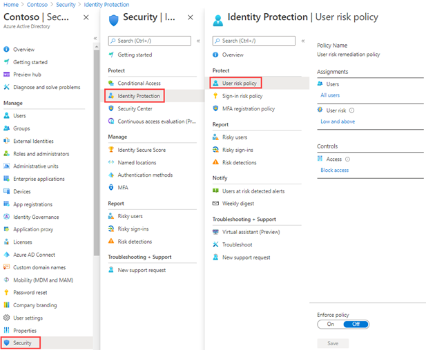

## Enable user risk policy

1. Sign in to the [Azure portal](https://portal.azure.com/) using a Global administrator account.

2. Open the portal menu and then select **Azure Active Directory**.

3. On the Azure Active Directory blade, under **Manage**, select **Security**.

4. On the Security blade, in the left navigation, select **Identity protection**.

5. In the Identity protection blade, in the left navigation, select User risk policy.

6. Under **Assignments**, select **All users** and review the available options.

   You can select from **All users** or **Select individuals and groups** if limiting your rollout.

   Additionally, you can choose to exclude users from the policy.

7. Under **User risk**, select **Low and above**.

8. In the User risk pane, select **High** and then select **Done**.

9. Under **Controls** > **Access**, select **Block access**.

10. In the Access pane, review the available options.

> [!TIP]
> Microsoft's recommendation is to Allow access and Require password change.

11. Select the **Require password change** check box and then select **Done**.

12. Under **Enforce Policy**, select **On** and then select **Save**.

## Enable sign-in risk policy

1. On the Identity protection blade, in the left navigation, select **Sign-in risk policy**.

1. As with the User risk policy, the Sign-in risk policy can be assigned to users and groups and allows you to exclude users from the policy.

1. Under **Sign-in risk**, select **Medium and above**.

1. In the Sign-in risk pane, select **High** and then select **Done**.

1. Under **Controls** > **Access**, select **Block access**.

1. Select the **Require multi-factor authentication** check box and then select **Done**.

1. Under **Enforce Policy**, select **On** and then select **Save**.

