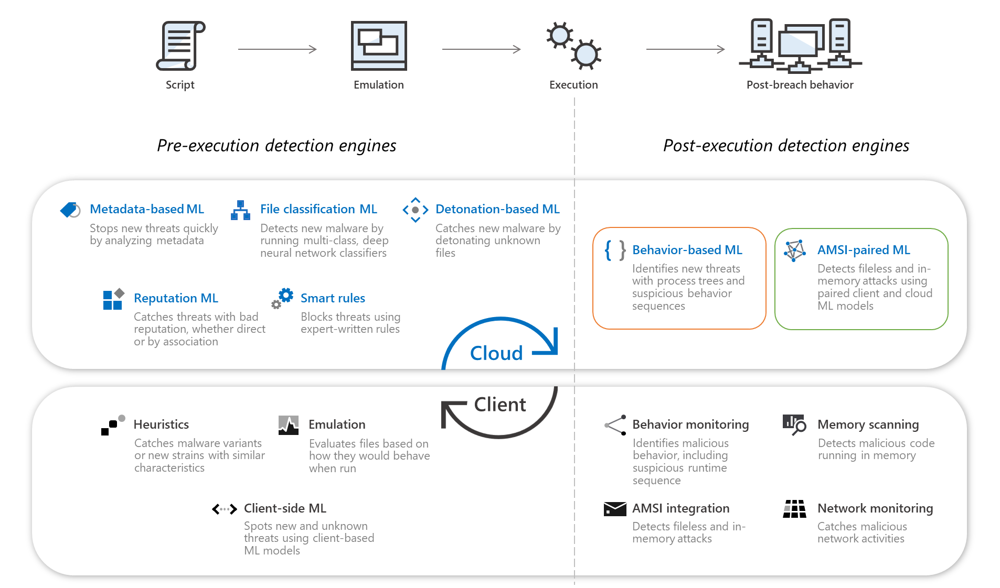
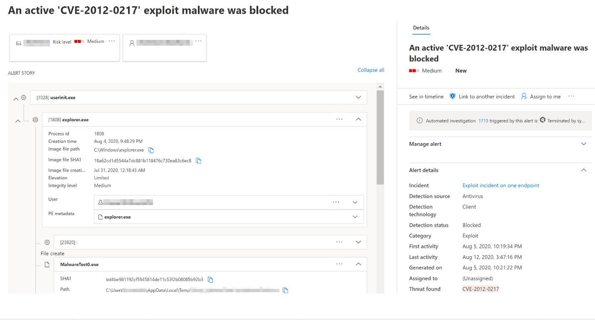

Today’s threat landscape is overrun by fileless malware that lives off the land, highly polymorphic threats that mutate faster than traditional solutions can keep up with, and human-operated attacks that adapt to what adversaries find on compromised devices. Traditional security solutions are not sufficient to stop such attacks. You need artificial intelligence (AI) and machine learning (ML) backed capabilities, such as behavioral blocking and containment, included in Defender for Endpoint.

Behavioral blocking and containment capabilities can help identify and stop threats based on their behaviors and process trees even when the threat has already started. Next-generation protection, EDR, and Defender for Endpoint components and features work together in behavioral blocking and containment capabilities.

Behavioral blocking and containment capabilities work with multiple components and features of Defender for Endpoint to stop attacks immediately and prevent attacks from progressing.

- Next-generation protection (which includes Microsoft Defender Antivirus) can detect threats by analyzing behaviors and stop threats that have started running.

- Endpoint detection and response (EDR) receives security signals across your network, devices, and kernel behavior. As threats are detected, alerts are created. Multiple alerts of the same type are aggregated into incidents, which makes it easier for your security operations team to investigate and respond.

- Defender for Endpoint has a wide range of optics across identities, email, data, and apps, as well as the network, endpoint, and kernel behavior signals received through EDR. A component of Microsoft 365 Defender, Defender for Endpoint processes and correlates these signals, raises detection alerts, and connects related alerts in incidents.

With these capabilities, more threats can be prevented or blocked, even if they start running. Whenever suspicious behavior is detected, the threat is contained, alerts are created, and threats are stopped in their tracks.

The following image shows an example of an alert that was triggered by behavioral blocking and containment capabilities:

## Client behavioral blocking

Client behavioral blocking is a component of behavioral blocking and containment capabilities in Defender for Endpoint. As suspicious behaviors are detected on devices (also referred to as clients or endpoints), artifacts (such as files or applications) are blocked, checked, and remediated automatically.

### How client behavioral blocking works

Microsoft Defender Antivirus can detect suspicious behavior, malicious code, fileless and in-memory attacks, and more on a device. When suspicious behaviors are detected, Microsoft Defender Antivirus monitors and sends those suspicious behaviors and their process trees to the cloud protection service. Machine learning differentiates between malicious applications and good behaviors within milliseconds and classifies each artifact. As soon as an artifact is found to be malicious, it's blocked on the device.

Whenever a suspicious behavior is detected, an alert is generated and is visible in the Microsoft Defender Security Center

Client behavioral blocking is effective because it not only helps prevent an attack from starting, but it can help stop an attack that has begun executing. With feedback-loop blocking (another capability of behavioral blocking and containment), attacks are prevented on other devices in your organization.

### Behavior-based detections

Behavior-based detections are named according to the MITRE ATT&CK Matrix for Enterprise. The naming convention helps identify the attack stage where malicious behavior was observed:

| Tactic| Detection threat name|
| :--- | :--- |
| Initial Access| Behavior:Win32/InitialAccess.*!ml|
| Execution| Behavior:Win32/Execution.*!ml|
| Persistence| Behavior:Win32/Persistence.*!ml|
| Privilege Escalation| Behavior:Win32/PrivilegeEscalation.*!ml|
| Defense Evasion| Behavior:Win32/DefenseEvasion.*!ml|
| Credential Access| Behavior:Win32/CredentialAccess.*!ml|
| Discovery| Behavior:Win32/Discovery.*!ml|
| Lateral Movement| Behavior:Win32/LateralMovement.*!ml|
| Collection| Behavior:Win32/Collection.*!ml|
| Command and Control| Behavior:Win32/CommandAndControl.*!ml|
| Exfiltration| Behavior:Win32/Exfiltration.*!ml|
| Impact| Behavior:Win32/Impact.*!ml|
| Uncategorized| Win32/Generic.*!ml|

## Feedback-loop blocking

Feedback-loop blocking, also referred to as rapid protection, is a component of behavioral blocking and containment capabilities in Microsoft Defender for Endpoint. With feedback-loop blocking, devices across your organization are better protected from attacks.

### How feedback-loop blocking works

When a suspicious behavior or file is detected, such as by Microsoft Defender Antivirus, information about that artifact is sent to multiple classifiers. The rapid protection loop engine inspects and correlates the information with other signals to arrive at a decision as to whether to block a file. Checking and classifying artifacts happens quickly. It results in rapid blocking of confirmed malware and drives protection across the entire ecosystem.

With rapid protection in place, an attack can be stopped on a device, other devices in the organization, and devices in other organizations, as an attack attempts to broaden its foothold.

## EDR in block mode

When endpoint detection and response (EDR) in block mode is turned on, Defender for Endpoint blocks malicious artifacts or behaviors that are observed through post-breach protection. EDR in block mode works behind the scenes to remediate malicious artifacts that are detected post-breach.

>[!VIDEO https://www.microsoft.com/videoplayer/embed/RE4HjW2?rel=0]

EDR in block mode is also integrated with threat & vulnerability management. Your organization's security team will get a security recommendation to turn EDR in block mode on if it isn't already enabled.

### What happens when something is detected?

When EDR in block mode is turned on and a malicious artifact is detected, blocking and remediation actions are taken. You'll see detection status as Blocked or Prevented as completed actions in the Action Center.

The following image shows an instance of unwanted software that was detected and blocked through EDR in block mode:

