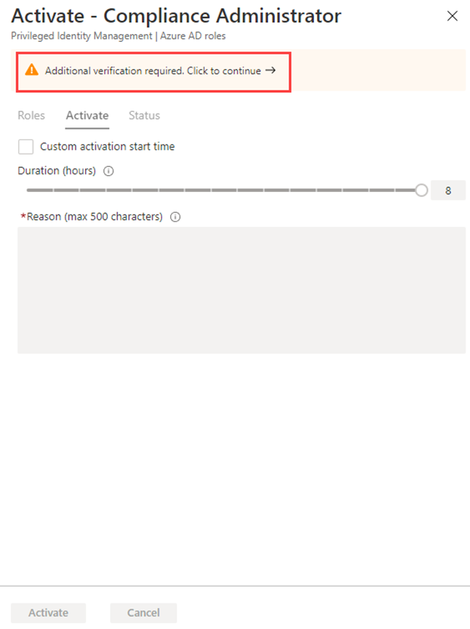

With Azure Active Directory (Azure AD), a Global administrator can make permanent Azure AD admin role assignments. These role assignments can be created using the Azure portal or using PowerShell commands.

The Azure AD Privileged Identity Management (PIM) service also allows Privileged role administrators to make permanent admin role assignments. Additionally, Privileged role administrators can make users eligible for Azure AD admin roles. An eligible administrator can activate the role when they need it, and then their permissions expire once they're done.

## Assign a role

Follow these steps to make a user eligible for an Azure AD admin role.

1. Sign in to the [Azure portal](https://portal.azure.com/) as a tenant administrator.

2. Search for and then select **Azure AD Privileged Identity Management.**

3. In the Privileged Identity Management blade, in the left navigation, select **Azure AD roles.**

4. On the Quick start page, in the left navigation, select **Roles**.

5. On the top menu, select **+ Add assignments.**

   > [!div class="mx-imgBorder"]
   > 

6. In the Add assignments blade, on the **Membership** tab, review the settings.

7. Select the **Select role** menu and then select **Compliance Administrator**.

   You can use the **Search role by name** filter to help located a role.

8. Under **Select member(s),** select **No members selected**.

9. In the Select a member pane, select your administrator account and then select **Select**.

   > [!div class="mx-imgBorder"]
   > 

10. In the Add assignments blade, select **Next**.

11. On the **Settings** tab, under **Assignment type**, review the available options. For this task, use the default setting.

     - Eligible assignments require the member of the role to perform an action to use the role. Actions might include performing a multi-factor authentication (MFA) check, providing a business justification, or requesting approval from designated approvers.

     - Active assignments do not require the member to perform any action to use the role. Members assigned as active have the privileges always assigned to the role.

12. Review the remaining settings and then select **Assign**.

## Activate your Azure AD roles

When you need to assume an Azure AD role, you can request activation by opening **My roles** in Privileged Identity Management.

1. On the Privileged Identity Management blade, in the left navigation menu, select **My roles.**

2. In the My roles blade, review the list of eligible assignments.

   > [!div class="mx-imgBorder"]
   > 

3. In the Compliance Administrator role row, select **Activate**.

4. In the Activate – Compliance Administrator pane, select **Additional verification required** and then follow the instructions to provide additional security verification. You are required to authenticate only once per session.

   > [!div class="mx-imgBorder"]
   > 

5. After you have completed the additional security verification, in the Activate – Compliance Administrator pane, in the **Reason** box, enter the justification for activating this role.

6. Select **Activate**.

## Assign a role with restricted scope

For certain roles, the scope of the granted permissions can be restricted to a single admin unit, service principal, or application. This procedure is an example if assigning a role that has the scope of an administrative unit.

1. Browse to the Privileged Identity Management blade, and in the left navigation menu, select Azure **AD roles.**

2. In the Roles blade, on the top menu, select **+ Add assignments.**

3. In the Add assignments blade, select the **Select role** menu and then select **User administrator.**

4. Select the **Scope type** menu and review the available options. For now, you will use the **Directory** scope type.

   > [!TIP]
   > Go to [Manage administrative units in Azure Active Directory](https://docs.microsoft.com/azure/active-directory/roles/admin-units-manage) to find more information about the administrative unit scope type.

5. As you did when assigning a role without a restricted scope, you would add members and complete the settings options. For now, select **Cancel**.

## Update or remove an existing role assignment

Follow these steps to update or remove an existing role assignment.

1. In the Open Azure AD Privileged Identity Management > Azure AD roles blade, in the left navigation, select **Assignments**.

2. In **Assignments** list, for Compliance Administrator, review the options in the **Action** column.

    > [!div class="mx-imgBorder"]
    > 

3. Select **Update** and review the options available in the Membership settings pane. When complete, close the pane.

4. Select **Remove**.

5. In the **Remove** dialog box, review the information and then select **Yes**.

