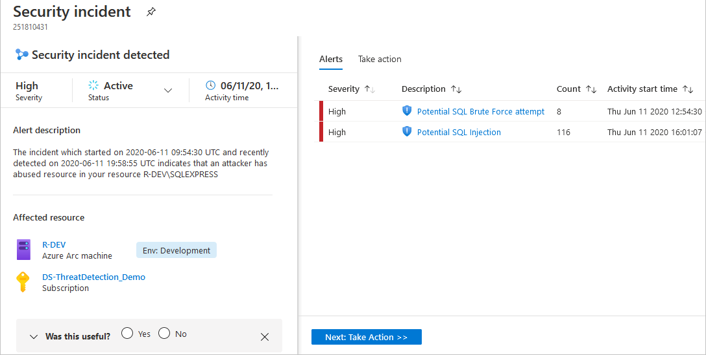

Triaging and investigating security alerts can be time consuming for even the most skilled security analysts. For many, it's hard to know where to begin.

Security Center uses analytics to connect the information between distinct security alerts. Using these connections, Security Center can provide a single view of an attack campaign and its related alerts to help you understand the attacker's actions and the affected resources.

Incidents appear on the Security alerts page. Select an incident to view the related alerts and get more information.

On the Security Center overview page, select the Security alerts tile. The incidents and alerts are listed. Notice that security incidents have a different icon to security alerts.

To view details, select an incident. The Security incident page shows more details.

The left pane of the security incident page shows high-level information about the security incident: title, severity, status, activity time, description, and the affected resource. Next to the affected resource, you can see the relevant Azure tags. Use these tags to infer the organizational context of the resource when investigating the alert.

The right pane includes the Alerts tab with the security alerts that were correlated as part of this incident.

To switch to the Take action tab, select the tab or the button at the bottom of the right pane. Use this tab to take further actions such as:

- Mitigate the threat - provides manual remediation steps for this security incident

- Prevent future attacks - provides security recommendations to help reduce the attack surface, increase security posture, and prevent future attacks

- Trigger automated response - provides the option to trigger a Logic App as a response to this security incident

- Suppress similar alerts - provides the option to suppress future alerts with similar characteristics if the alert isn’t relevant for your organization

To remediate the threats in the incident, follow the remediation steps provided with each alert.

