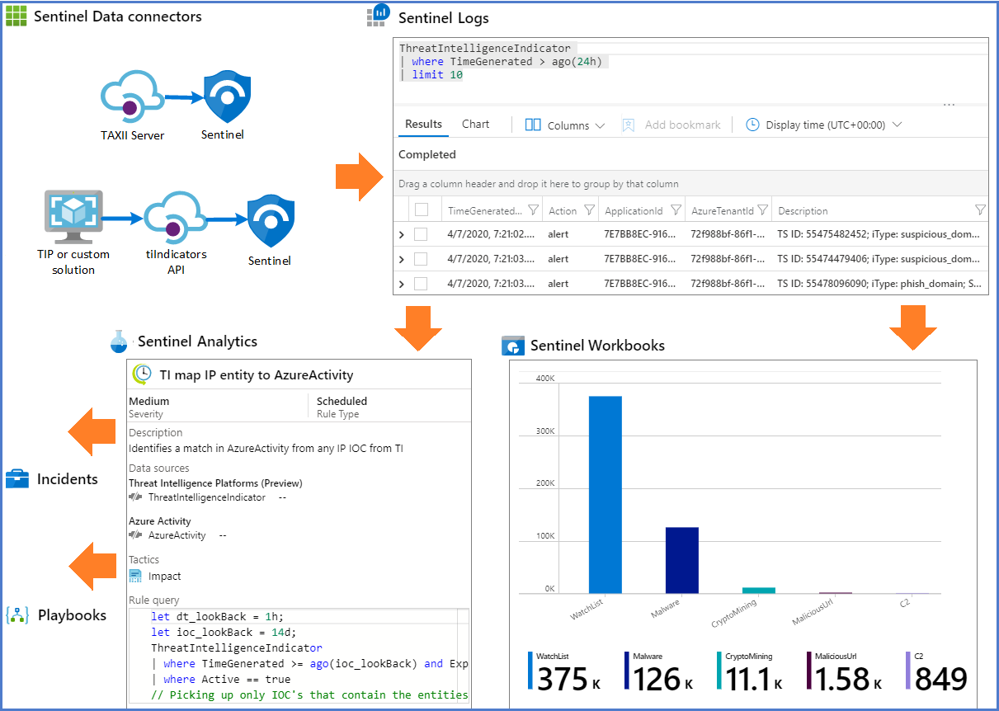

Cyber threat intelligence (CTI) is information describing known existing or potential threats to systems and users. This type of knowledge takes many forms, from written reports detailing a particular threat actor's motivations, infrastructure, and techniques, to specific observations of IP addresses, domains, and file hashes associated with cyber threats. Organizations use CTI to provide essential context to unusual activity so that security personnel can quickly take action to protect their people and assets. CTI can be sourced from many places, such as open-source data feeds, threat intelligence-sharing communities, commercial intelligence feeds, and local intelligence gathered in security investigations within an organization.

Within a Security Information and Event Management (SIEM) solution like Microsoft Sentinel, the most utilized form of CTI is threat indicators, often referred to as Indicators of Compromise or IoCs. Threat indicators are data that associate observations such as URLs, file hashes, or IP addresses with known threat activity such as phishing, botnets, or malware. This form of threat intelligence is often referred to as tactical threat intelligence because it can be applied to security products and automation on a large scale to protect and detect potential threats to an organization. In Microsoft Sentinel, you can use threat indicators to help detect malicious activity observed in your environment and provide context to security investigators to help inform response decisions.

You can integrate threat intelligence (TI) into Microsoft Sentinel through the following activities:

- Use Data connectors to various TI platforms to import threat intelligence into Microsoft Sentinel.

- View and manage the imported threat intelligence in Logs and the new Threat Intelligence area of Microsoft Sentinel.

- Use the built-in Analytics rule templates to generate security alerts and incidents using your imported threat intelligence.

- Visualize critical information about your threat intelligence in Microsoft Sentinel with the Threat Intelligence workbook.

- Perform threat hunting with your imported threat intelligence.

