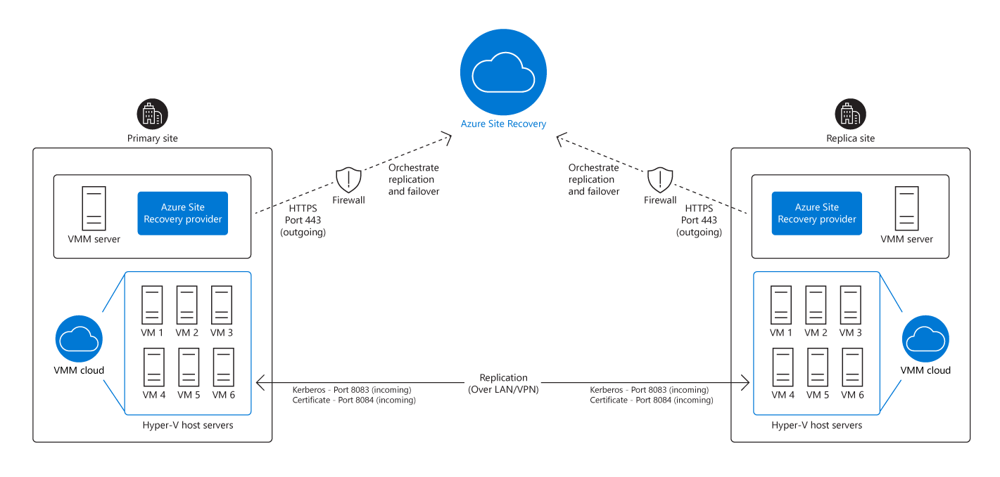

As a Contoso Windows server administrator, you need to assess what runtime scenarios are available with Site Recovery, and which of those scenarios are potentially applicable to Contoso workloads and environments. You've examined one option of implementing on-premises Hyper-V Replication to Azure, and now want to know how to use VMM to implement on-premises Hyper-V Replication.

### On-premises Hyper-V Replication to a secondary on-premises Hyper-V site (with VMM)

The following graphic illustrates two on-premises environments, a primary site and an identical replica site, both with VMM private cloud environments with Hyper-V host servers running six VMs. The private clouds contain a VMM management server with the Azure Site Recovery Provider installed, and have a connection to Azure Site Recovery over HTTPS and port 443 which orchestrates the replication and failover. Replication traffic goes directly between the two on-premises environments sites over HTTPS port 8083 for Kerberos traffic and 8084 for certificate traffic. Azure Site Recovery orchestrates the replication and failover between the two sites but not VM data replicates to Azure.

> [!IMPORTANT]
> Data never replicates to Site Recovery during the replication between two on-premises locations. Site Recovery only monitors replication between sites and controls failover; data does **not** transfer to, or through, Azure.

It's recommended to use VMM in your local environment to establish and manage replication to Site Recovery.

> [!NOTE] 
> You can use Site Recovery without having VMM deployed by choosing the option to establish replication between your on-premises Hyper-V and Azure.

To implement Site Recovery with VMM, perform the following high-level configuration steps.

#### Task 1: Create Azure resources

1. Create an **Azure Recovery Services vault** or a **Site Recovery vault**.
1. In a Recovery Services vault, you can:
    1. Specify the scenario in which you want to use Site Recovery.
    1. Register a VMM server (or VMM servers) with Site Recovery.
    1. Configure replication settings.
    1. Manage recovery plans.

    > [!NOTE] 
    > You can have multiple Recovery Services vaults in a single Azure subscription.

#### Task 2: Configure the Recovery Services vault

1. Register **VMM** with **Site Recovery**:
    1. Based on the scenario that you want to implement and the protection goals that you configure in the Recovery Services vault, you can download a **Site Recovery provider** and **vault registration key**.
    1. When you install the provider on a VMM management server, it registers the VMM with Site Recovery and sends configuration data about the cloud (or clouds) that are defined in the VMM.

#### Task 3: Prepare infrastructure

1. Prepare the infrastructure for Site Recovery.
1. In the infrastructure-planning step, you must:
    1. Specify the location of the machines with which you want to use Site Recovery.
    1. Specify where they should be replicated if they're virtualized and if you have completed deployment planning.
    1. Register the **VMM** with Site Recovery.
1. After registering the **VMM**, you can configure the cloud environments that you want to protect and the cloud to which the machines should be replicated, and then create and associate a **replication policy**.
    - A *replication policy* defines the replication settings, such as the copy frequency, authentication type, and data transfer compression.
1. Download and run the **Site Recovery Capacity Planner** to more accurately estimate network bandwidth, storage, and other requirements to meet your replication needs.

#### Task 4: Enable replication

1. Replicate the application.
1. Enable the replication of VMs from the protected cloud.
    - You can enable replication of a single VM or multiple VMs based on the infrastructure that you configured in the previous step.

#### Task 5: Manage a recovery plan

1. Create and customize a **recovery plan** for failover.
    - A *recovery plan* gathers machines into recovery groups for the purpose of failover.
    - A recovery plan helps you to define a systematic recovery process, by creating small, independent units that you can fail over. A unit typically represents an app in your environment.
    - A recovery plan controls how a Site Recovery failover is performed. It specifies the order in which VMs should start at the secondary location and more actions that should be performed during the failover.
1. Specify which VMs are included in the recovery plan, perform a test failover, a planned failover, an unplanned failover, and a reverse replication after failover.

> [!NOTE] 
> Site Recovery can orchestrate the failover of multiple VMs between the primary and secondary VMM cloud.
