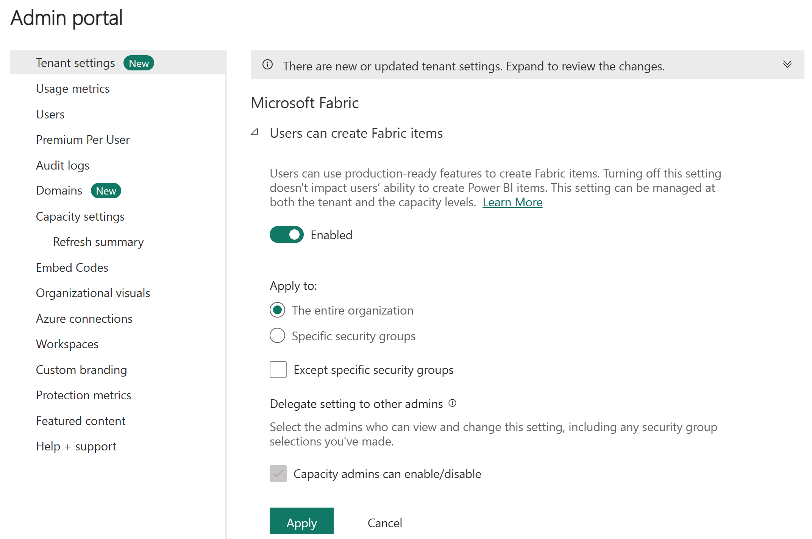
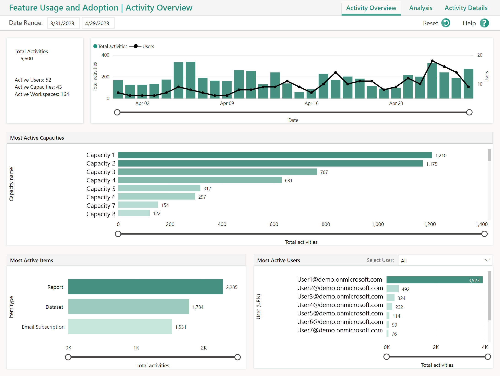

Now that you understand the Fabric architecture and what you and your colleagues may be doing with the product, let's look at the admin role and the tools you use to manage the platform.

There are several roles that work together to administer Microsoft Fabric for your organization. If you're a Microsoft 365 admin, a Power Platform admin, a Power BI admin, or a Fabric capacity admin, you are involved in administering Fabric.

> [!NOTE]
> See [What is Microsoft Fabric administration?](/fabric/admin/fabric-roles-responsibilities) for specific details on the different admin roles and responsibilities.

As a Fabric admin, you work primarily in the Fabric admin portal. You may also need familiarize yourself with: the [Microsoft 365 admin center](/microsoft-365/admin/admin-overview/admin-center-overview), the [Microsoft 365 Security & Microsoft Purview compliance portal](/microsoft-365/compliance/microsoft-365-compliance-center), [Azure Active Directory in the Azure portal](/azure/active-directory/fundamentals/active-directory-whatis), [PowerShell cmdlets](/powershell/power-bi/overview), and [administrative APIs and SDK](/rest/api/power-bi/admin).

## Describe admin tasks

As an admin, you may be responsible for a wide range of tasks to keep the Fabric platform running smoothly. These tasks include:

**Security and access control**: One of the most important aspects of Fabric administration is managing security and access control to ensure that only authorized users can access sensitive data. You can use role-based access control (RBAC) to define who can view and edit content, set up data gateways to securely connect to on-premises data sources, and use Azure Active Directory (Azure AD) to manage user access.  

**Data Management**: Effective Fabric administration requires a solid understanding of data management principles. You should know how to connect to various data sources, how to create data models, how to optimize data refresh performance, and how to monitor usage and performance metrics. You should also know how to apply data governance policies to ensure data accuracy and consistency.

**Collaboration and sharing**: Fabric allows users to collaborate in real-time, and as an admin, you play a key role in managing collaboration and sharing settings. You need to know how to control access to Fabric workspaces and items, manage permissions for sharing, and define content workflows and approval processes.
  
**Customization and configuration**: Fabric administration also involves customizing and configuring the platform to meet the needs of your organization. This could include defining data lineage and impact analysis, configuring data classification policies, and defining the look and feel of reports and dashboards.
  
**Monitoring and optimization**: As a Fabric admin, you need to know how to monitor the performance and usage of the platform, optimize resources, and troubleshoot issues. This includes configuring monitoring and alerting settings, optimizing query performance, managing capacity and scaling, and troubleshooting data refresh and connectivity issues.

Specific tasks may vary depending on the needs of your organization and the complexity of your Fabric implementation.

## Administrator Tools

You need to familiarize yourself with a few tools to effectively implement the tasks outlined above. Fabric admins can perform most admin tasks using one or more of the following tools: the Fabric admin portal, PowerShell cmdlets, admin APIs and SDKs, and the admin monitoring workspace.

### Fabric admin portal

Fabric's *admin portal* is a web-based portal where you can manage all aspects of the platform. In the admin portal you can manage groups and permissions,  configure data sources and gateways, and monitor usage and performance. You can also access the Fabric admin APIs and SDKs in the admin portal, which you'd use to automate common tasks and integrate Fabric with other systems.

> [!IMPORTANT]
> The Fabric admin portal is currently in preview. See [What is the Microsoft Fabric admin portal?](/power-platform/admin/fabric-admin-portal) for more information.

The admin portal enables you to turn settings on and off. There are many settings located in the admin portal, but there's one setting that we'd like to call out which may change your admin experience.

The *delegation* setting, located in tenant settings, allows you as an admin to assign specific administrative tasks to other users. This can help to reduce your workload as an admin, and also ensure that the appropriate users have the necessary permissions to perform their roles effectively.

### PowerShell cmdlets

Fabric provides a set of *[PowerShell cmdlets](/powershell/scripting/powershell-commands)* that you can use to automate common administrative tasks. A PowerShell cmdlet is a simple command that can be executed in PowerShell.

For example, you can use cmdlets in Fabric to systematically create and manage groups, configure data sources and gateways, and monitor usage and performance. You can also use the cmdlets to manage the Fabric admin APIs and SDKs.

> [!NOTE]
> See [Microsoft Power BI Cmdlets for Windows PowerShell and PowerShell Core](/powershell/power-bi/overview) for more resources on PowerShell cmdlets that work with Fabric.

### Admin APIs and SDKs

An admin *API and SDK* are tools that allow developers to interact with a software system programmatically. An API (Application Programming Interface) is a set of protocols and tools that enable communication between different software applications. An SDK (Software Development Kit) is a set of tools and libraries that helps developers create software applications that can interact with a specific system or platform. You can use APIs and SDKs to automate common administrative tasks and integrate Fabric with other systems.

For example, you can use the APIs and SDKs to create and manage groups, configure data sources and gateways, and monitor usage and performance. You can also use the APIs and SDKs to manage the Fabric admin APIs and SDKs.

You can make these requests using any HTTP client library that supports OAuth 2.0 authentication, such as Postman, or you can use PowerShell scripts to automate the process. For more information, see [Microsoft Power BI REST APIs](/rest/api/power-bi/).

### Admin monitoring workspace

The automatically created *admin monitoring workspace* is available to all Fabric admins, and gives you an overview of the total activities in your  environment, including the number of users, groups, and data sources. It also provides detailed information about the usage and performance of your Fabric environment, including the number of queries, data refreshes, and data sources. You can use this information to identify trends and patterns, and to troubleshoot issues.

As an admin, you can use the admin monitoring report to track the number of active users, capacities, and workspaces. You can also use the report to monitor the number of queries, data refreshes, and data sources.

This information can help you identify trends and patterns, and troubleshoot issues.

