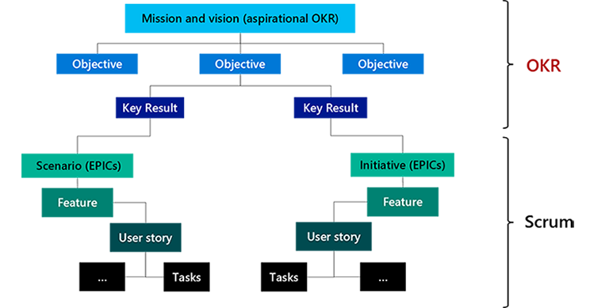

Continuous Planning is one of the eight DevOps capabilities.

Each capability identifies example practices. They aren't exhaustive lists.

### Discover why Continuous Planning is necessary

The **FBI Sentinel Project** was a software application developed by the U.S. Federal Bureau of Investigation between 2000 and 2005. The project wasn’t close to completion when it was officially abandoned in January 2005, having turned into a complete fiasco for the FBI. In addition to wasting at least US $100 million, the failure brought widespread criticism to the bureau and its director.

A second project was started in 2006, with similar disastrous results. The two efforts used big design up front and the Waterfall development methodology, with a classic planned big bang go-live event. They ended with nothing delivered and hundreds of millions of dollars spent.

#### Why did these attempts fail?

- **Big design up front** – 200-person team spent six months creating the requirements.
- **Shifting priorities** – 9/11 happened partway through the project, resulting in massive scope change – and another 300-person team worked for six months, which resulted in 600 pages of requirements.
- **Wasted effort and rework** led to missed deadlines and team burnout – 700,000 lines of code being written and re-written.

In December 2010, a Scrum studio was set up in the base of the Hoover building. Staff was reduced from 400 on the original projects to 40. Design went from 600 pages of requirements to 670 user stories. The team shipped code and demonstrated new features every two weeks. After a few sprints, it became possible to forecast rough timescales and plan incremental business changes. They were code complete by December 2011.

#### But why is it difficult to plan well in detail?

Alan Turing developed a machine during World War II to crack the encryption device known as the Enigma Machine, which was used by the Nazis.

Turing had to constantly decipher new codes to save lives. Instead of giving up because of the seemingly infinite complexity, Turing knew that he only had to crack small details to give way to bigger outcomes:

>*“We can only see a short distance ahead, but we can see plenty there that needs to be done."*

Ambitious software projects are always complex. But don’t let complexity overwhelm you. Instead, **execute where there's clarity**: the short term.

### Plan continuously and effectively with clear direction, focus, and agility relying on Objectives and Key Results (OKR)

Before we define Continuous Planning, we need to introduce an important concept and framework to help you plan continuously and effectively with clear direction, focus, and agility.

**Objectives & Key Results (OKRs)** is a goal-setting framework designed to connect strategic goals set by leadership with the day-to-day activities of execution teams.

>[!IMPORTANT]
>OKRs help identify the **best possible result** and **create clarity** around what real success looks like.
>
>OKRs are generally set on a quarterly basis for **sharp focus and agility**.
>
>The **objective** is the direction, and the **key result** must be measurable. At the end you can look, and without any arguments, decide: Did I do that, or did I not do it? Yes? No? Simple. No judgement in it.

OKRs are localized down and across all teams within the organization to demonstrate **alignment and transparency**.

#### What are OKRs?

There are three essential aspects of OKRs:

- They make up a **framework** for defining clear objectives, providing clarity on the intent and direction at all levels in the organization.

- They're **reinforced** with measurable key results. Key results are outcomes by which success is measured.

- They drive an **outcome** mindset culture, enabling a clear shift from an output mindset to an outcome mindset.

#### OKR example

Here’s an OKR example:

**Objective**: put an astronaut on the moon by 1970.

**Key results**:

1. Build a spaceship under 40000 pounds by 1965.
1. Train astronauts for moon landing by 1967.
1. Successfully land the spaceship on the moon.
1. Safely bring the astronauts back to earth.

This OKR example identifies the objective or goal of putting an astronaut on the moon by 1970.

>[!NOTE]
>Objectives need to be easy to understand, set clear direction, and provide motivation.

In this example, the Key Results are measures of progress that will measure the objective’s success.

>[!NOTE]
>Key Results need to be measurable and identify how to achieve the objective.

#### Key benefits of OKRs

There are five key benefits of OKRs:

- **Focus**: every objective should fit on one line. As for key results, you should have no more than five per objective.
- **Alignment**: managers and contributors alike link their day-to-day activities to the organization’s company-wide vision. The term for this linkage is alignment, and its value cannot be overstated.
- **Commitment**: schedules and resources will be adjusted to ensure that all agreed-upon commitments are delivered.
- **Tracking** OKRs from output to outcome is why management by objectives is so popular with top-tier companies. Every OKR should be able to be tracked via the metrics established when they were written.
- **Stretching:** OKRs inherently push organizations to strive further, to eke out a little more than what they thought was possible.

### Compare Continuous and Static Planning

**Continuous Planning** is a practice that requires planners, architects, and agile teams to integrate their plans across the enterprise on an ongoing basis.

In Continuous Planning, scrum-based planning methods and emerging designs allow teams to refine planning into the execution level.

It’s important to have a high-level plan that is resilient to change but is guided by clear vision and purpose.

The iron triangle of tradeoffs for Waterfall vs. Agile development methodologies illustrates the comparison between Continuous and Static Planning.

In the **Static** methodology, planning the scope is fixed. You determine how much time the project will take and how much it will cost.

In **Agile** methodology, which uses Continuous Planning principles, time is fixed to meet business objectives. The only thing that is negotiable is scope.

The iron triangle typically shows time, resources, and functionality. Gartner has added quality to this depiction because duration and cost are correlated, and quality is often missed.

But what about the success of the two practices?

One reason why Agile projects are more successful is because small batch releases increase the opportunities to gain knowledge.

There are four things to keep in mind:

- Business needs constantly change and do so on short notice.
- Agile has the planning mechanisms to keep up with business changes.
- High-performing teams can as easily go quickly in the wrong direction.
- Gaining knowledge reduces risk.

The Waterfall and Agile methodologies are both challenged. Agile just happens to be successful 30% more of the time.

### Explore the six principles of Continuous Planning

There are six principles of Continuous Planning:

1. Value simplicity
1. The manifesto for agile software development
1. Design thinking
1. Iterative and incremental development
1. Lean management
1. Estimation accuracy

#### Continuous Planning principle #1: Value simplicity

The first Continuous Planning principle is to value simplicity.
> *"If you can’t explain it simply, you don’t understand it well enough."*

-Albert Einstein

#### Continuous Planning principle #2: Manifesto for agile software development

The second Continuous Planning principle is the **manifesto for agile software development**.

The Manifesto is about delivering software. It’s about software development – not project management or design. It lies at the core of Continuous Planning and DevOps.

We're uncovering better ways of developing software by doing it and helping others do it. Through this work we've come to value the following:

- **Individuals and interactions** over processes and tools
- **Working software** over comprehensive documentation
- **Customer collaboration** over contract negotiation
- **Responding to change** over following a plan

#### Continuous Planning principle #3: Design thinking

The third Continuous Planning principle is **design thinking**.

Design thinking takes a human-centered approach to innovation. It focuses on the intersection of viability, feasibility, and desirability to establish boundaries and reduce waste.

#### Continuous Planning principle #4: Iterative and incremental development

The fourth Continuous Planning principle is **iterative and incremental development**.

Some fear that they won’t know what they'll get. Iterative development solves this problem by putting requirements and prioritization into the hands of the stakeholders in an iterative feedback loop. Each iteration is **complete**, **useable**, and **useful** to its users. It adds more functionality, preferably the most important functionality first.

#### Continuous Planning principles #5: Lean management

The fifth Continuous Planning principle is **lean management**.

Value is defined from the standpoint of the end customer. In the process, value streams are identified and steps where value isn't delivered to the customer are identified as waste and removed.

The process begins again, striving toward a state of perfection using continuous improvement.

#### Continuous Planning principle #6: Estimation accuracy

The sixth Continuous Planning principle is **estimation accuracy**.

An **estimate** is an analytical prediction of how long something will take, how much it will cost, or how many features can be delivered. It has two attributes – accuracy and precision, which are completely unrelated to each other. Estimates are owned by the engineering team.

A **target** is a statement of a business need: how long we would like something to take, how much we would like it to cost, or how many features we want to be delivered. Targets are owned by the business.

A **commitment** is a promise to deliver functionality and quality by a certain date. Commitments are owned jointly.

>[!IMPORTANT]
>The goal of continuous planning is to maintain alignment across estimates, target, and commitment. Otherwise we will fail to meet expectations inside and outside the organization.

### Explain the relationship between OKR and Scrum

Now that you understand the *why* and *what* of OKRs, as well as something about Continuous Planning, here is the connection between the two.

Structuring work using techniques like OKRs will reduce the uncertainty, at least for the short term. Because OKRs are meant to be defined in a cascading fashion, this will start to change how the managers will exhibit their management style.

Techniques like OKRs are a quick and efficient way to start the journey away from the authoritarian management style.

