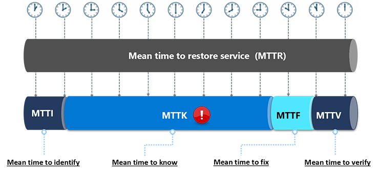

Continuous Collaboration is one of the eight capabilities in the DevOps taxonomy.

Each capability identifies example practices. They aren't exhaustive lists.

### Discover why Continuous Collaboration is necessary

Often, communication challenges affect the ability to resolve an incident. For example, a ticket might get created but a support engineer might not be monitoring email. Or a support engineer’s work transitions to a colleague when their shift ends, and context can be lost as the new engineer sorts through all the communication that occurred.

**MTTR, or mean time to resolution** is a measurement of the average amount of time from when an issue is detected until it has been completely fixed. Shortening MTTR by attacking MTTK (mean time to know) is a good operations KPI. Reducing MTTK requires a great deal of collaboration across different organizations and teams.

*The 5 Dysfunctions of a Team*, a book by Patrick Lencioni, identifies the following five dysfunctions:

- **Absence of trust** - Members of great teams trust one another on a fundamental, emotional level, and they are comfortable being vulnerable with each other about their weaknesses, mistakes, fears, and behaviors.
- **Fear of conflict** - Teams that trust one another are not afraid to engage in passionate dialogue around issues and decisions that are key to the organization's success.
- **Lack of commitment** - Teams that engage in unfiltered conflict can achieve genuine buy-in around important decisions, even when various members of the team initially disagree, because they ensure that all opinions and ideas are put on the table and considered.
- **Avoidance of accountability** - Teams that commit to decisions and standards of performance do not hesitate to hold one another accountable for adhering to those decisions and standards.
- **Inattention to results** - Teams that trust one another, engage in conflict, commit to decisions, and hold one another accountable are very likely to set aside their individual needs and agendas and focus almost exclusively on what is best for the team.

### What is Continuous Collaboration?

**Continuous Collaboration** is a practice that supports the cultural shifts that are key to any DevOps journey. Continuous Collaboration enables teams to innovate outside of the boundaries of planned meetings, and fosters innovation within the team by creating an integrated experience.

Silos can be broken down using technologies and practices that make it possible for teams to work together even if no ideal co-location exists.

Review The Agile Manifesto from the perspective of Continuous Collaboration and you will realize that it really is all about the value of collaborating and having personal interactions in order to truly innovate. Continuous Collaboration encourages you to value:  

- **Individuals and interactions** over processes and tools
- **Working software** over comprehensive documentation
- **Customer collaboration** over contract negotiation
- **Responding to change** over following a plan

According to *Accelerate*: "The organizational culture predicts the way information flows through an organization. Good informational flow is critical to the safe and effective operation of high-tempo and high-consequence environments, including technology organizations."

[Culture](https://docs.microsoft.com/learn/modules/introduce-foundation-pillars-devops/3-explore-first-foundation) and cross-functional collaboration have many beneficial impacts on performance, including:

- Different perspectives, which can spur innovation
- Buy-in and trust, which can help increase the momentum of change
- Knowledge gets cross-pollinated, and everyone learns more
- The challenging of old ideas
- Leveling the playing field

Collaboration relies on communication, and how you communicate is how you build your software. Looking at communications through the lens of Conway’s Law shows us that:

- Siloed functional teams create specialized, siloed solutions.
- [Cross-functional teams create solutions that provide capabilities](https://docs.microsoft.com/learn/modules/introduce-foundation-pillars-devops/4-explore-second-foundation).

Therefore, designing teams and architecture around micro-services is an effective way to focus teams on capabilities.

