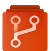
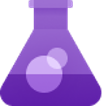
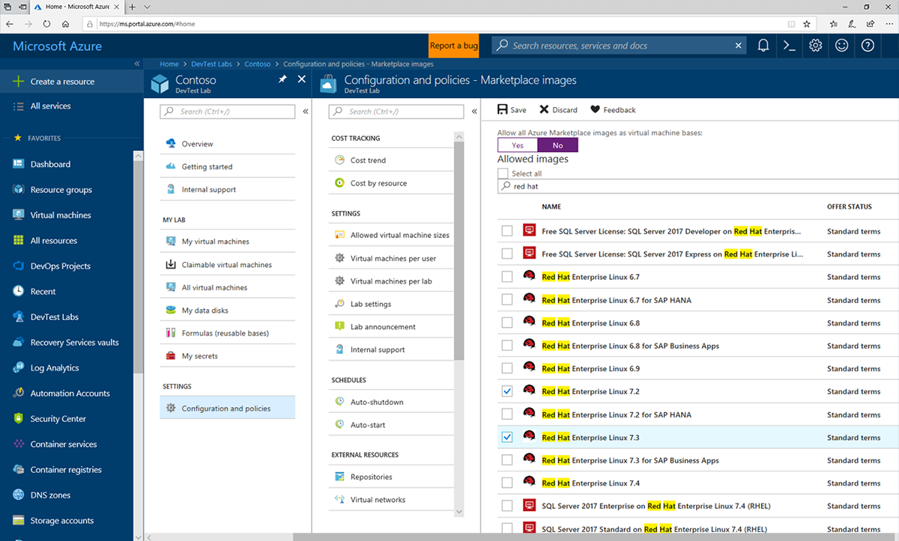
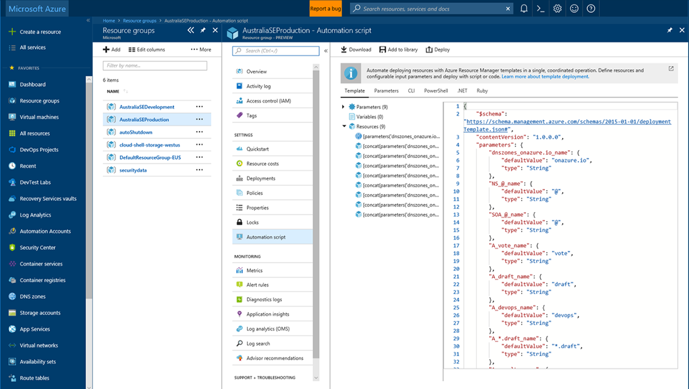
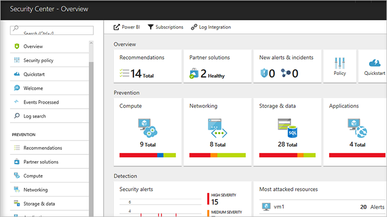
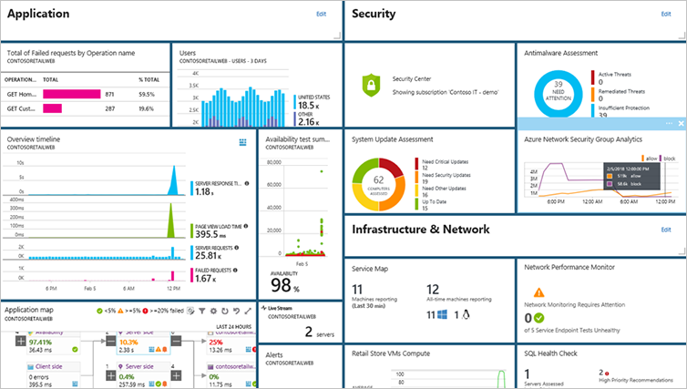
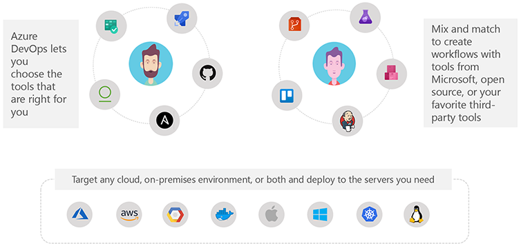
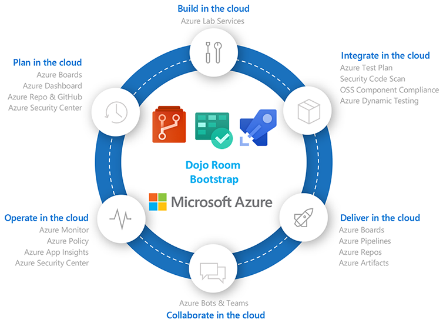

**Technology** continually evolves to enable DevOps practices. Choosing the right solution will empower your team on their DevOps journey.

Here's where [Azure DevOps](https://azure.com/devops) comes in. **Azure DevOps** encompasses the entire toolchain, from source control (Git or Team Foundation) through continuous integration, release automation, and even production monitoring. It was recently ranked as a leader in The Forrester Wave™: Continuous Delivery And Release Automation Report.

Modern dev services such as Azure Boards, Azure Pipelines, Azure Repos, Azure Test Plans, and Azure Artifacts help you plan smarter, collaborate better, and ship faster.

:::row:::
   :::column span="":::
      

      **Azure Boards**
      
      Deliver value to your users faster using proven agile tools to plan, track, and discuss work across your teams.

   :::column-end:::
   :::column span="":::
      

      **Azure Pipelines**
      
      Build, test, and deploy with CI/CD that works with any language, platform, and cloud. Connect to GitHub or any other Git provider and deploy continuously.

   :::column-end:::
      :::column span="":::
      

      **Azure Repos**
      
      Get unlimited, cloud-hosted private Git repos and collaborate to build better code with pull requests and advanced file management.

   :::column-end:::
:::row-end:::

:::row:::
   :::column span="":::
      

      **Azure Test Plans**
      
      Test and ship with confidence using manual and exploratory testing tools.

   :::column-end:::
   :::column span="":::
      

      **Azure Artifacts**
      
      Create, host, and share packages with your team, and add artifacts to your CI/CD pipelines with a single click.

   :::column-end:::
      :::column span="":::
   :::column-end:::
:::row-end:::

> [!NOTE]
> Azure DevOps is an **open platform** that integrates with the most popular OSS tools and technologies.

### Manage self-service dev/test environments

A common DevOps challenge for IT organizations is keeping up with project demand for development and test environments.

**Azure Lab Services** simplifies environment management for dev & test environments in the Azure cloud.

You can use it to provide self-service access for teams, with policies to control costs and enforce use of appropriate images and artifacts. You can also use templates, custom images, and formulas to reproduce environments, and orchestrate with Azure Pipelines or integrate using REST API.

> [!div class="mx-imgBorder"]
> 

### Deploy faster with infrastructure as code

Infrastructure as code enables repeated and reliable deployment by providing management of infrastructure using source code.

**Azure Resource Manager** provides configuration as code capabilities for Azure to manage environment configurations out of the box, to treat application configuration resources as versioned artifacts, and to migrate code seamlessly between environments.

Azure also supports third-party tools such as Terraform, Ansible, Chef, Puppet, and SaltStack!

> [!div class="mx-imgBorder"]
> 

### Ensure Continuous Security

**Microsoft Defender for Cloud** provides organizations with full visibility and control of their cloud security state with a single, unified view. Its capabilities include:

- Security data collection from multiple sources
- Integration with existing security workflows
- Easy onboarding of cloud resources
- Continuous security assessment
- Centralized policy management
- Compliance reporting
- Support for hybrid workloads

Microsoft analyzes 300 billion user authentications and checks 200 billion emails for spam and malware every month. Microsoft also has unprecedented visibility into cloud infrastructure choices, platforms, and the activity therein. Such visibility has no precedent in the on-premises world.

### Get smarter insights, faster

Azure’s monitoring solutions provide pre-defined monitors with smart thresholds and intuitive, customizable dashboards to present data.

**Azure Monitor** provides metrics for all Azure infrastructure. **Log Analytics** and **Application Insights** provide greater insights into infrastructure and applications.

For monitoring cloud health, Log Analytics will:

- Collect and store data from any source
- Gain deep operational insights
- Detect, diagnose, and fix issues quickly

### Choose the tools and clouds you love

With Azure DevOps, you have choices that help maximize your existing investments.

Choose the tools that are right for you. Get support for infrastructure as a service (IaaS) on Linux, Java, and PHP Web application platforms. Develop and test Linux and open-source components in Azure. Mix and match to create workflows with tools from Microsoft, open source, or your favorite third-party tools. Bring the tools you love, the skills you already have, and run virtually any application, using your data source, with your operating system, on your device.

### Dojo Classroom Bootstrap

With end-to-end solutions in Azure, teams can implement DevOps practices in each of the application lifecycle phases:

1. **Plan** in the cloud with Azure Boards, Azure Dashboard, Azure Repo & GitHub, and Microsoft Defender for Cloud.
1. **Build** in the cloud with Azure Lab Services.
1. **Integrate** in the cloud with Azure Test Plan, Security Code Scan, OSS Component Compliance, and Azure Dynamic Testing.
1. **Deliver** in the cloud with Azure Boards, Azure Pipelines, Azure Repos, Azure Artifacts.
1. **Collaborate** in the cloud with Azure Bots and Teams.
1. **Operate** in the cloud with Azure Monitor, Azure Policy, Azure App Insights, and Microsoft Defender for Cloud.

These DevOps technologies, combined with people and processes, enable teams to continually provide value to customers.

Using the robust integration of these DevOps capabilities in Azure allows us to bootstrap our **Dojo Classroom** labs with auto-provisioning to provide hands-on experiences during the master class.

The Dojo Classroom environment includes everything you need in the immersive Dojo classroom, including tracking with ACR (Azure Consumed Revenue)!
