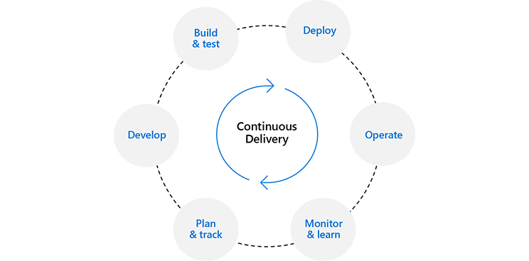
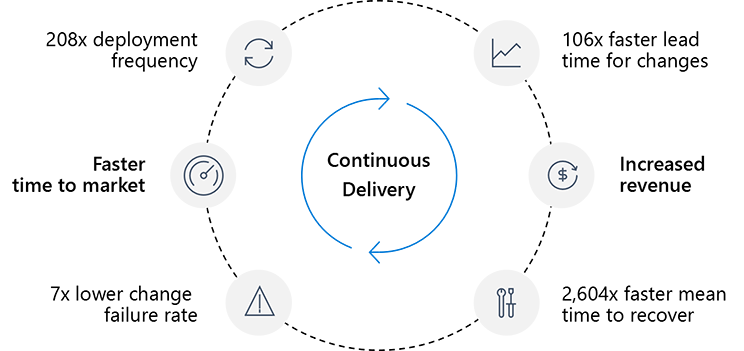

Continuous Delivery is one of the eight capabilities in the DevOps taxonomy.

Each capability identifies example practices. They aren't exhaustive lists.

### Discover why Continuous Delivery is necessary

In 2012, a software deployment error resulted in a $460M loss for Knight Capital Group, the largest trader in U.S. equities at the time.

The losses began when the market opened. There were no bugs in the code – the problem was caused by an error that was made during a manual deployment to only one of their eight production servers.

When they tried to fix it, all eight servers ended up misconfigured – so they lost even more money. Because all deployment was manual, they had no way to automatically roll the changes back.

After trying to fix the problem for 45 minutes, they finally shut down the entire system. In that time, they had lost $460M.

This is a real story. What would be the impact in your organization? Are you doing manual deployment?

Perhaps the single most important question to ask to help understand delivery performance in an organization is:

>[!IMPORTANT]
>How **big** is your deployment pain to production?

The fear and anxiety that engineers and technical staff feel when they push code into production can tell us a lot about a team’s software delivery performance.

### What is Continuous Delivery?

>[!IMPORTANT]
>**Continuous Delivery** is a software engineering approach in which teams produce software in short cycles, ensuring that the software can be:
>
>- Reliably released at any time
>- Released manually

The purpose of Continuous Delivery is to:

- Build, test, and release software with greater speed and frequency
- Reduce the cost, time, and risk of delivering changes by allowing for more incremental updates to applications in production  

Continuous Delivery happens when:

- Software is deployable throughout its lifecycle
- Continuous Integration as well as extensive automation are available through all possible parts of the delivery process, typically using a deployment pipeline
- It’s possible to perform push-button deployments of any version of the software to any environment on demand

**Large manual deployments** create a high level of risk by drastically increasing the complexity of the software being released, introducing the likelihood of human error, and making it harder to identify and remedy deployment failures. Deployment frequency is low, lead time for changes is high, mean time to recover is long and you have a high change failure rate.

A designated operations team performs manual deployment during off-business hours. They need a manual steps document and time to test the documented steps manually. Large deployments also take longer to execute, are harder to roll back if failed, and involve a bigger testing scope after deployment. The number of changes per deployment is larger, and feedback takes more time to implement.

By automating the process and enabling the ability to release to production at any time, the **benefits of Continuous Delivery** are significant and numerous:

- Less waste
- Faster ROI
- Lower risk
- Higher quality
- Early feedback
- [Better planning](https://docs.microsoft.com/learn/modules/analyze-devops-continuous-planning-intergration/2-explore-continuous-planning)
- [Faster collaboration](https://docs.microsoft.com/learn/modules/characterize-devops-continous-collaboration-improvement/2-explore-continuous-collaboration)
- Everyone is involved
- [Fewer production issues](https://docs.microsoft.com/learn/modules/explain-devops-continous-delivery-quality/3-explore-continuous-quality)
- [Ability to shift left on security](https://docs.microsoft.com/learn/modules/explore-devops-continuous-security-operations/2-explore-continuous-security)
- Adapt and react a lot more quickly
- Much more predictable releases
- Deploy during any business hours
- Faster response to market changes
- Change delivered without significant delay
- Anyone in the team can initiate deployments
- Fast, repeatable, and configurable deployments

According to the 2019 State of DevOps Report, high-performing DevOps organizations when compared to low performers achieve:

- More than 200 times more frequent deployments
- More than 100 times faster lead time for changes
- More than 2600 times faster mean time to recover
- Seven times lower change failure rate

In addition, according to a global study by CA Technologies, organizations realize up to 20% improvement in time to market and increased revenue.

>[!NOTE]
>Continuous Delivery is sometimes confused with Continuous Deployment.
>**Continuous Deployment** means that every change goes through the pipeline and automatically gets put into production, resulting in many production deployments every day.
>**Continuous Delivery** just means that you can do frequent deployments but may choose not to, usually due to businesses preferring a slower rate of deployment. You must be doing Continuous Delivery to do Continuous Deployment.

**Continuous Integration** is a prerequisite for Continuous Delivery. Practices in place enable building and (reliably) deploying the application at any time and with high quality, from source control.

