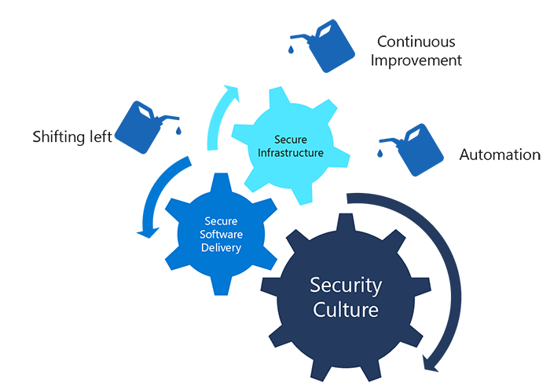

Continuous Security is one of the eight capabilities in the DevOps taxonomy.

Each capability identifies example practices. They aren't exhaustive lists.

### Discover why Continuous Security is necessary

Cyber-crime is an inevitable fact of the digital times we live in. Many organizations are being attacked daily by criminals doing it to do damage or by hackers doing it for fun. As well as our organizations, we as users of third party services are also possible targets for these attacks.

Here are some real-life examples.

|                                                                    |                                                                                                                                                                                                                                                                                                                                                                                                |
|--------------------------------------------------------------------|------------------------------------------------------------------------------------------------------------------------------------------------------------------------------------------------------------------------------------------------------------------------------------------------------------------------------------------------------------------------------------------------|
|  | **Yahoo**: In 2013, all 3 billion Yahoo user accounts were affected by data theft. The investigation indicated the stolen information didn't include passwords in clear text, payment card data, or bank account details.                                                                                                                                                       |
|       | **Uber**: In 2016 hackers accessed the personal information of 57 million riders. At the time of the breach, Uber paid hackers $100,000 to destroy the data. They didn't tell regulators or users that their information was stolen. They disclosed the breach a year later.                                                                                                                                                                             |
|        | **Instagram**: In 2017, an Instagram hack affected millions of accounts and resulted in exposing users' phone numbers. The numbers ended up in a data base where people could search for victim's contact information for $10 per search.                                                                                                                                                                                                                                                                                             |
|         | **Facebook**: In 2018, hackers stole detailed personal data from 14 million Facebook users. Stolen data included search results, recent locations, and hometowns.                                                                                                                                                                              |
|         | **Equifax**: On March 6, 2017, Apache Foundation announced a new vulnerability and available patch for its Struts 2 framework. Soon after, Equifax, one of the credit reporting agencies that assess the financial health of many consumers in the US, started notifying selected customers that it suffered a breach. In September 2017, Equifax announced its breach publicly worldwide. The breach affected 145.4 million consumers in the US and 8000 in Canada. A total of 15.2 million records were compromised in the UK, including sensitive data affecting 700,000 consumers. In March 2018, Equifax announced that 2.4 million more US consumers were affected than originally disclosed. |

Today, the advice given by Michael Hayden (former director of the NSA and the CIA) is to assume that you have been breached, and that defense-in-depth at each level should be central to an organization’s security posture. According to Hayden, there are two types of companies: those that have been breached, and those that don’t know it yet.

The Microsoft product group philosophy, which inspires their DevSecOps approach, is:

- to assume you have been breached
- the bad actors are already in the network with internal access
- defense-in-depth is essential.

#### You are only as secure as your weakest link
Organizations are installing applications everywhere. They rely on web and mobile applications to engage customers and software to run a massive new wave of Internet of Things (IoT) devices. But these apps are exposing firms to increasing risk; when asked how external attackers carried out successful attacks, global network path security decision makers whose companies had been breached in the previous 12 months said the top two attack methods were direct web application attacks and taking advantage of vulnerable software.
And firms are only going to funnel more customers and data through these vulnerable targets for the foreseeable future. Forrester predicts that the majority of businesses will see 76% to 100% of their total sales through digital products and/or products sold online by 2022. So security pros must focus on securing applications.

> [!div class="centered"]
> ![Diagram depicts the results of the State of Application Security, 2020 showing that applications remain the most common attack vector. 42% of external attacks were carried out through software vulnerability. 35% were carried out through web applications. 27% were carried out through use of stolen credentials. 25% were due to exploitation of lost or stolen asset, and 24% due to strategic web compromise. 24% were distributed denial of service attacks. 22% were due to mobile malware. 21% were DNS attacks. 18% were due to phishing. 15% were ransomware attacks. 6% of the attacks were committed through social engineering.](../media/5-2-report.png)

Image source: [The State Of Application Security, 2020, Forrester Research, Inc., May 4, 2020](https://www.forrester.com/report/The+State+Of+Application+Security+2020/-/E-RES159057)

### What is Continuous Security?

Security is the application of technologies, processes, and controls to protect systems, networks, programs, devices, and data from unauthorized access or criminal use.

Security provides confidentiality, integrity, and availability assurances against deliberate attacks and abuse of valuable data and systems. 

> [!IMPORTANT]
> It is important to highlight that security is not focused on mistakes, but on deliberate attacks. This is important, because they would require different countermeasures: for mistakes, a simple notification or request of confirmation may do, for malicious actions, definitely not.

**Continuous Security** is a practice that ensures security is an integral part of the software delivery lifecycle.  Continuous security in DevOps should cover a holistic view of security including security culture, secure software delivery, and secure infrastructure.  

Continuous security requires mindset change, education, and automation.

There are three elements to establish continuous security:

- A strong security focus within the organization’s **culture**
- An **infrastructure** implemented and operated by adopting latest security recommended practices
- A **software delivery process** that focuses on security, such as the Microsoft Security Development Lifecycle (SDL)

The three principles in DevOps that need to be taken into consideration in every capability so also in continuous security are:

|                                                                    |                                                                                                                                                                                                                                                                                                                                                                                                |
|--------------------------------------------------------------------|------------------------------------------------------------------------------------------------------------------------------------------------------------------------------------------------------------------------------------------------------------------------------------------------------------------------------------------------------------------------------------------------|
|  | **Shift left** means to anticipate security activities and conduct them earlier in the software delivery process instead of downstream from the process. Studies have demonstrated that fixing bugs earlier in the development cycle has a significant impact on costs and losses.                                                                                                                                                      |
|           | **Automation** of repetitive actions is key to helping reduce the possibility of mistakes. This approach allows tasks and processes that are typically infrequent, such as deployment, to be conducted more frequently. |
|       | **Continuous improvement** is achieved through analysis of current behaviors and identification of possibilities for optimization.                                                                                                                                                                             |

> [!div class="centered"]
> 

> [!IMPORTANT]
> When the three principles of shifting left, automation, and continuous improvement are combined with the elements of continuous security: Culture, Software Delivery and Infrastructure, they represent a holistic approach to security.
