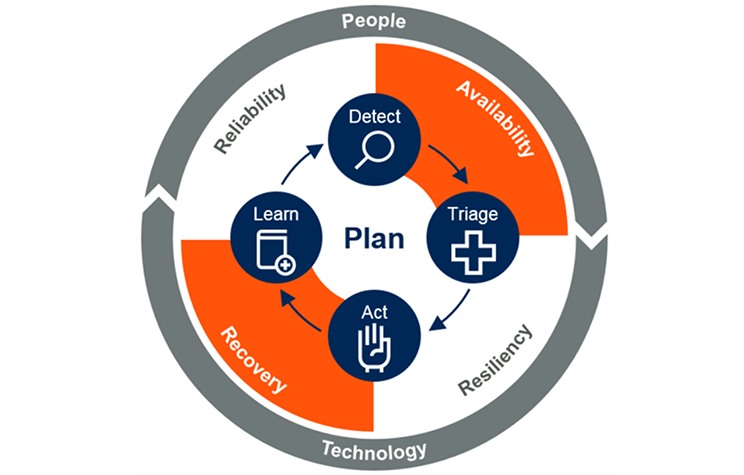
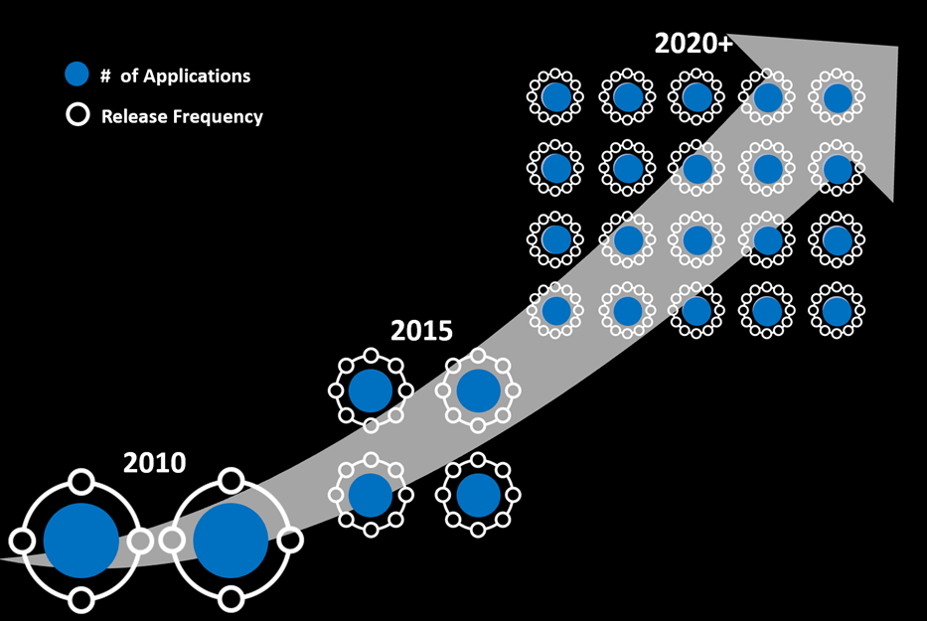
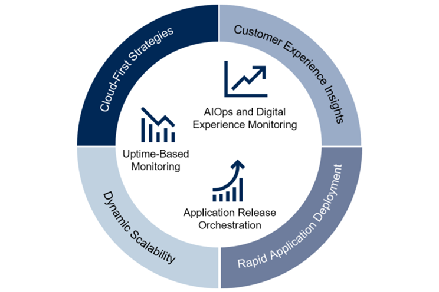
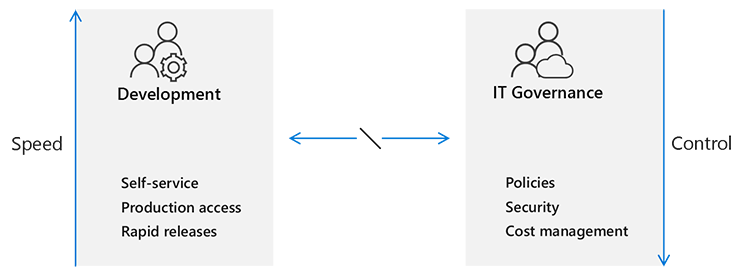
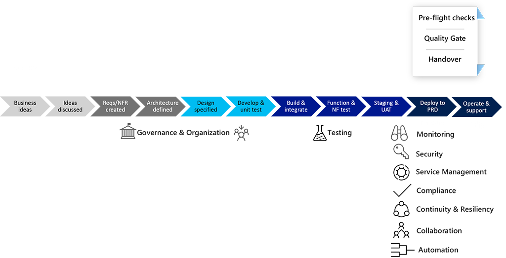
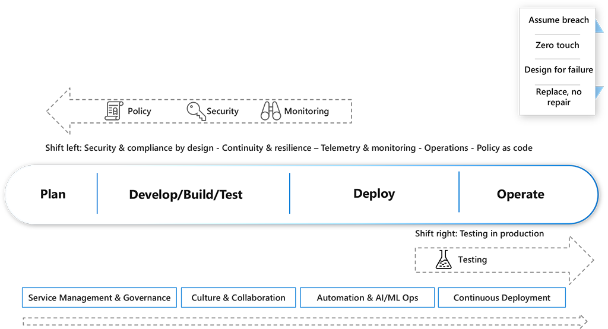

Continuous Operations is one of the eight capabilities in the DevOps taxonomy.

### Discover why Continuous Operations is necessary

Complex systems do fail and can cause costly outages and interruptions. Let's look at some examples.

| Companies | Event |
|---|---|
|  **Delta Air Lines** | In August 2016, Delta was forced to cancel 2,300 flights when a single piece of malfunctioning equipment caused a power outage at its operations center in Atlanta. Reported cost to the company was $150 million. |
|  **FedEx and UK National Health Service** | In May 2017, WannaCry ransomware caused operational disruptions to FedEx. One FedEx subsidiary reported $300 million in losses. The UK's National Health Service was another victim of the ransomware, which blocked access to its computers, locked out vital medical equipment, and forced some hospitals to divert ambulances to other locations. |
|  **Amazon S3** | In February 2017, operator error caused a four-hour disruption to Amazon's core storage services, which had multiple impacts on significant web properties such as Alexa, IFTTT, Quora, and Trello. |
|  **LinkedIn** | LinkedIn experienced a problem that prevented DEV work from being done for two months. |
|  **Equifax** | Equifax experienced a breach in 2017, that resulted in the personal information of over 160 million consumers being exposed. We discussed it in more detail in [Continuous Security](/learn/modules/explore-devops-continuous-security-operations/2-explore-continuous-security). |

#### The business impact and cost of a breach

The costs of a breach often go well beyond the loss of sales and trust in a company. These costs can include:

- Response & notification
  - There are operational and service costs to notifying affected parties as required by law. These costs often also include additional costs for call centers, PR support, and credit monitoring services.
- Lost employee productivity and turnover
  - Yahoo's general counsel resigned, and the CEO was not awarded an annual bonus for 2016.
- Lawsuits and settlements
  - Target paid $18.5 million to 47 US states.
- Regulatory fines and responses
  - With the new data protection policies effective in the European Union since 2018, the fine is 4% of annual revenue or €20 million, whichever is greater.
- Brand recovery costs
  - Mining technology firm Codan saw revenue drop from $45 million to $9.2 million within a year.
- Other liabilities
  - Verizon paid $350 million less for Yahoo after two massive hacks.

Additional security and audit requirements might also be necessary.

#### Availability and recovery in Continuous Operations

According to a Gartner survey, business and IT leaders expect that some 47% of production applications are expected to be running in public cloud locations by 2020.

When entire datacenters can be destroyed with one line of code, I&O leaders’ focus on the availability and recovery of production environments needs to change. New deployment patterns are changing how we ensure application and infrastructure availability and recovery capabilities.

#### Increasing numbers of apps and releases in production

Key performance indicators for software delivery performance are:

- Lead time for change
- Deployment frequency
- Mean time to restore
- Change fail rate

Teams that work to increase speed but don't invest enough in building [quality](/learn/modules/explain-devops-continous-delivery-quality/3-explore-continuous-quality) into the process will experience larger failures, and more time to restore service. Teams that build quality into the process achieve both speed and stability.

The number of web and mobile applications, and the frequency of application releases have increased greatly. Code has also become increasingly complex.

>[!NOTE]
>A big part of the value of DevOps in general is about finding the right balance between innovation (speed) and business continuity (control).

### What is Continuous Operations?

>[!IMPORTANT]
>**Continuous Operations** reduces or eliminates the need for planned downtimes or interruptions, such as scheduled maintenance.
>Continuous monitoring of infrastructure, applications, and services should be tied to automated remediation if possible.
>A user should never know when an update or incremental release occurs.

#### Compare traditional and Continuous Operation practices

In a traditional enterprise model, IT enforces what's released, and controls everyone with rigid processes and procedures.

This approach causes a misalignment between Development teams and IT Governance. Development teams are mostly agile, focused on speed, and expecting to release as often as they wish. To them, IT Governance seems to be a bottleneck that isn’t aligned with the expected Time to Market objectives of today’s business needs.

>[!IMPORTANT]
>When properly implemented, DevOps can deliver both innovation (**speed**) and business continuity (**control**).

In a traditional development lifecycle:

- Testing is done just before go-live.
- Monitoring is often handed over.
- Security is often consulted in the testing stages.
- During handover, security checks of the code and all Service Management controls must be done.
- Compliance is often not part of the handover, but something that ‘pops’ up during the operational state of a service. 
- Resilience / Continuity planning is done as part of the design phase, but actual testing of related scenarios is often only done during the operations or test phase, which can lead to configuration changes, rework, and wasted effort.
- Collaboration among operations, security & compliance, and developers is often done reactively through incident management and problem management processes.
- Leaving automation until the final stages often leaves few resources to get it done.

New methods, technologies, and ways of working call for a new approach to Continuous Operations. The following eight main Continuous Operations practices have emerged and continue to evolve:

- **Security & compliance** by design acknowledges that certain standards, legislation, but also business requirements such as traceability and auditability must  be taken into consideration at design time when designing for highly-automated cloud environments.
- **Continuity & resilience** requires close collaboration with the organization to ensure business needs are reflected in the design and implementation.
- **Telemetry & monitoring** can be used to discover customer usage patterns, potential new needs, and detailed information about where users encounter errors. These tools can also help ensure that value is delivered.
- **Service Management** is a different conversation in a DevOps culture:
  - Shift towards means you own it. You build it, you run it, and when it breaks you fix it.
  - Focus on what’s required.
  - Empower governance.
  - Facilitate transparency.
- **[Culture](/learn/modules/introduce-foundation-pillars-devops/3-explore-first-foundation) & [collaboration](/learn/modules/characterize-devops-continous-collaboration-improvement/2-explore-continuous-collaboration)** are essential for Continuous Operations. Organizations are often required to change the way they work to facilitate transformation toward DevOps teams. Collaboration is also essential when designing for security and resilience.
- **Automation & AI/ML Ops** are important aspects of what make DevOps (and cloud) different compared to traditional operations teams. The focus must be on the whole system being automated (systemic automation), and not just one area.
- **[Continuous Deployment](/learn/modules/explain-devops-continous-delivery-quality/2-use-continuous-delivery-release-faster)** uses modern release pipelines to allow development teams to deploy new features fast and safely, allowing a continuous stream of customer value and shortening the time to remediate issues.
- **[Shift-right testing](/learn/modules/explain-devops-continous-delivery-quality/3-explore-continuous-quality)** uses practices such as dark launching, feature flags, monitoring, and A/B testing. Teams are then able to continue testing to make sure an application meets behavior, performance, and availability expectations during live use.

To evolve into a DevOps approach, a major paradigm shift needs to occur in the culture to deliver business value with a modern IT approach.

|                                |        **Traditional IT**           |                 **Modern IT**                    |
|:------------------------------:|:-----------------------------------:|:------------------------------------------------:|
| **DNA**                        | Intermediation                      | Removal of intermediation                                |
| **Service delivery**           | Wave-based                          | Continuous iteration-based                       |
| **Service stability**          | Design for success (HA/Redundant)   | Design for failure (resilient)                   |
| **Delegation levels**          | IT silos                            | End-to-end services                              |
| **Processes**                  | In documents, optimized, redesigned | Self service, knowledge, low friction, automated |
| **Automation**                 | Isolated, manually initiated        | Systemic, triggered, automatic                   |
| **Monitoring**                 | Element, fault-focused              | Service, end-to-end-capability focused           |
| **Support**                    | Service Desk / Contact Center       | Customer care / Self service                     |
| **Lifecycle**                  | *N*-1 or older                      | *N*, *N*+1                                       |
| **Configuration/Asset Management** | Discovered / Manual configuration   | Prescribed, declarative, automated               |

These changes result in simplified and automated processes, aligned outcome incentives, reduced risk, and a customer-centric approach.
