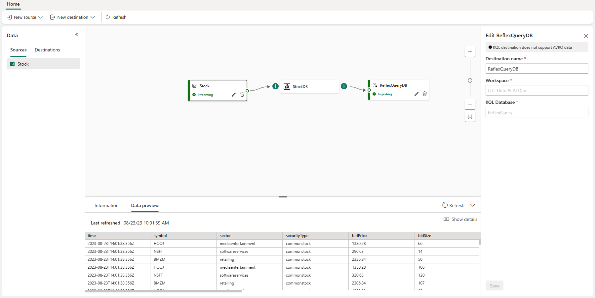
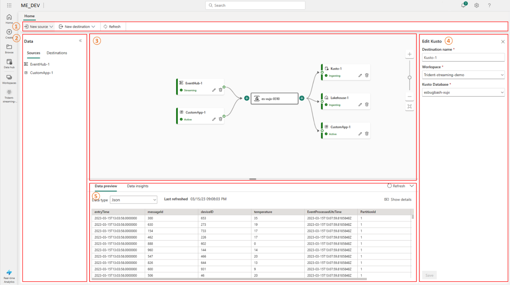

## What is Eventstream and why use it?

Microsoft Fabric Eventstream is a no-code feature that lets you capture and send real-time events to different places. You can use it to make event-driven apps, such as IoT, streaming, and dashboards. You can also connect to various data sources and destinations, and preview the event data. Microsoft Fabric Eventstream is part of the Real-time analytics experience in Microsoft Fabric. You should use it if you want to use real-time data in a simple way.

## How Eventstream works

Microsoft Fabric Eventstream works by creating a pipeline of events from multiple internal and external sources to different destinations. You can think of it as a conveyor belt that moves data from one place to another. You can also add some transformations to the data along the way, such as filtering, aggregating, or enriching.

Eventstream's Main Editor can be used to design your pipeline by dragging and dropping different nodes, such as sources, destinations, and transformations. You can also see the event data flowing through the pipeline in real-time. Microsoft Fabric Eventstream handles the scaling, reliability, and security of your eventstream automatically. You don’t need to write any code or manage any infrastructure to use Microsoft Fabric Eventstream.

## The components of Eventstream

Microsoft Fabric Eventstream is a feature that lets you work with real-time events in a simple way. You can capture events from different sources, transform them as you need, and send them to various destinations without writing any code. You can also connect your eventstreams with Azure services like Event Hubs, KQL databases, and lakehouses.

The main components of Microsoft Fabric Eventstream are:

* **Eventstream**: Eventstream is what you create in the portal to set up your event data flow. It has a name, a sensitivity level, and an endorsement status.
* **Source**: Source is where your event data comes from. You can pick Azure Event Hubs, sample data, or custom app as your source type. You can also choose the data format and the consumer group of your source.
* **Destination**: Destination is where your event data goes to. You can pick KQL database or lakehouse as your destination type. You can also give the table name and the schema mapping of your destination.
* **Main Editor**: Main Editor is the place where you can add and manage your sources and destinations. You can also see the event data, check the data insights, and view logs for each source or destination. Each source or destination shows up as a tile (node) in the place.

 

## Main Editor components

Before we dive deeper into Eventstream, it's important to understand the design canvas known as Main Editor. Understanding Main Editor assists you in your no code development and designing eventstreams in an efficient and approach that allows for reuse.

1. **Ribbon**: The ribbon menu provides source and destination options.
2. **Data navigation pane**: The data navigation pane allows you to navigate the sources and destinations.
3. **Canvas and diagram view**: The canvas and diagram view pane provides graphical representation of the entire eventstream topology, from the sources to the destinations. Each source or destination appears as a tile or node within the canvas.
4. **Configuration and modification pane**: The configuration and modification pane allows you to configure or modify a specific source or destination.
5. **Bottom pane for information, data preview, data insights, and runtime logs**: For each tile or node, the data preview shows you data inside the selected tile or node.

> [!NOTE]
> The bottom pane also summarizes runtime logs where the runtime logs exist in certain sources or destinations It also provides metrics for you to monitor the data insights for certain sources or destinations, such as input events, output events, incoming messages, outgoing messages, etc.

## The benefits of Eventstream

Some of the main benefits of Microsoft Fabric Eventstream are:

* Eventstream lets you capture, transform, and route real-time events to various destinations with a no-code experience. You can use the drag and drop feature to make your event data processing logic without writing any code.
* Eventstream gives you various source connectors to get event data from different sources, such as Azure Event Hubs, sample data, or custom app. You can also choose the data format and the consumer group of your source.
* Eventstream supports sending data to different destinations, such as lakehouse, KQL database, or custom app. You can also attach multiple destinations in an eventstream to get data from your eventstreams at the same time without interfering with each other.
* Eventstream uses a scalable infrastructure that manages scaling and resourcing automatically. The scalable infrastructure helps you capture your real-time events easily, making streaming ETL (Extract, Transform, Load) operations possible.
* Eventstream connects your eventstreams and has full interoperability with Azure services like Event Hubs, KQL databases, and lakehouses. This interoperability gives you more options and flexibility to work with your event data.
